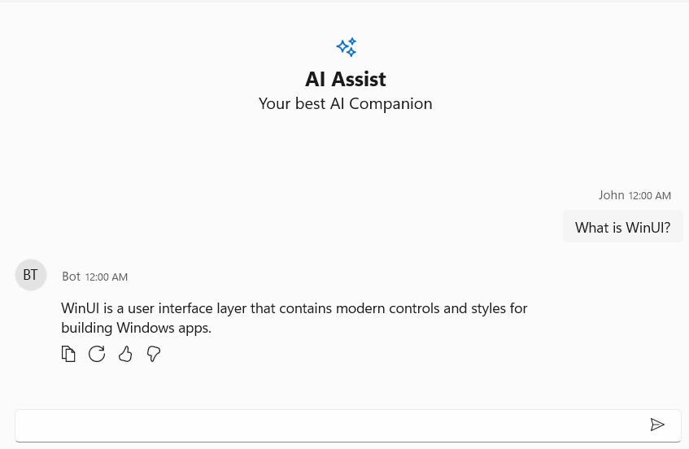

# Getting Started with WinUI AI AssistView

This section explains the steps required to add the WinUI [SfAIAssistView](https://help.syncfusion.com/cr/winui/Syncfusion.UI.Xaml.Chat.SfAIAssistView.html) control with its basic features.

## Creating an application with WinUI AI AssistView

1. Create a [WinUI 3 desktop app for C# and .NET 6](https://docs.microsoft.com/en-us/windows/apps/winui/winui3/get-started-winui3-for-desktop).
2. Add reference to [Syncfusion.Chat.WinUI](https://www.nuget.org/packages/Syncfusion.Chat.WinUI) NuGet. 
3. Import the control namespace `Syncfusion.UI.Xaml.Chat` in XAML or C# code.
4. Initialize the [SfAIAssistView](https://help.syncfusion.com/cr/winui/Syncfusion.UI.Xaml.Chat.SfAIAssistView.html) control.

## Initialize AI AssistView




<Page
    x:Class="GettingStarted.MainPage"
    xmlns="http://schemas.microsoft.com/winfx/2006/xaml/presentation"
    xmlns:x="http://schemas.microsoft.com/winfx/2006/xaml"
    xmlns:local="using:GettingStarted"
    xmlns:d="http://schemas.microsoft.com/expression/blend/2008"
    xmlns:mc="http://schemas.openxmlformats.org/markup-compatibility/2006"
    xmlns:syncfusion="using:Syncfusion.UI.Xaml.Core"
    mc:Ignorable="d"
    Background="{ThemeResource ApplicationPageBackgroundThemeBrush}">
    <Grid>
      <syncfusion:SfAIAssistView />
    </Grid>
</Page>

 



// Creating an instance of the AI AssistView control.
SfAIAssistView aiAssistView = new SfAIAssistView();
           



## Creating ViewModel for AI AssistView

Create a simple chat collection as shown in the following code example in a new class file. Save it as ViewModel.cs file.





<Page
    x:Class="GettingStarted.MainPage"
    xmlns="http://schemas.microsoft.com/winfx/2006/xaml/presentation"
    xmlns:x="http://schemas.microsoft.com/winfx/2006/xaml"
    xmlns:local="using:GettingStarted"
    xmlns:d="http://schemas.microsoft.com/expression/blend/2008"
    xmlns:mc="http://schemas.openxmlformats.org/markup-compatibility/2006"
    xmlns:syncfusion="using:Syncfusion.UI.Xaml.Core"
    mc:Ignorable="d"
    Background="{ThemeResource ApplicationPageBackgroundThemeBrush}">
    <Grid>
      <syncfusion:SfAIAssistView   CurrentUser="{Binding CurrentUser}"  
                                   Messages="{Binding Chats}"/>
    </Grid>
</Page>

 



 public class ViewModel : INotifyPropertyChanged
 {
     private ObservableCollection<object> chats;
     private Author currentUser;
     public ViewModel()
     {
         this.Chats = new ObservableCollection<object>();          
         this.CurrentUser = new Author { Name="John"};
         this.GenerateMessages();
     }

     private async void GenerateMessages()
     {
         this.Chats.Add( new TextMessage { Author = CurrentUser, Text = "What is WinUI?" } );        
         await Task.Delay(1000);
         this.Chats.Add( new TextMessage { Author = new Author { Name = "Bot" }, Text = "WinUI is a user interface layer that contains modern controls and styles for building Windows apps." });
     }

     public ObservableCollection<object> Chats
     {
         get
         {
             return this.chats;
         }
         set
         {
             this.chats = value;
             RaisePropertyChanged("Messages");
         }
     }

     public Author CurrentUser
     {
         get
         {
             return this.currentUser;
         }
         set
         {
             this.currentUser = value;
             RaisePropertyChanged("CurrentUser");
         }
     }

     public void RaisePropertyChanged(string propName)
     {
         if (PropertyChanged != null)
         {
             PropertyChanged(this, new PropertyChangedEventArgs(propName));
         }
     }

     public event PropertyChangedEventHandler PropertyChanged;
  }




N> [View sample in GitHub](https://github.com/SyncfusionExamples/Syncfusion-winui-ai-assistView-examples/tree/master/Samples/Getting-Started)