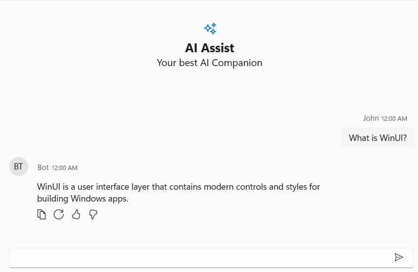

# Getting Started with WinUI AIAssistView

This section explains the steps required to add the WinUI [SfAIAssistView](https://help.syncfusion.com/cr/winui/Syncfusion.UI.Xaml.Chat.SfAIAssistView.html) control and populate it with a simple chat collection.

## Creating an application with the WinUI SfAIAssistView

1. Create a [WinUI 3 desktop app for C# and .NET](https://learn.microsoft.com/en-us/windows/apps/winui/winui3/get-started-winui3-for-desktop).
2. Add a reference to the [Syncfusion.Chat.WinUI](https://www.nuget.org/packages/Syncfusion.Chat.WinUI) NuGet package.
3. Import the control namespace `Syncfusion.UI.Xaml.Chat` in your XAML or C# files.
4. Initialize the [SfAIAssistView](https://help.syncfusion.com/cr/winui/Syncfusion.UI.Xaml.Chat.SfAIAssistView.html) control.
5. Set the window's `DataContext` to a view model so the bindings in the following sections resolve.

## Initialize the SfAIAssistView




<Window
    x:Class="GettingStarted.MainWindow"
    xmlns="http://schemas.microsoft.com/winfx/2006/xaml/presentation"
    xmlns:x="http://schemas.microsoft.com/winfx/2006/xaml"
    xmlns:local="using:GettingStarted"
    xmlns:d="http://schemas.microsoft.com/expression/blend/2008"
    xmlns:mc="http://schemas.openxmlformats.org/markup-compatibility/2006"
    xmlns:syncfusion="using:Syncfusion.UI.Xaml.Chat"
    mc:Ignorable="d">
    <Grid>
      <syncfusion:SfAIAssistView />
    </Grid>
</Window>





using Microsoft.UI.Xaml;
using Microsoft.UI.Xaml.Controls;
using Syncfusion.UI.Xaml.Chat;

namespace GettingStarted;

public sealed partial class MainWindow : Window
{
    public MainWindow()
    {
        this.InitializeComponent();
        // Create an instance of the SfAIAssistView control.
        SfAIAssistView aiAssistView = new SfAIAssistView();

        // Host the control inside a Grid and assign it as the window's content.
        Grid grid = new Grid();
        grid.Children.Add(aiAssistView);
        this.Content = grid;
    }
}




## Creating a view model for the SfAIAssistView

Update the XAML to bind the control, set the window's `DataContext` in the code-behind, and add a `ViewModel.cs` class to the project as shown below.





<Window
    x:Class="GettingStarted.MainWindow"
    xmlns="http://schemas.microsoft.com/winfx/2006/xaml/presentation"
    xmlns:x="http://schemas.microsoft.com/winfx/2006/xaml"
    xmlns:local="using:GettingStarted"
    xmlns:d="http://schemas.microsoft.com/expression/blend/2008"
    xmlns:mc="http://schemas.openxmlformats.org/markup-compatibility/2006"
    xmlns:syncfusion="using:Syncfusion.UI.Xaml.Chat"
    mc:Ignorable="d">
    <Grid x:Name="grid">
      <syncfusion:SfAIAssistView CurrentUser="{Binding CurrentUser}"
                                 Messages="{Binding Chats}"/>
    </Grid>
</Window>





using Microsoft.UI.Xaml;

namespace GettingStarted;

public sealed partial class MainWindow : Window
{
    public MainWindow()
    {
        this.InitializeComponent();
        grid.DataContext = new ViewModel();
    }
}





using System.Collections.ObjectModel;
using System.ComponentModel;
using System.Threading.Tasks;
using Syncfusion.UI.Xaml.Chat;

namespace GettingStarted;

public class ViewModel : INotifyPropertyChanged
{
    private ObservableCollection<object> chats;
    private Author currentUser;

    public ViewModel()
    {
        this.Chats = new ObservableCollection<object>();
        this.CurrentUser = new Author { Name = "John" };
        this.GenerateMessages();
    }

    private async void GenerateMessages()
    {
        this.Chats.Add(new TextMessage { Author = this.CurrentUser, Text = "What is WinUI?" });
        await Task.Delay(1000);
        this.Chats.Add(new TextMessage { Author = new Author { Name = "Bot" }, Text = "WinUI is a user interface layer that contains modern controls and styles for building Windows apps." });
    }

    public ObservableCollection<object> Chats
    {
        get { return this.chats; }
        set
        {
            this.chats = value;
            this.RaisePropertyChanged(nameof(this.Chats));
        }
    }

    public Author CurrentUser
    {
        get { return this.currentUser; }
        set
        {
            this.currentUser = value;
            this.RaisePropertyChanged(nameof(this.CurrentUser));
        }
    }

    protected void RaisePropertyChanged(string propertyName)
    {
        this.PropertyChanged?.Invoke(this, new PropertyChangedEventArgs(propertyName));
    }

    public event PropertyChangedEventHandler PropertyChanged;
}




N> [View sample in GitHub](https://github.com/SyncfusionExamples/Syncfusion-winui-ai-assistView-examples/tree/master/Samples/Getting-Started)
