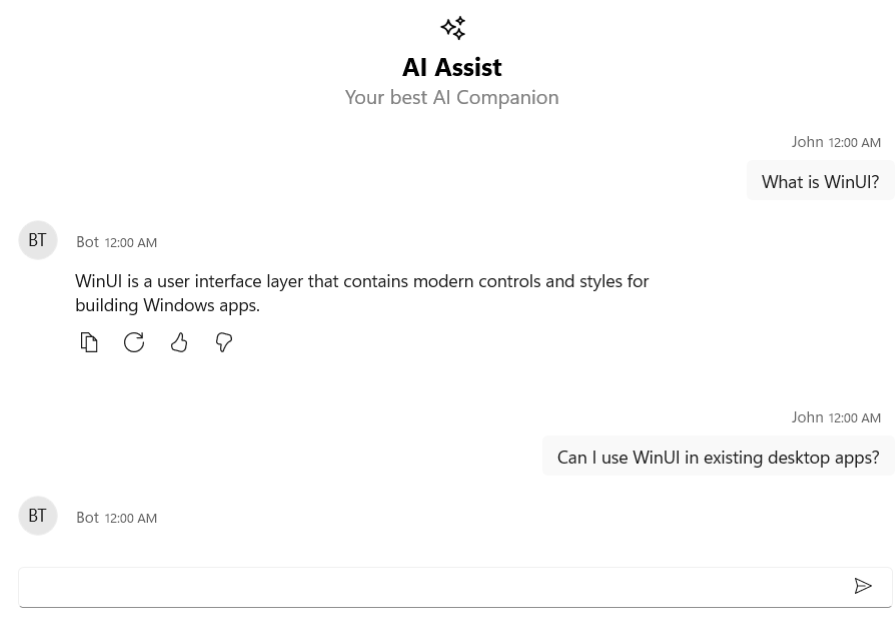
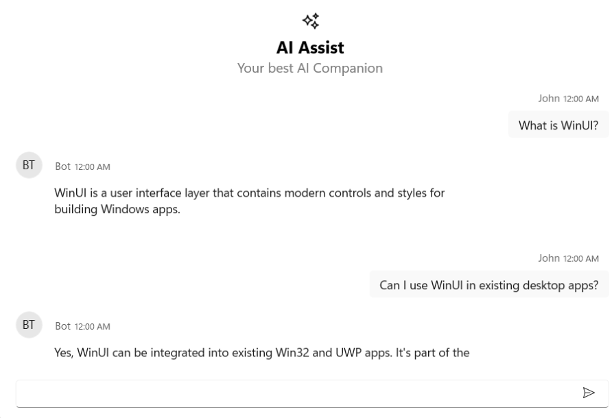
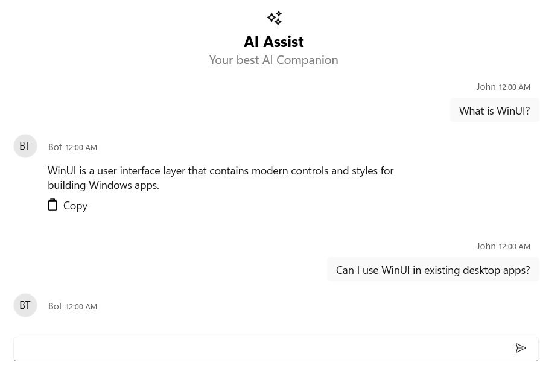

# Response Toolbar in WinUI AI AssistView 

The [SfAIAssistView](https://help.syncfusion.com/cr/winui/Syncfusion.UI.Xaml.Chat.SfAIAssistView.html) control includes a **Response Toolbar** feature that enables users to customize the response toolbar in chat interactions. By default, the toolbar offers built-in options such as Copy, Regenerate, Like, and Dislike. Additionally, you can add custom toolbar items as needed.

## ResponseToolbarItem

The **ResponseToolbarItem** class is used to define and add items in the response toolbar of chat responses for SfAIAssistView. The following properties are available in this class:

- **Index**: Specifies the internal order or position of the toolbar item
- **IsEnabled**: Specifies whether the toolbar item is enabled (interactive) or disabled (non-interactive).
- **Tooltip**: Sets the tooltip text displayed when the user hovers over the toolbar item.
- **Visible**: Indicates whether the toolbar item is visible.
- **ItemType**: Specifies the type of the toolbar item. This is used to distinguish between built-in and custom items.
- **ItemTemplate**: Allows you to set a custom template for rendering the toolbar item.




 <Grid x:Name="grid1">
    <syncfusion:SfAIAssistView x:Name="aiAssistView" CurrentUser="{Binding CurrentUser}"  
                               Messages="{Binding Chats}" >
    </syncfusion:SfAIAssistView>
</Grid>

 


## Response Toolbar Visibility

The **IsResponseToolbarVisible** property of the [SfAIAssistView](https://help.syncfusion.com/cr/winui/Syncfusion.UI.Xaml.Chat.SfAIAssistView.html) control determines whether the response toolbar is displayed below each chat message. When set to false, the response toolbar is hidden. By default, this property is set to true.




<Grid x:Name="grid1">
    <syncfusion:SfAIAssistView CurrentUser="{Binding CurrentUser}"  
                               Messages="{Binding Chats}" IsResponseToolbarVisible="False">
    </syncfusion:SfAIAssistView>
</Grid>

 



SfAIAssistView aiAssistView = new SfAIAssistView();
aiAssistView.IsResponseToolbarVisible = false;




## Customized Response Toolbar Item using item template

The **ResponseToolbarItem** in [SfAIAssistView](https://help.syncfusion.com/cr/winui/Syncfusion.UI.Xaml.Chat.SfAIAssistView.html) can be customized using the ItemTemplate property to define a custom appearance and behavior. This allows you to display icons, buttons, text, or even controls like Path, Image, or TextBlock.




 <Grid x:Name="grid1">
     <syncfusion:SfAIAssistView x:Name="aiAssistView" CurrentUser="{Binding CurrentUser}"  
                                Messages="{Binding Chats}" >
         <syncfusion:SfAIAssistView.ResponseToolbarItems>
             <syncfusion:ResponseToolbarItem ItemType="Custom" Tooltip="Copy">
                 <syncfusion:ResponseToolbarItem.ItemTemplate>
                     <DataTemplate>
                         <Button ToolTipService.ToolTip="Copy to clipboard"
                                 HorizontalAlignment="Left"
                                 Padding="5,2"
                                 Background="Transparent"
                                 BorderThickness="0">
                             <StackPanel Orientation="Horizontal" VerticalAlignment="Center">
                                 <Path Width="16" Height="16" Fill="Black"
                                       Stretch="Uniform"
                                       Data="M3,1 L10,1 C10.55,1 11,1.45 11,2 L11,3 L12,3 C12.55,3 13,3.45 13,4 L13,14 C13,14.55 12.55,15 12,15 L4,15 C3.45,15 3,14.55 3,14 L3,4 C3,3.45 3.45,3 4,3 L5,3 L5,2 C5,1.45 5.45,1 6,1 Z M5,3 L9,3 L9,2 L5,2 Z M4,5 L12,5 L12,14 L4,14 Z"/>
                                 <TextBlock Text="Copy" Margin="6,0,0,0" VerticalAlignment="Center"/>
                             </StackPanel>
                         </Button>
                     </DataTemplate>
                 </syncfusion:ResponseToolbarItem.ItemTemplate>
             </syncfusion:ResponseToolbarItem>
         </syncfusion:SfAIAssistView.ResponseToolbarItems>
     </syncfusion:SfAIAssistView>
 </Grid>

 


## Item Clicked Event 

The **ResponseToolbarItemClicked** event is triggered whenever a toolbar item (like a button) in the ResponseToolbarItems collection is clicked by the user.




<Grid x:Name="grid1">
    <syncfusion:SfAIAssistView x:Name="sfAIAssistView"
                           ResponseToolbarItemClicked="AiAssistView_ResponseToolbarItemClicked"/>
</Grid>

 



SfAIAssistView sfAIAssistView = new SfAIAssistView();
sfAIAssistView.ResponseToolbarItemClicked += AiAssistView_ResponseToolbarItemClicked;

private void AiAssistView_ResponseToolbarItemClicked(object sender, ResponseToolbarItemClickedEventArgs e)
{
    // Call the logic similar to HandleResponseToolbarItemClick
}



