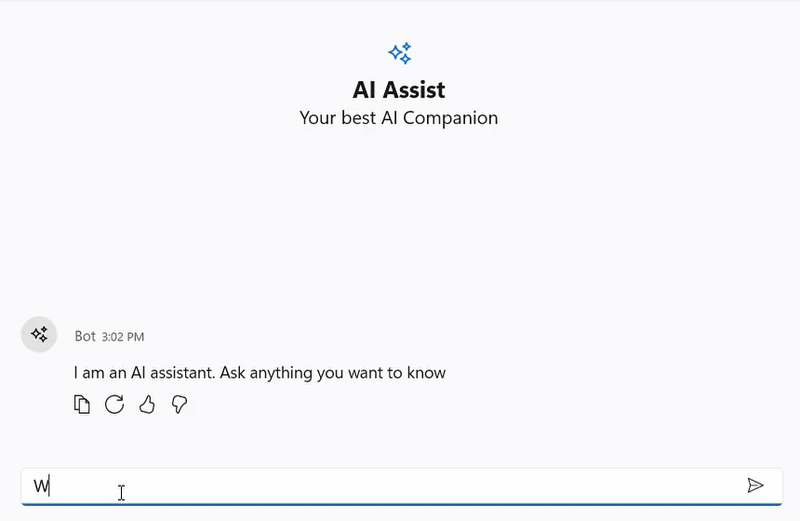
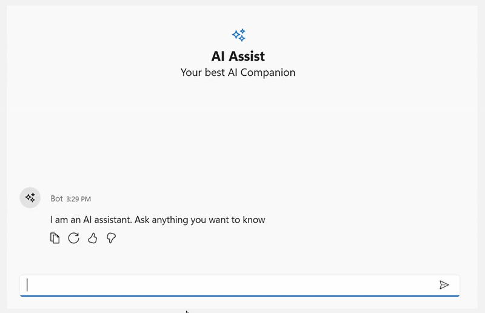

## Stop Responding

The **SfAIAssistView** control provides a **Stop Responding** feature that allows users to cancel an ongoing AI response by clicking the Stop Responding button. This feature ensures that users can interrupt the response if it is no longer needed. By default, the Stop Responding button is not displayed; to enable it, set the **EnableStopResponding** property to **true**.





<Page
    x:Class="GettingStarted.MainPage"
    xmlns="http://schemas.microsoft.com/winfx/2006/xaml/presentation"
    xmlns:x="http://schemas.microsoft.com/winfx/2006/xaml"
    xmlns:local="using:GettingStarted"
    xmlns:d="http://schemas.microsoft.com/expression/blend/2008"
    xmlns:mc="http://schemas.openxmlformats.org/markup-compatibility/2006"
    xmlns:syncfusion="using:Syncfusion.UI.Xaml.Chat"
    mc:Ignorable="d"
    Background="{ThemeResource ApplicationPageBackgroundThemeBrush}">
    <Grid>
      <syncfusion:SfAIAssistView  x:Name="sfAIAssistView"
                                  EnableStopResponding= "True"/>
    </Grid>
</Page>

 



SfAIAssistView aiAssistView = new SfAIAssistView();
aiAssistView.EnableStopResponding = true;




### Event and Command

The **SfAIAssistView** control includes a built-in event called **StopResponding** and a command named **StopRespondingCommand**. These are triggered when the Stop Responding button is clicked. To cancel the response using the StopRespondingCommand or StopResponding event, you can include logic to stop the ongoing response as shown below.

#### StopResponding Event





<Page
    x:Class="GettingStarted.MainPage"
    xmlns="http://schemas.microsoft.com/winfx/2006/xaml/presentation"
    xmlns:x="http://schemas.microsoft.com/winfx/2006/xaml"
    xmlns:local="using:GettingStarted"
    xmlns:d="http://schemas.microsoft.com/expression/blend/2008"
    xmlns:mc="http://schemas.openxmlformats.org/markup-compatibility/2006"
    xmlns:syncfusion="using:Syncfusion.UI.Xaml.Chat"
    mc:Ignorable="d"
    Background="{ThemeResource ApplicationPageBackgroundThemeBrush}">
    <Grid>
      <syncfusion:SfAIAssistView  x:Name="sfAIAssistView"
                                  StopResponding="sfAIAssistView_StopResponding"/>
    </Grid>
</Page>

 



SfAIAssistView aiAssistView = new SfAIAssistView();
aiAssistView.StopResponding += sfAIAssistView_StopResponding;

private void sfAIAssistView_StopResponding(object sender, EventArgs e)
{
    // Handle the Stop Responding action
}




#### StopResponding Command  





<Page
    x:Class="GettingStarted.MainPage"
    xmlns="http://schemas.microsoft.com/winfx/2006/xaml/presentation"
    xmlns:x="http://schemas.microsoft.com/winfx/2006/xaml"
    xmlns:local="using:GettingStarted"
    xmlns:d="http://schemas.microsoft.com/expression/blend/2008"
    xmlns:mc="http://schemas.openxmlformats.org/markup-compatibility/2006"
    xmlns:syncfusion="using:Syncfusion.UI.Xaml.Chat"
    mc:Ignorable="d"
    Background="{ThemeResource ApplicationPageBackgroundThemeBrush}">
    <Grid>
      <syncfusion:SfAIAssistView  x:Name="sfAIAssistView"
                                  StopRespondingCommand="{Binding StopRespondingCommand}"/>
    </Grid>
</Page>

 



public class ViewModel : INotifyPropertyChanged
{
    public ICommand StopRespondingCommand { get; set; }
  
    public ViewModel()
    {
        StopRespondingCommand = new RelayCommand(ExecuteStopResponding);
    }

    private void ExecuteStopResponding()
    {
        Chats.Add(new AIMessage
        {
           Author = new Author { Name = "Bot", ContentTemplate = AIIcon },
           DateTime = DateTime.Now,
           Solution = "You canceled the response",
        });
    }
}




#### StopRespondingTemplate

The **StopRespondingTemplate** property in SfAIAssistView is a data template that defines the UI for stopping AI responses. It allows customization of how the stop action is presented, enabling users to modify the appearance and behavior of the stop button.





<Page
    x:Class="GettingStarted.MainPage"
    xmlns="http://schemas.microsoft.com/winfx/2006/xaml/presentation"
    xmlns:x="http://schemas.microsoft.com/winfx/2006/xaml"
    xmlns:local="using:GettingStarted"
    xmlns:d="http://schemas.microsoft.com/expression/blend/2008"
    xmlns:mc="http://schemas.openxmlformats.org/markup-compatibility/2006"
    xmlns:syncfusion="using:Syncfusion.UI.Xaml.Chat"
    mc:Ignorable="d"
    Background="{ThemeResource ApplicationPageBackgroundThemeBrush}">
    <Grid>
       <Grid.Resources>
                  <DataTemplate x:Key="stopRespondingTemplate">
            <Grid Background="Transparent">
                <Button Content="Stop AI" Background="Red" Foreground="White" FontSize="14" CornerRadius="5" HorizontalAlignment="Center" 
                 VerticalAlignment="Center" Click="StopResponding" Command="{Binding ElementName=sfAIAssistView, Path=StopRespondingCommand}"/>
            </Grid>
        </DataTemplate>
       </Grid.Resources>
      <syncfusion:SfAIAssistView  x:Name="sfAIAssistView"
                                  EnableStopResponding= "True"
                                  StopRespondingTemplate="{StaticResource stopRespondingTemplate}">
      </syncfusion:SfAIAssistView>
    </Grid>
</Page>

 



SfAIAssistView aiAssistView = new SfAIAssistView();
aiAssistView.EnableStopResponding = true;
if(this.Resources.TryGetValue("stopRespondingTemplate", out var templateObj) && templateObj is DataTemplate template)
{
     aiAssistView.StopRespondingTemplate = template;
}




