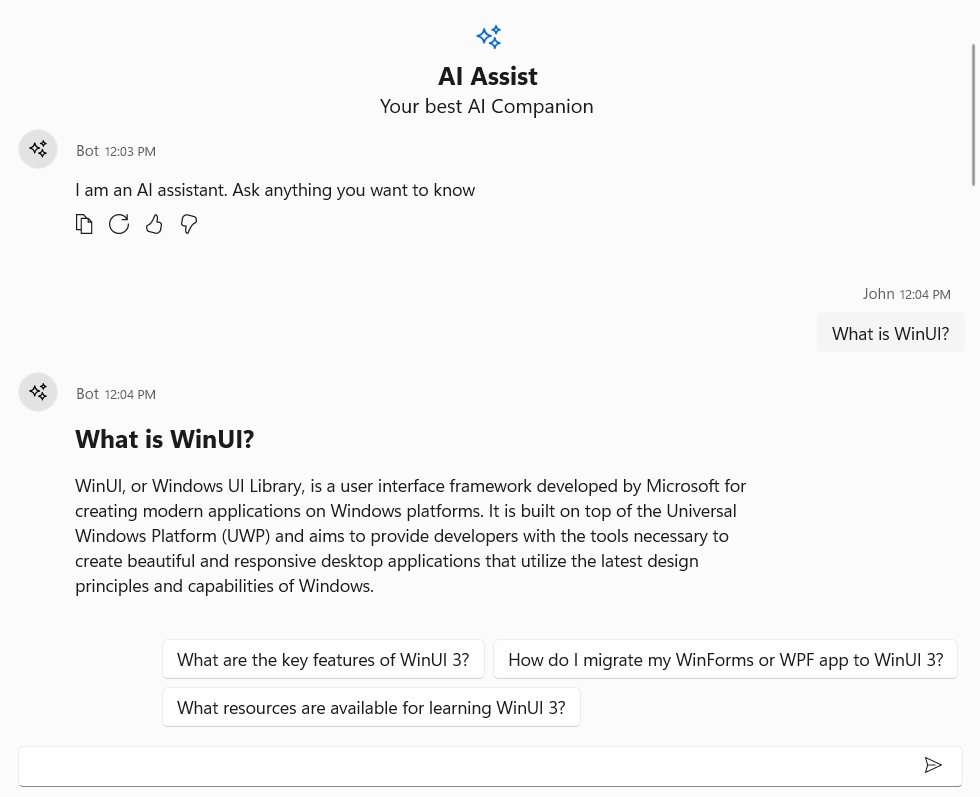

# Suggestions in WinUI AI AssistView

By using the [Suggestions](https://help.syncfusion.com/cr/winui/Syncfusion.UI.Xaml.Chat.SfAIAssistView.html#Syncfusion_UI_Xaml_Chat_SfAIAssistView_Suggestions) property, the AssistView displays AI-driven suggestions in the bottom right corner, making it easy for users to quickly respond or choose from relevant options.





<Page
    x:Class="GettingStarted.MainPage"
    xmlns="http://schemas.microsoft.com/winfx/2006/xaml/presentation"
    xmlns:x="http://schemas.microsoft.com/winfx/2006/xaml"
    xmlns:local="using:GettingStarted"
    xmlns:d="http://schemas.microsoft.com/expression/blend/2008"
    xmlns:mc="http://schemas.openxmlformats.org/markup-compatibility/2006"
    xmlns:syncfusion="using:Syncfusion.UI.Xaml.Core"
    mc:Ignorable="d"
    Background="{ThemeResource ApplicationPageBackgroundThemeBrush}">
    <Grid>
      <syncfusion:SfAIAssistView   CurrentUser="{Binding CurrentUser}"
                                   Suggestions="{Binding Suggestion}" 
                                   Messages="{Binding Chats}"/>
    </Grid>
</Page>

 



 public class ViewModel : INotifyPropertyChanged
 {
     private ObservableCollection<object> chats;
     private Author currentUser;
     private IEnumerable<string> suggestion;

     public ViewModel()
     {
         this.Chats = new ObservableCollection<object>();          
         this.CurrentUser = new Author { Name="John"};
         Suggestion = new ObservableCollection<string>();
         this.GenerateMessages();
     }

     private async void GenerateMessages()
     {
         this.Chats.Add( new TextMessage { Author = CurrentUser, Text = "What is WinUI?" } );        
         await Task.Delay(1000);
         this.Chats.Add( new TextMessage { Author = new Author { Name = "Bot" }, Text = "WinUI is a user interface layer that contains modern controls and styles for building Windows apps." });
         Suggestion = new ObservableCollection<string> {"What is the future of WinUI?", "What is XAML?", "What is the difference between WinUI 2 and WinUI 3?" };
     }

    
     public IEnumerable<string> Suggestion
     {
        get
        {
         return this.suggestion;
        }
        set
        {
         this.suggestion = value;
         RaisePropertyChanged("Suggestion");
        }
     }

     public ObservableCollection<object> Chats
     {
         get
         {
             return this.chats;
         }
         set
         {
             this.chats = value;
             RaisePropertyChanged("Messages");
         }
     }

     public Author CurrentUser
     {
         get
         {
             return this.currentUser;
         }
         set
         {
             this.currentUser = value;
             RaisePropertyChanged("CurrentUser");
         }
     }

     public void RaisePropertyChanged(string propName)
     {
         if (PropertyChanged != null)
         {
             PropertyChanged(this, new PropertyChangedEventArgs(propName));
         }
     }

     public event PropertyChangedEventHandler PropertyChanged;
  }




