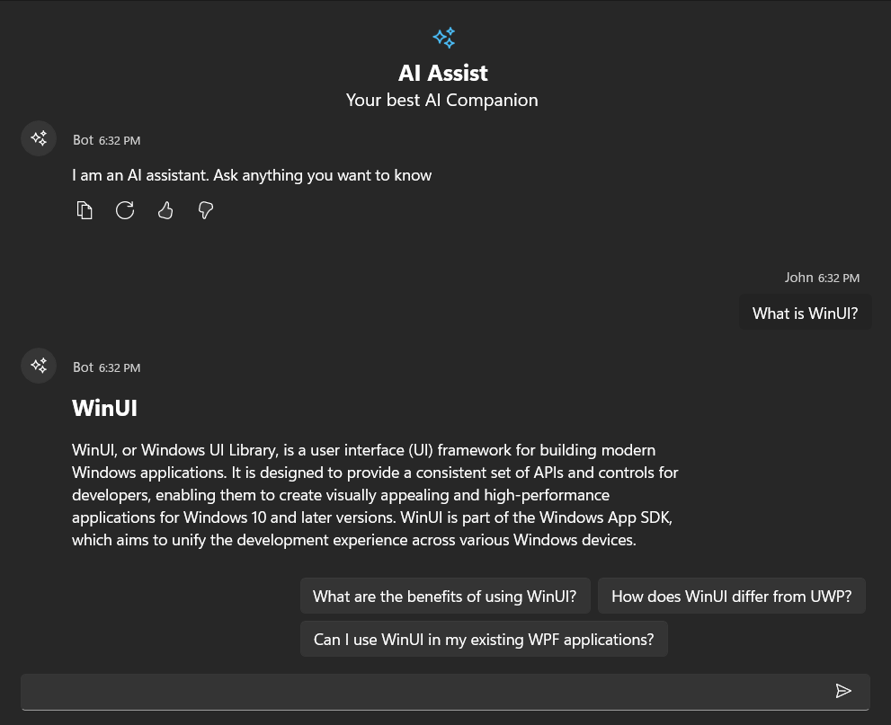

# Theme support in WinUI AI AssistView Control

This section explains AIAssistView Control's various themes.

## Set the Themes in AI AssistView Control

The AI AssistView Control provides various themes to be applied by setting the theme name in `RequestedTheme` property in the App.xaml file.

### Dark Theme




<Application
    x:Class="UI_Customization.App"
    xmlns="http://schemas.microsoft.com/winfx/2006/xaml/presentation"
    xmlns:x="http://schemas.microsoft.com/winfx/2006/xaml"
    xmlns:local="using:UI_Customization" RequestedTheme="Dark">
</Application>


 

### Light Theme




<Application
    x:Class="UI_Customization.App"
    xmlns="http://schemas.microsoft.com/winfx/2006/xaml/presentation"
    xmlns:x="http://schemas.microsoft.com/winfx/2006/xaml"
    xmlns:local="using:UI_Customization" RequestedTheme="Light">
</Application>


 

