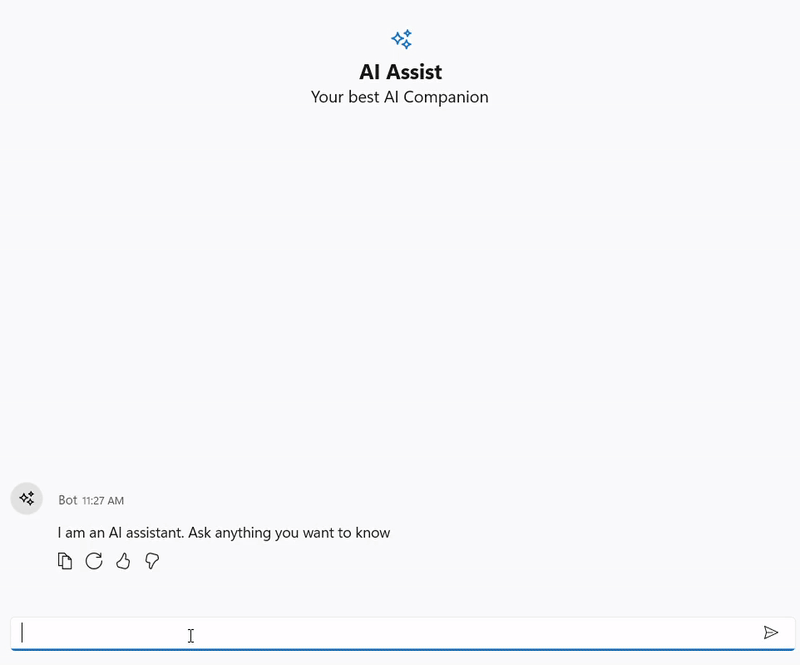

# OpenAI connection for AIAssistView

This section explains about how to connect the AIAssistView with OpenAI.

## Creating an application with WinUI AIAssistView

1. Create a [WinUI 3 desktop app for C# and .NET 6](https://docs.microsoft.com/en-us/windows/apps/winui/winui3/get-started-winui3-for-desktop).
2. Add reference to [Microsoft.Semantickernal](https://www.nuget.org/packages/Microsoft.SemanticKernel) NuGet. 

## Creating the OpenAI view model class.

To connect with OpenAI, we need the following details.
* OPENAI_KEY: A string variable where we should add our valid OpenAI API key.
* OPENAI_MODEL: A string variable representing the OpenAI language model we want to use.
* API_ENDPOINT: A string variable representing the URL endpoint of the OpenAI API.





<Page
    x:Class="GettingStarted.MainPage"
    xmlns="http://schemas.microsoft.com/winfx/2006/xaml/presentation"
    xmlns:x="http://schemas.microsoft.com/winfx/2006/xaml"
    xmlns:local="using:GettingStarted"
    xmlns:d="http://schemas.microsoft.com/expression/blend/2008"
    xmlns:mc="http://schemas.openxmlformats.org/markup-compatibility/2006"
    xmlns:syncfusion="using:Syncfusion.UI.Xaml.Core"
    mc:Ignorable="d"
    Background="{ThemeResource ApplicationPageBackgroundThemeBrush}">
    <Grid>
      <syncfusion:SfAIAssistView   CurrentUser="{Binding CurrentUser}"
                                   Suggestions="{Binding Suggestion}"
                                   ShowTypingIndicator="True"
                                   TypingIndicator="{Binding TypingIndicator}"
                                   Messages="{Binding Chats}"/>
    </Grid>
</Page>

 



 public class ViewModel : INotifyPropertyChanged
 {
     AIAssistChatService service;

     private ObservableCollection<object> chats;
     public ObservableCollection<object> Chats
     {
         get
         {
             return this.chats;
         }
         set
         {
             this.chats = value;
             RaisePropertyChanged("Messages");
         }
     }
     public DataTemplate AIIcon { get; set; }
     private ObservableCollection<string> suggestion;

     public void RaisePropertyChanged(string propName)
     {
         if (PropertyChanged != null)
         {
             PropertyChanged(this, new PropertyChangedEventArgs(propName));
         }
     }

     public event PropertyChangedEventHandler PropertyChanged;

     private Author currentUser;
     public Author CurrentUser
     {
         get
         {
             return this.currentUser;
         }
         set
         {
             this.currentUser = value;
             RaisePropertyChanged("CurrentUser");
         }
     }

     private bool showTypingIndicator;
     public bool ShowTypingIndicator
     {
         get
         {
             return this.showTypingIndicator;
         }
         set
         {
             this.showTypingIndicator = value;
             RaisePropertyChanged("ShowTypingIndicator");
         }
     }

     public ObservableCollection<string> Suggestion
     {
         get
         {
             return this.suggestion;
         }
         set
         {
             this.suggestion = value;
             RaisePropertyChanged("Suggestion");
         }
     }

     private TypingIndicator typingIndicator;
     public TypingIndicator TypingIndicator
     {
         get
         {
             return this.typingIndicator;
         }
         set
         {
             this.typingIndicator = value;
             RaisePropertyChanged("TypingIndicator");
         }
     }

     public ViewModel()
     {
         this.Chats = new ObservableCollection<object>();
         this.Chats.CollectionChanged += Chats_CollectionChanged;
         this.CurrentUser = new Author() { Name = "User" };
        this.TypingIndicator = new TypingIndicator() { Author = new Author { ContentTemplate = AIIcon } };
         service = new AIAssistChatService();
         service.Initialize();
         
     }

     private async void Chats_CollectionChanged(object sender, System.Collections.Specialized.NotifyCollectionChangedEventArgs e)
     {
         var item = e.NewItems?[0] as ITextMessage;
         if (item != null)
         {
             if (item.Author.Name == currentUser.Name)
             {
                 ShowTypingIndicator = true;
                 await service.NonStreamingChat(item.Text);
                 Chats.Add(new TextMessage
                 {
                     Author = new Author { Name = "Bot", ContentTemplate = AIIcon },
                     DateTime = DateTime.Now,
                     Text = service.Response
                 });
                 ShowTypingIndicator = false;
             }
         }
     }

     public class AIAssistChatService
     {
         IChatCompletionService gpt;
         Kernel kernel;
         private string OPENAI_KEY = "";// Add a valid OpenAI key here.

         private string OPENAI_MODEL = "gpt-4o-mini";
 
         private string API_ENDPOINT = "https://openai.azure.com";

         public string Response { get; set; }
         public async Task Initialize()
         {
              var builder = Kernel.CreateBuilder().AddAzureOpenAIChatCompletion(
    OPENAI_MODEL, API_ENDPOINT, OPENAI_KEY);       

             kernel = builder.Build();
             gpt = kernel.GetRequiredService<IChatCompletionService>();
         }
         public async Task NonStreamingChat(string line)
         {
             Response = string.Empty;
             var response = await gpt.GetChatMessageContentAsync(line);
             Response = response.ToString();
         }
     }
 }




