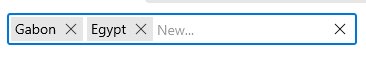
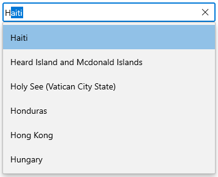
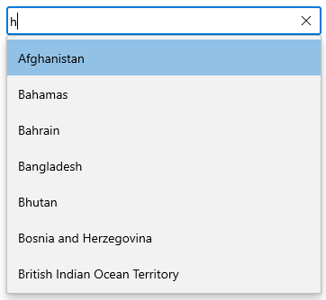
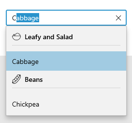

# Getting Started with WinUI AutoComplete (SfAutoComplete)

This section explains the steps required to add the [AutoComplete] control and binding data in `AutoComplete` control. This section covers only basic features needed to get started with Syncfusion `AutoComplete` control.

## Creating an application with WinUI AutoComplete

1. Create a [WinUI 3 desktop app for C# and .NET 5](https://docs.microsoft.com/en-us/windows/apps/winui/winui3/get-started-winui3-for-desktop).
2.  Download and refer the following NuGet package in the project.

    * [Syncfusion.Editors.WinUI](https://www.nuget.org/packages/Syncfusion.Editors.WinUI)

3. Import the control namespace `Syncfusion.UI.Xaml.Editors` in XAML or C# code.
4. Initialize the `SfAutoComplete` control.




<Window
    x:Class="GettingStarted.MainPage"
    xmlns="http://schemas.microsoft.com/winfx/2006/xaml/presentation"
    xmlns:x="http://schemas.microsoft.com/winfx/2006/xaml"
    xmlns:local="using:GettingStarted"
    xmlns:d="http://schemas.microsoft.com/expression/blend/2008"
    xmlns:mc="http://schemas.openxmlformats.org/markup-compatibility/2006"
    xmlns:editors="using:Syncfusion.UI.Xaml.Editors"
    mc:Ignorable="d"
    Background="{ThemeResource ApplicationPageBackgroundThemeBrush}">
    <Grid Name="grid">
        <!--Adding AutoComplete control -->
        <editors:SfAutoComplete Name="AutoComplete"/>
    </Grid>
</Window>





using Syncfusion.UI.Xaml.Editors;
namespace GettingStarted
{
    public sealed partial class MainWindow : Window
    {
        public MainPage()
        {
            this.InitializeComponent();
            // Creating an instance of the AutoComplete control
            SfAutoComplete autoComplete = new SfAutoComplete();

            grid.Children.Add(autoComplete);
        }
    }
}




## Populating items using data binding

The `AutoComplete` can be bound to an external data source using the [ItemsSource] property. Now, let us create Model and ViewModel classes to populate `AutoComplete` with Country details.

**Step 1:** Define a simple model class Country with fields ID, Name and Continent, and then populate country data in the ViewModel.




//Model.cs
 public class Country
    {
        public string Name { get; set; }

        public string Continent { get; set; }

        public int ID { get; set; }
    }

//ViewModel.cs
public class ViewModel : NotificationObject
{
    private ObservableCollection<Country> countries = new ObservableCollection<Country>();
     public ViewModel()
        {
            Countries = new ObservableCollection<Country>();
            Countries.Add(new Country() { Name = "Unítéd Stâteś", ID = 0, Continent = "America" });
            Countries.Add(new Country() { Name = "Afghanistan", ID = 1, Continent = "Asia" });
            Countries.Add(new Country() { Name = "Albania", ID = 2, Continent = "Europe" });
            Countries.Add(new Country() { Name = "Algeria", ID = 3, Continent = "Africa" });
            Countries.Add(new Country() { Name = "Andorra", ID = 4, Continent = "Europe" });
            Countries.Add(new Country() { Name = "Angola", ID = 5, Continent = "Africa" });
    }
}




**Step 2:** Populate data in `AutoComplete`. 

Now, populate this ViewModel data in `AutoComplete` control by binding to the `ItemSource` property. 




<Window
    x:Class="GettingStarted.MainPage"
    xmlns="http://schemas.microsoft.com/winfx/2006/xaml/presentation"
    xmlns:x="http://schemas.microsoft.com/winfx/2006/xaml"
    xmlns:local="using:GettingStarted"
    xmlns:d="http://schemas.microsoft.com/expression/blend/2008"
    xmlns:mc="http://schemas.openxmlformats.org/markup-compatibility/2006"
    xmlns:editors="using:Syncfusion.UI.Xaml.Editors"
    mc:Ignorable="d"
    Background="{ThemeResource ApplicationPageBackgroundThemeBrush}">
    <Grid Name="grid">
       <Grid.DataContext>
         <local:SocialMediaViewModel />
       </Grid.DataContext>

        <!--Setting ItemsSource-->
        <editors:SfAutoComplete x:Name="autocomplete" 
                            Width="250"
                            ItemsSource="{Binding Countries}" />
    </Grid>
</Window>





autocomplete.DataContext = new ViewModel();
ViewModel viewModel = (autocomplete.DataContext as ViewModel);
autocomplete.ItemsSource = viewModel.Countries;




N> Set the ViewModel instance as the DataContext of your control; this is done to bind properties of ViewModel to `AutoComplete`.

**Step 3:** Setting TextMemberPath and DisplayMemberPath.

The `AutoComplete` control is populated with the list of Coutries. But the Country model contains Three properties, ID, Name and Continent, so it is necessary to intimate by which property it should display value in the selection box portion of the `AutoComplete` control, when an item is selected.

[TextMemberPath] - This property path is used to get the value for displaying in the selection box portion of the `AutoComplete` control when an item is selected. The default value is `String.Empty`.

[DisplayMemberPath] - This property path is used to the name or path of the property displayed for each data item in the drop-down list. The default value is `String.Empty`.




autocomplete.DisplayMemberPath = "Name";
autocomplete.TextMemberPath = "Name";




## Selection

The [AutoComplete] allows user to select single or multiple items from the drop-down list by clicking Tab key or lost focus from the text box. The selection mode can be set by using the [SelectionMode] property. There are two different selection modes: `Single`, and `Multiple`.

### Single selection

The `AutoComplete` allows user to select a single item from the drop-down list or Enter the value in the editing text box.

### Multi selection

The `AutoComplete` allows user to select multiple values by enter multiple values. The multi-select `AutoComplete` mode can be enabled by setting the [SelectionMode] property as `Multiple`. We can use the tab 
key or lost focus for represent selected items.

## Filtering

The [AutoComplete] has built-in support to filter data items depending on the text entered in the editing text box. The filter operation starts as soon as you start typing characters in the component.

### Filter mode

The string comparison for filtering suggestions can be changed using the [TextSearchMode] property. The default filtering type is `StartsWith`, ignoring accent and it is case insensitive. The available filtering modes are, `StartsWith` and `Contains`. These Filter modes are, Explainded at Searching and Filtering section in detail. 

#### StartsWith

#### Contains

## Grouping

To display grouped data in `AutoComplete` control, set the [ItemsSource] property to a [CollectionViewSource] with the `IsSourceGrouped` property set to `true`. The `CollectionViewSource` acts as a proxy over the collection class to enable grouping support. We should use the Custom Filter for customize the grouping of `AutoComplete` control.

