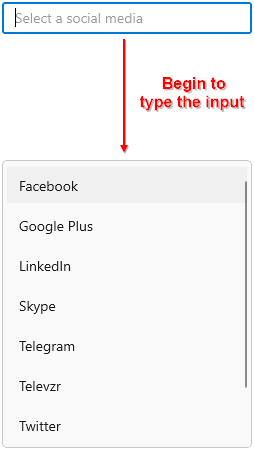
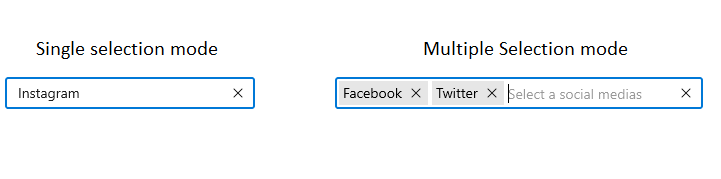

# Getting Started with WinUI AutoComplete (SfAutoComplete)

This section explains how to add the [AutoComplete](https://help.syncfusion.com/cr/winui/Syncfusion.UI.Xaml.Editors.SfAutoComplete.html) control and bind data to it. It covers only the basic features needed to get started with the Syncfusion&reg; `AutoComplete` control.

## Creating an application with WinUI AutoComplete

1. Create a [WinUI 3 desktop application using C# and .NET 8 or later](https://learn.microsoft.com/en-us/windows/apps/winui/winui3/create-your-first-winui3-app).
2. Install the following NuGet package in the project (latest stable version):

    * [Syncfusion.Editors.WinUI](https://www.nuget.org/packages/Syncfusion.Editors.WinUI)

3. Import the control namespace `Syncfusion.UI.Xaml.Editors` in XAML (via `xmlns:editors`) and in C# (via `using Syncfusion.UI.Xaml.Editors;`).
4. Initialize the `SfAutoComplete` control.





<Window
    x:Class="GettingStarted.MainWindow"
    xmlns="http://schemas.microsoft.com/winfx/2006/xaml/presentation"
    xmlns:x="http://schemas.microsoft.com/winfx/2006/xaml"
    xmlns:local="using:GettingStarted"
    xmlns:d="http://schemas.microsoft.com/expression/blend/2008"
    xmlns:mc="http://schemas.openxmlformats.org/markup-compatibility/2006"
    xmlns:editors="using:Syncfusion.UI.Xaml.Editors"
    mc:Ignorable="d">
    <Grid Name="grid">
        <!--Adding AutoComplete control -->
        <editors:SfAutoComplete Name="AutoComplete"/>
    </Grid>
</Window>





using Syncfusion.UI.Xaml.Editors;

namespace GettingStarted
{
    public sealed partial class MainWindow : Window
    {
        public MainWindow()
        {
            this.InitializeComponent();

            // Creating an instance of the AutoComplete control
            SfAutoComplete autoComplete = new SfAutoComplete();
            grid.Children.Add(autoComplete);
        }
    }
}




{{ codesnippet1 | OrderList_Indent_Level_1 }}

## Populating items using data binding

The `AutoComplete` can be bound to an external data source using the [ItemsSource](https://help.syncfusion.com/cr/winui/Syncfusion.UI.Xaml.Editors.DropDownListBase.html#Syncfusion_UI_Xaml_Editors_DropDownListBase_ItemsSource) property. The following steps create `Model` and `ViewModel` classes to populate `AutoComplete` with social media details.

**Step 1:** Create a simple model class `SocialMedia` with properties `ID` and `Name`, and then populate social media data in the `SocialMediaViewModel`.

Add the following `using` directives to the file:




using System.Collections.ObjectModel;

//Model.cs
public class SocialMedia
{
    public string Name { get; set; }
    public int ID { get; set; }
}

//ViewModel.cs
public class SocialMediaViewModel
{
    public ObservableCollection<SocialMedia> SocialMedias { get; set; }
    public SocialMediaViewModel()
    {
        this.SocialMedias = new ObservableCollection<SocialMedia>();
        this.SocialMedias.Add(new SocialMedia() { Name = "Facebook", ID = 0 });
        this.SocialMedias.Add(new SocialMedia() { Name = "Google Plus", ID = 1 });
        this.SocialMedias.Add(new SocialMedia() { Name = "Instagram", ID = 2 });
        this.SocialMedias.Add(new SocialMedia() { Name = "LinkedIn", ID = 3 });
        this.SocialMedias.Add(new SocialMedia() { Name = "Skype", ID = 4 });
        this.SocialMedias.Add(new SocialMedia() { Name = "Telegram", ID = 5 });
        this.SocialMedias.Add(new SocialMedia() { Name = "Televzr", ID = 6 });
        this.SocialMedias.Add(new SocialMedia() { Name = "Tik Tok", ID = 7 });
        this.SocialMedias.Add(new SocialMedia() { Name = "Tout", ID = 8 });
        this.SocialMedias.Add(new SocialMedia() { Name = "Tumblr", ID = 9 });
        this.SocialMedias.Add(new SocialMedia() { Name = "Twitter", ID = 10 });
        this.SocialMedias.Add(new SocialMedia() { Name = "Vimeo", ID = 11 });
        this.SocialMedias.Add(new SocialMedia() { Name = "WhatsApp", ID = 12 });
        this.SocialMedias.Add(new SocialMedia() { Name = "YouTube", ID = 13 });
    }
}




**Step 2:** Populate data in `AutoComplete`.

Now, populate the `SocialMediaViewModel` data in the `AutoComplete` control by binding to the `ItemsSource` property.




<Window
    x:Class="GettingStarted.MainWindow"
    xmlns="http://schemas.microsoft.com/winfx/2006/xaml/presentation"
    xmlns:x="http://schemas.microsoft.com/winfx/2006/xaml"
    xmlns:local="using:GettingStarted"
    xmlns:d="http://schemas.microsoft.com/expression/blend/2008"
    xmlns:mc="http://schemas.openxmlformats.org/markup-compatibility/2006"
    xmlns:editors="using:Syncfusion.UI.Xaml.Editors"
    mc:Ignorable="d">
    <Grid Name="grid">
       <Grid.DataContext>
            <local:SocialMediaViewModel />
       </Grid.DataContext>

        <!--Setting ItemsSource-->
        <editors:SfAutoComplete x:Name="autoComplete" 
                                Width="250"
                                ItemsSource="{Binding SocialMedias}" />
    </Grid>
</Window>





autoComplete.DataContext = new SocialMediaViewModel();
SocialMediaViewModel socialMediaViewModel = (autoComplete.DataContext as SocialMediaViewModel);
autoComplete.ItemsSource = socialMediaViewModel.SocialMedias;




N> Set the `SocialMediaViewModel` instance as the `DataContext` of the `AutoComplete` control so that the `SocialMedias` property can be resolved through the binding.

**Step 3:** Set the `TextMemberPath` and `DisplayMemberPath`.

The `AutoComplete` control is populated with the list of social media. However, because the `SocialMedia` model contains two properties, `Name` and `ID`, you must specify which property should be displayed in the selection box and the drop-down suggestion of the `AutoComplete` control.

[TextMemberPath](https://help.syncfusion.com/cr/winui/Syncfusion.UI.Xaml.Editors.DropDownListBase.html#Syncfusion_UI_Xaml_Editors_DropDownListBase_TextMemberPath) - This property path is used to get the value for displaying in the selection box portion of the `AutoComplete` control when an item is selected. The default value is `String.Empty`.

[DisplayMemberPath](https://help.syncfusion.com/cr/winui/Syncfusion.UI.Xaml.Editors.DropDownListBase.html#Syncfusion_UI_Xaml_Editors_DropDownListBase_DisplayMemberPath) - This property path is used to specify the name or path of the property displayed for each data item in the drop-down list. The default value is `String.Empty`.




<editors:SfAutoComplete x:Name="autoComplete" 
                        DisplayMemberPath = "Name"
                        TextMemberPath = "Name"
                        ItemsSource="{Binding SocialMedias}" />




autoComplete.DisplayMemberPath = "Name";
autoComplete.TextMemberPath = "Name";




## Selection

The `AutoComplete` allows the user to select a single item or multiple items from the drop-down list by pressing the `Enter` key or moving focus away from the text box. To change the selection mode between single and multi-selection, set the [SelectionMode](https://help.syncfusion.com/cr/winui/Syncfusion.UI.Xaml.Editors.SfAutoComplete.html#Syncfusion_UI_Xaml_Editors_SfAutoComplete_SelectionMode) property to [AutoCompleteSelectionMode](https://help.syncfusion.com/cr/winui/Syncfusion.UI.Xaml.Editors.AutoCompleteSelectionMode.html).`Single` or `Multiple`.




<editors:SfAutoComplete x:Name="autoComplete"
                        SelectionMode="Multiple"
                        DisplayMemberPath = "Name"
                        TextMemberPath = "Name"
                        ItemsSource="{Binding SocialMedias}" />




autoComplete.SelectionMode = AutoCompleteSelectionMode.Multiple;
autoComplete.DisplayMemberPath = "Name";
autoComplete.TextMemberPath = "Name";




## Filtering

The `AutoComplete` control allows you to filter the data items based on whether they start with the text entered in the text box or whether they contain that text. The string comparison for filtering suggestions can be changed using the [TextSearchMode](https://help.syncfusion.com/cr/winui/Syncfusion.UI.Xaml.Editors.SfAutoComplete.html#Syncfusion_UI_Xaml_Editors_SfAutoComplete_TextSearchMode) property. It also supports a custom filtering option. Supported modes include `StartsWith` and `Contains`.




<editors:SfAutoComplete x:Name="autoComplete"
                        TextSearchMode="Contains"
                        DisplayMemberPath = "Name"
                        TextMemberPath = "Name"
                        ItemsSource="{Binding SocialMedias}" />




autoComplete.TextSearchMode = AutoCompleteTextSearchMode.Contains;
autoComplete.DisplayMemberPath = "Name";
autoComplete.TextMemberPath = "Name";




**TextSearchMode="StartsWith"**

**TextSearchMode="Contains"**

