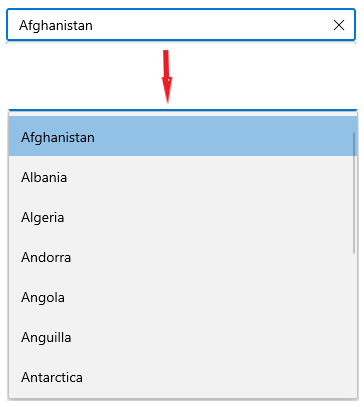

# Getting Started with WinUI AutoComplete (SfAutoComplete)

This section explains how to add the [AutoComplete](https://help.syncfusion.com/cr/winui/Syncfusion.UI.Xaml.Editors.SfAutoComplete.html) control and bind data to it. This section covers only the basic features needed to get started with the Syncfusion `AutoComplete` control.

## Creating an application with WinUI AutoComplete

1. Create a [WinUI 3 desktop app for C# and .NET 5](https://docs.microsoft.com/en-us/windows/apps/winui/winui3/get-started-winui3-for-desktop).
2. Download and refer to the following NuGet package in the project.

    * [Syncfusion.Editors.WinUI](https://www.nuget.org/packages/Syncfusion.Editors.WinUI)

3. Import the control namespace `Syncfusion.UI.Xaml.Editors` in XAML or C# code.
4. Initialize the `SfAutoComplete` control.




<Window
    x:Class="GettingStarted.MainWindow"
    xmlns="http://schemas.microsoft.com/winfx/2006/xaml/presentation"
    xmlns:x="http://schemas.microsoft.com/winfx/2006/xaml"
    xmlns:local="using:GettingStarted"
    xmlns:d="http://schemas.microsoft.com/expression/blend/2008"
    xmlns:mc="http://schemas.openxmlformats.org/markup-compatibility/2006"
    xmlns:editors="using:Syncfusion.UI.Xaml.Editors"
    mc:Ignorable="d">
    <Grid Name="grid">
        <!--Adding AutoComplete control -->
        <editors:SfAutoComplete Name="AutoComplete"/>
    </Grid>
</Window>





using Syncfusion.UI.Xaml.Editors;

namespace GettingStarted
{
    public sealed partial class MainWindow : Window
    {
        public MainPage()
        {
            this.InitializeComponent();

            // Creating an instance of the AutoComplete control
            SfAutoComplete autoComplete = new SfAutoComplete();
            grid.Children.Add(autoComplete);
        }
    }
}




## Populating items using data binding

The `AutoComplete` can be bound to an external data source using the [ItemsSource](https://help.syncfusion.com/cr/winui/Syncfusion.UI.Xaml.Editors.SfDropDownListBase.html#Syncfusion_UI_Xaml_Editors_SfDropDownListBase_ItemsSource) property. Now, let us create Model and ViewModel classes to populate items with social media details in `AutoComplete`.

**Step 1:** Define a simple model class 'SocialMedia' with fields 'ID' and 'Name', and then populate social media data in the 'SocialMediaViewModel'.




//Model.cs
public class SocialMedia
{
    public string Name { get; set; }
    public int ID { get; set; }
}

//ViewModel.cs
public class SocialMediaViewModel
{
    public ObservableCollection<SocialMedia> SocialMedias { get; set; }
    public SocialMediaViewModel()
    {
        this.SocialMedias = new ObservableCollection<SocialMedia>();
        this.SocialMedias.Add(new SocialMedia() { Name = "Facebook", ID = 0 });
        this.SocialMedias.Add(new SocialMedia() { Name = "Google Plus", ID = 1 });
        this.SocialMedias.Add(new SocialMedia() { Name = "Instagram", ID = 2 });
        this.SocialMedias.Add(new SocialMedia() { Name = "LinkedIn", ID = 3 });
        this.SocialMedias.Add(new SocialMedia() { Name = "Skype", ID = 4 });
        this.SocialMedias.Add(new SocialMedia() { Name = "Telegram", ID = 5 });
        this.SocialMedias.Add(new SocialMedia() { Name = "Televzr", ID = 6 });
        this.SocialMedias.Add(new SocialMedia() { Name = "Tik Tok", ID = 7 });
        this.SocialMedias.Add(new SocialMedia() { Name = "Tout", ID = 8 });
        this.SocialMedias.Add(new SocialMedia() { Name = "Tumblr", ID = 9 });
        this.SocialMedias.Add(new SocialMedia() { Name = "Twitter", ID = 10 });
        this.SocialMedias.Add(new SocialMedia() { Name = "Vimeo", ID = 11 });
        this.SocialMedias.Add(new SocialMedia() { Name = "WhatsApp", ID = 12 });
        this.SocialMedias.Add(new SocialMedia() { Name = "YouTube", ID = 13 });
    }
}




**Step 2:** Populate data in `AutoComplete`. 

Now, populate this 'SocialMediaViewModel' data in the `AutoComplete` control by binding to the `ItemsSource` property.




<Window
    x:Class="GettingStarted.Window"
    xmlns="http://schemas.microsoft.com/winfx/2006/xaml/presentation"
    xmlns:x="http://schemas.microsoft.com/winfx/2006/xaml"
    xmlns:local="using:GettingStarted"
    xmlns:d="http://schemas.microsoft.com/expression/blend/2008"
    xmlns:mc="http://schemas.openxmlformats.org/markup-compatibility/2006"
    xmlns:editors="using:Syncfusion.UI.Xaml.Editors"
    mc:Ignorable="d"
    Background="{ThemeResource ApplicationPageBackgroundThemeBrush}">
    <Grid Name="grid">
       <Grid.DataContext>
            <local:SocialMediaViewModel />
       </Grid.DataContext>

        <!--Setting ItemsSource-->
        <editors:SfAutoComplete x:Name="autoComplete" 
                                Width="250"
                                ItemsSource="{Binding SocialMedias}" />
    </Grid>
</Window>





autoComplete.DataContext = new SocialMediaViewModel();
SocialMediaViewModel socialMediaViewModel = (autoComplete.DataContext as SocialMediaViewModel);
autoComplete.ItemsSource = SocialMediaViewModel.SocialMedias;




N> Set the 'SocialMediaViewModel' instance as the `DataContext` of your control; this is done to bind properties of 'SocialMediaViewModel' to `AutoComplete`.

**Step 3:** Setting `TextMemberPath` and `DisplayMemberPath`.

The `AutoComplete` control is populated with the list of social media. However, because the 'SocialMedia' model contains two properties such as 'Name' and 'ID', it is necessary to intimate, which property should be a display value in the selection box portion and drop-down suggestion of the `AutoComplete` control.

[TextMemberPath](https://help.syncfusion.com/cr/winui/Syncfusion.UI.Xaml.Editors.SfDropDownListBase.html#Syncfusion_UI_Xaml_Editors_SfDropDownListBase_TextMemberPath) - This property path is used to get the value for displaying in the selection box portion of the `AutoComplete` control when an item is selected. The default value is `String.Empty`.

[DisplayMemberPath](https://help.syncfusion.com/cr/winui/Syncfusion.UI.Xaml.Editors.SfDropDownListBase.html#Syncfusion_UI_Xaml_Editors_SfDropDownListBase_DisplayMemberPath) - This property path is used to specify the name or path of the property displayed for each data item in the drop-down list. The default value is `String.Empty`.




<editors:SfAutoComplete x:Name="autoComplete" 
                        DisplayMemberPath = "Name"
                        TextMemberPath = "Name"
                        ItemsSource="{Binding SocialMedias}" />




autoComplete.DisplayMemberPath = "Name";
autoComplete.TextMemberPath = "Name";




## Selection

The `AutoComplete` allows the user to select single or multiple items from the drop-down list by clicking the `Enter` key or losing focus from the text box. To change the selection mode either single or multi-selection, set the [SelectionMode](https://help.syncfusion.com/cr/winui/Syncfusion.UI.Xaml.Editors.SfDropDownListBase.html#Syncfusion_UI_Xaml_Editors_SfDropDownListBase_SelectionMode) property as `Single` or `Multiple`.




<editors:SfAutoComplete x:Name="autoComplete"
                        SelectionMode="Multiple"
                        DisplayMemberPath = "Name"
                        TextMemberPath = "Name"
                        ItemsSource="{Binding SocialMedias}" />




autoComplete.SelectionMode= AutoCompleteSelectionMode.Multiple;
autoComplete.DisplayMemberPath = "Name";
autoComplete.TextMemberPath = "Name";




N> You can refer more information about selection support from [this](https://help.syncfusion.com/winui/autocomplete/selection) link.

## Filtering

The `AutoComplete` control allows you to filter the data items based on their starting letter or whether they contain a specific letter entered in the editing text box. The string comparison for filtering suggestions can be changed using the [TextSearchMode](https://help.syncfusion.com/cr/winui/Syncfusion.UI.Xaml.Editors.SfAutoComplete.html#Syncfusion_UI_Xaml_Editors_SfAutoComplete_SelectionMode) property. It also supports the custom filtering option.




<editors:SfAutoComplete x:Name="autoComplete"
                        TextSearchMode="Contains"
                        DisplayMemberPath = "Name"
                        TextMemberPath = "Name"
                        ItemsSource="{Binding SocialMedias}" />




autoComplete.TextSearchMode = AutoCompleteTextSearchMode.Contains;
autoComplete.DisplayMemberPath = "Name";
autoComplete.TextMemberPath = "Name";




### TextSearchMode="StartWith"

### TextSearchMode="Contains"

N> You can refer more information about filtering support from [this](https://help.syncfusion.com/winui/autocomplete/searching-filtering) link.