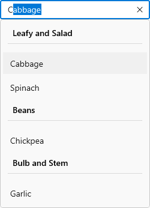

# Grouping in WinUI AutoComplete (SfAutoComplete)

This section explains about the grouping support available in [AutoComplete].

## Enable grouping

To display grouped data in `AutoComplete` control, set the [ItemsSource] property to a [CollectionViewSource] with the `IsSourceGrouped` property set to `true`. The `CollectionViewSource` acts as a proxy over the collection class to enable grouping support. We should use the Custom Filter for customize the grouping of `AutoComplete` control.

Also, the appearance of groups in a drop-down list can be defined by using the [GroupStyle] property. The default value of `GroupStyle` is `null`.

In the following example, define a `CollectionViewSource` that wraps a collection of vegetable objects and specifies a property to group on (the vegetable category). Then, bind the `View` property of `CollectionViewSource` to the `ItemsSource` property of `AutoComplete` control.




//Model.cs
public class Vegetable
{
    public string Name { get; set; }
    public string Category { get; set; }
}

//ViewModel.cs
public class VegetablesViewModel
{
    public object Vegetables { get; set; }

    public VegetablesViewModel()
    {
        var vegetables = new ObservableCollection<Vegetable>();
        vegetables.Add(new Vegetable {
            Name = "Cabbage",
            Category = "Leafy and Salad",
        });
        vegetables.Add(new Vegetable {
            Name = "Chickpea",
            Category = "Beans",
        });
        vegetables.Add(new Vegetable {
            Name = "Garlic",
            Category = "Bulb and Stem",
        });
        vegetables.Add(new Vegetable {
            Name = "Green bean",
            Category = "Beans",
        });
        vegetables.Add(new Vegetable {
            Name = "Horse gram",
            Category = "Beans",
        });
        vegetables.Add(new Vegetable {
            Name = "Nopal",
            Category = "Bulb and Stem",
        });
        vegetables.Add(new Vegetable {
            Name = "Onion",
            Category = "Bulb and Stem",
        });
        vegetables.Add(new Vegetable {
            Name = "Pumpkins",
            Category = "Leafy and Salad",
        });
        vegetables.Add(new Vegetable {
            Name = "Spinach",
            Category = "Leafy and Salad",
        });

        //Groups the elements based on value of Vegetable's Category.
        this.Vegetables = vegetables.GroupBy(item => item.Category);
    }
}







<editors:SfAutoComplete
                        PlaceholderText="Select a Vegetable"
                        ItemsSource="{Binding Vegetables}">
                        <editors:SfAutoComplete.FilteringBehavior>
                            <local:CustomGroupFilter/>
                        </editors:SfAutoComplete.FilteringBehavior>
                        <editors:SfAutoComplete.GroupStyle>
                            <GroupStyle>
                                <GroupStyle.HeaderTemplate>
                                    <DataTemplate>
                                        <Grid>
                                            <Grid.ColumnDefinitions>
                                                <ColumnDefinition Width="18"/>
                                                <ColumnDefinition Width="*"/>
                                                <ColumnDefinition/>
                                            </Grid.ColumnDefinitions>
                                            <Path 
                                                  HorizontalAlignment="Left"
                                                  Data="{Binding Key, Converter={StaticResource StringToPathConverter}}"
                                                  Fill="{Binding Foreground, RelativeSource={RelativeSource Mode=TemplatedParent}}"
                                                  Stretch="Uniform" />

                                            <TextBlock
                                                Grid.Column="1"
                                                Margin="8,0,0,0"
                                                FontWeight="SemiBold"
                                                FontSize="14"
                                                FontFamily="{ThemeResource ContentControlThemeFontFamily}"
                                                VerticalAlignment="Center"
                                                Text="{Binding Key}" />
                                        </Grid>
                                    </DataTemplate>
                                </GroupStyle.HeaderTemplate>
                            </GroupStyle>
                        </editors:SfAutoComplete.GroupStyle>

                    </editors:SfAutoComplete>




public class CustomGroupFilter : AutoCompleteFilteringBehavior
    {
        private int charLength;

        public CustomGroupFilter()
        {

        }

        public override int FindHighlightedIndex(string searchText, List<object> filteredItems)
        {
            return 0;
        }

        public override object FindMatchingItems(string searchText)
        {
            List<Vegetable> list = new List<Vegetable>();
            IEnumerable itemsSource = this.AutoComplete?.ItemsSource as IEnumerable;
            if (int.TryParse(searchText, out this.charLength))
            {
                list.AddRange(from item in itemsSource.Cast<Vegetable>()
                              where item.Name.Length == this.charLength
                              select item);
            }

            var collectionViewSource = new CollectionViewSource();
            collectionViewSource.Source = list.GroupBy(item => item.Category);
            collectionViewSource.IsSourceGrouped = true;

            return collectionViewSource.View;
        }
    }




