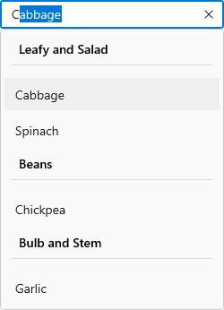

# Grouping in WinUI AutoComplete (SfAutoComplete)

This section explains the grouping support available in the [SfAutoComplete](https://help.syncfusion.com/cr/winui/Syncfusion.UI.Xaml.Editors.SfAutoComplete.html) control.

## Enable grouping

To display grouped data in the `SfAutoComplete` control, bind the [ItemsSource](https://help.syncfusion.com/cr/winui/Syncfusion.UI.Xaml.Editors.DropDownListBase.html?tabs=tabid-1#Syncfusion_UI_Xaml_Editors_DropDownListBase_ItemsSource) property to the [CollectionViewSource](https://learn.microsoft.com/en-us/uwp/api/windows.ui.xaml.data.collectionviewsource?view=winrt-28000) `View`, with the `IsSourceGrouped` property set to `true`. The `CollectionViewSource` acts as a proxy over the collection to enable grouping support. To customize how groups are matched while the user types, use a custom filter behavior.

You can define the appearance of groups in the drop-down list by using the [GroupStyle](https://help.syncfusion.com/cr/winui/Syncfusion.UI.Xaml.Editors.DropDownListBase.html#Syncfusion_UI_Xaml_Editors_DropDownListBase_GroupStyle) property. `GroupStyle` is the WinUI `Microsoft.UI.Xaml.Controls.GroupStyle`, and its default value is `null`.

The following example defines a `CollectionViewSource` that groups a collection of `Vegetable` objects by the `Category` property, and binds its `View` to the `ItemsSource` of `SfAutoComplete`.




//Model.cs
public class Vegetable
{
    public string Name { get; set; }
    public string Category { get; set; }
}

//ViewModel.cs
public class VegetablesViewModel
{
    // Exposed as object because GroupBy returns IEnumerable<IGrouping<string, Vegetable>>.
    public object Vegetables { get; set; }

    public VegetablesViewModel()
    {
        var vegetables = new ObservableCollection<Vegetable>();
        vegetables.Add(new Vegetable { Name = "Cabbage",     Category = "Leafy and Salad" });
        vegetables.Add(new Vegetable { Name = "Chickpea",    Category = "Beans" });
        vegetables.Add(new Vegetable { Name = "Garlic",      Category = "Bulb and Stem" });
        vegetables.Add(new Vegetable { Name = "Green bean",  Category = "Beans" });
        vegetables.Add(new Vegetable { Name = "Horse gram",  Category = "Beans" });
        vegetables.Add(new Vegetable { Name = "Nopal",       Category = "Bulb and Stem" });
        vegetables.Add(new Vegetable { Name = "Onion",       Category = "Bulb and Stem" });
        vegetables.Add(new Vegetable { Name = "Pumpkins",    Category = "Leafy and Salad" });
        vegetables.Add(new Vegetable { Name = "Spinach",     Category = "Leafy and Salad" });

        // Group elements by the value of Vegetable.Category.
        this.Vegetables = vegetables.GroupBy(item => item.Category);
    }
}







public class CustomGroupFilter : IAutoCompleteFilterBehavior
{
    public async Task<object> GetMatchingItemsAsync(SfAutoComplete source, AutoCompleteFilterInfo filterInfo)
    {
        List<Vegetable> list = new List<Vegetable>();
        IEnumerable itemsSource = source.ItemsSource as IEnumerable;

        list.AddRange(from item in itemsSource.Cast<Vegetable>()
                      let filteritem = this.GetStringFromMemberPath(item, "Name")
                      where filteritem.Contains(filterInfo.Text, StringComparison.CurrentCultureIgnoreCase)
                      select item);

        var collectionViewSource = new CollectionViewSource();
        collectionViewSource.Source = list.GroupBy(item => item.Category);
        collectionViewSource.IsSourceGrouped = true;

        return collectionViewSource.View;
    }

    private string GetStringFromMemberPath(object item, string path)
    {
        string value = item.ToString();
        if (!string.IsNullOrEmpty(path))
        {
            value = item.GetType()?.GetRuntimeProperty(path)?.GetValue(item).ToString();
        }

        return value;
    }
}







<editors:SfAutoComplete
    PlaceholderText="Select a Vegetable"
    ItemsSource="{Binding Vegetables}">
    <editors:SfAutoComplete.FilteringBehavior>
        <local:CustomGroupFilter/>
    </editors:SfAutoComplete.FilteringBehavior>
    <editors:SfAutoComplete.GroupStyle>
        <GroupStyle>
            <GroupStyle.HeaderTemplate>
                <DataTemplate>
                    <Grid>
                        <TextBlock
                            Grid.Column="1"
                            Margin="8,0,0,0"
                            FontWeight="SemiBold"
                            FontSize="14"
                            FontFamily="{ThemeResource ContentControlThemeFontFamily}"
                            VerticalAlignment="Center"
                            Text="{Binding Key}" />
                    </Grid>
                </DataTemplate>
            </GroupStyle.HeaderTemplate>
        </GroupStyle>
    </editors:SfAutoComplete.GroupStyle>
    
</editors:SfAutoComplete>




In the page's code-behind, set the `DataContext` so the binding resolves:




this.DataContext = new VegetablesViewModel();




**Outcome:** The drop-down groups vegetables by `Category` (e.g., *Beans*, *Bulb and Stem*, *Leafy and Salad*) and the group headers render with the semi-bold style defined in `GroupStyle.HeaderTemplate`.

