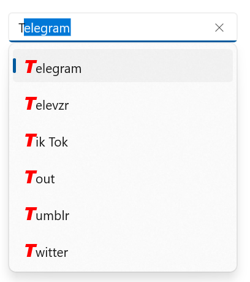
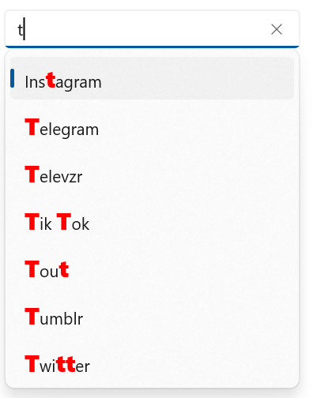
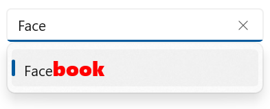

# Highlighting in WinUI AutoComplete(SfAutoComplete)

## Highlighting text in WinUI SfAutoComplete

Highlight matching characters in a suggestion list to pick an item with more clarity. There are two ways to highlight the matching text:

* **Beginning Text**
* **Containing Text**

The text highlight can be indicated with various customizing styles by enabling the below properties. They are

* **HighlightedTextColor** - sets the color of the highlighted text for differentiating the highlighted characters.

* **HighlightedTextFontStyle** - sets the FontStyle of the highlighted text.
        
* **HighlightedTextFontWeight** - sets the FontWeight of the highlighted text.

* **HightlightedTextFontSize** - sets the Fontsize of the highlighted text.

### **Beginning Text**
It highlights the first position of the matching characters in the suggestion list.




<editors:SfAutoComplete                             x:Name="autoComplete"                                
                                Width="250"
                                DisplayMemberPath="Name"
                                TextMemberPath="Name"
                                TextHighlightMode="Matched"
                                TextSearchMode="StartsWith"
                                HighlightedTextFontSize="20"
                                HighlightedTextFontStyle="Italic"
                                HighlightedTextFontWeight="ExtraBold"
                                HighlightedTextForeground="Red"                                
                                ItemsSource="{Binding SocialMedias}">
        </editors:SfAutoComplete>




autoComplete.DisplayMemberPath = "Name";
autoComplete.TextMemberPath = "Name";
autoComplete.TextHighlightMode = AutoCompleteTextHighlightMode.Matched;
autoComplete.TextSearchMode = AutoCompleteTextSearchMode.StartsWith;
autoComplete.HighlightedTextFontSize = 10;
autoComplete.HighlightedTextFontStyle = FontStyle.Normal;
autoComplete.HighlightedTextFontWeight = FontWeights.ExtraLight;
autoComplete.HighlightedTextForeground = Color.Red;




### **Containing Text**
It highlights the matching character that are present everywhere in the suggestion list for Contains case in SuggestionMode.




<editors:SfAutoComplete                             x:Name="autoComplete"                                
                                Width="250"
                                DisplayMemberPath="Name"
                                TextMemberPath="Name"
                                TextHighlightMode="Matched"
                                TextSearchMode="Contains"
                                HighlightedTextFontSize="20"
                                HighlightedTextFontStyle="Italic"
                                HighlightedTextFontWeight="ExtraBold"
                                HighlightedTextForeground="Red"                                
                                ItemsSource="{Binding SocialMedias}">
        </editors:SfAutoComplete>




autoComplete.DisplayMemberPath = "Name";
autoComplete.TextMemberPath = "Name";
autoComplete.TextHighlightMode = AutoCompleteTextHighlightMode.Matched;
autoComplete.TextSearchMode = AutoCompleteTextSearchMode.Contains;
autoComplete.HighlightedTextFontSize = 10;
autoComplete.HighlightedTextFontStyle = FontStyle.Normal;
autoComplete.HighlightedTextFontWeight = FontWeights.ExtraLight;
autoComplete.HighlightedTextForeground = Color.Red;




## **TextHighlightMode** 
 The SfAutoComplete provides the following modes.

* **Matched** - This mode highlights the text that matches the user input.
* **Unmatched** - This mode highlights the text that doesnot matches the user input.




<editors:SfAutoComplete                             x:Name="autoComplete"                                
                                Width="250"
                                DisplayMemberPath="Name"
                                TextMemberPath="Name"
                                TextHighlightMode="Unmatched"
                                TextSearchMode="Contains"
                                HighlightedTextFontSize="20"
                                HighlightedTextFontStyle="Italic"
                                HighlightedTextFontWeight="ExtraBold"
                                HighlightedTextForeground="Red"                                
                                ItemsSource="{Binding SocialMedias}">
        </editors:SfAutoComplete>




autoComplete.DisplayMemberPath = "Name";
autoComplete.TextMemberPath = "Name";
autoComplete.TextHighlightMode = AutoCompleteTextHighlightMode.Unmatched;
autoComplete.TextSearchMode = AutoCompleteTextSearchMode.Contains;
autoComplete.HighlightedTextFontSize = 10;
autoComplete.HighlightedTextFontStyle = FontStyle.Normal;
autoComplete.HighlightedTextFontWeight = FontWeights.ExtraLight;
autoComplete.HighlightedTextForeground = Color.Red;




* **None** - This mode doesnot highlight any text.

