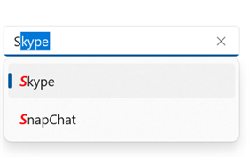
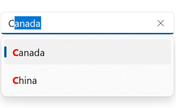
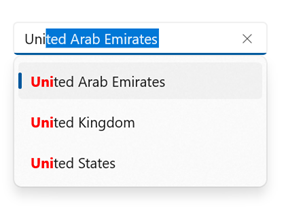
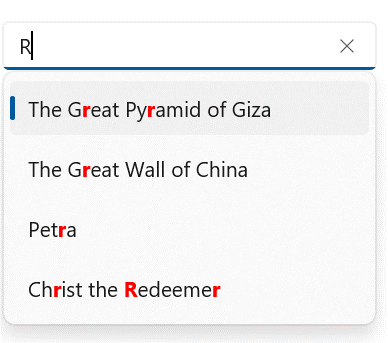
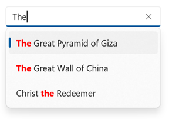
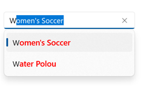
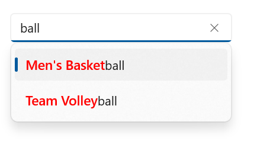

# Highlighting in WinUI AutoComplete (SfAutoComplete)

Highlight matching characters in the suggestion list to pick an item with more clarity. The following options are available to highlight the matching text:

* **Highlight beginning text**
* **Highlight all occurrence of search text**

> **Requirements**: WinUI 3, Syncfusion WinUI Editors package.

The text highlight can be indicated with various customizing styles by enabling the following properties. They are:

* **HighlightedTextColor** - Sets the color of the highlighted text for differentiating the highlighted characters.
* **HighlightedTextFontStyle** - Sets the font style of the highlighted text.
* **HighlightedTextFontWeight** - Sets the font weight of the highlighted text.
* **HighlightedTextFontSize** - Sets the font size of the highlighted text.
* **HighlightedTextBackground** - Sets the background color of the highlighted text.



    <editors:SfAutoComplete x:Name="autoComplete"
                            DisplayMemberPath="Name"                       
                            TextHighlightMode="Matched"                                
                            TextSearchMode="StartsWith"                               
                            HighlightedTextFontSize="15"                               
                            HighlightedTextFontStyle="Italic"                               
                            HighlightedTextFontWeight="Medium"                                
                            HighlightedTextForeground="Red"                                
                            ItemsSource="{Binding SocialMedias}">       
    </editors:SfAutoComplete>



using Syncfusion.UI.Xaml.Editors;

autoComplete.DisplayMemberPath = "Name";
autoComplete.TextMemberPath = "Name";
autoComplete.TextHighlightMode = AutoCompleteTextHighlightMode.Unmatched;
autoComplete.TextSearchMode = AutoCompleteTextSearchMode.Contains;
autoComplete.HighlightedTextFontSize = 10;
autoComplete.HighlightedTextFontStyle = FontStyle.Normal;
autoComplete.HighlightedTextFontWeight = FontWeights.ExtraLight;
autoComplete.HighlightedTextForeground = Color.Red;




## Highlighting search text mode

The SfAutoComplete provides the following `TextHighlightMode` values. The default value is **None**.

* **None** - This mode does not highlight any text.
* **Matched** - This mode highlights the text that matches the user input.
* **Unmatched** - This mode highlights the text that does not match the user input.

### Highlight beginning text

It highlights the matches that start with the typed characters in the suggestion list. Use `TextSearchMode="StartsWith"` with `TextHighlightMode="Matched"`.



<editors:SfAutoComplete x:Name="autoComplete"
                        DisplayMemberPath="Name"
                        TextHighlightMode="Matched"
                        TextSearchMode="StartsWith"
                        HighlightedTextForeground="Red"
                        ItemsSource="{Binding Countries}">
</editors:SfAutoComplete>


autoComplete.DisplayMemberPath = "Name";
autoComplete.TextHighlightMode = AutoCompleteTextHighlightMode.Matched;
autoComplete.TextSearchMode = AutoCompleteTextSearchMode.StartsWith;
autoComplete.HighlightedTextForeground = new SolidColorBrush(Colors.Red);



*Searching with one character*

*Searching with more than one character*

### Highlight all occurrence of search text

It highlights all the matches that contain the typed characters in the suggestion list. Use `TextSearchMode="Contains"` with `TextHighlightMode="Matched"`.



<editors:SfAutoComplete x:Name="autoComplete"
                        DisplayMemberPath="Name"
                        TextHighlightMode="Matched"
                        TextSearchMode="Contains"
                        HighlightedTextForeground="Red"
                        ItemsSource="{Binding Wonders}">
</editors:SfAutoComplete>


autoComplete.DisplayMemberPath = "Name";
autoComplete.TextHighlightMode = AutoCompleteTextHighlightMode.Matched;
autoComplete.TextSearchMode = AutoCompleteTextSearchMode.Contains;
autoComplete.HighlightedTextForeground = new SolidColorBrush(Colors.Red);



*Searching with one character*

*Searching with more than one character*

### TextSearchMode="StartsWith" with Unmatched highlighting



<editors:SfAutoComplete x:Name="autoComplete"
                        DisplayMemberPath="Name"
                        TextHighlightMode="Unmatched"
                        TextSearchMode="StartsWith"
                        HighlightedTextForeground="Red"
                        ItemsSource="{Binding OlympicGames}">
</editors:SfAutoComplete>


autoComplete.DisplayMemberPath = "Name";
autoComplete.TextHighlightMode = AutoCompleteTextHighlightMode.Unmatched;
autoComplete.TextSearchMode = AutoCompleteTextSearchMode.StartsWith;
autoComplete.HighlightedTextForeground = new SolidColorBrush(Colors.Red);



### TextSearchMode="Contains" with Unmatched highlighting



<editors:SfAutoComplete x:Name="autoComplete"
                        DisplayMemberPath="Name"
                        TextHighlightMode="Unmatched"
                        TextSearchMode="Contains"
                        HighlightedTextForeground="Red"
                        ItemsSource="{Binding OlympicGames}">
</editors:SfAutoComplete>


autoComplete.DisplayMemberPath = "Name";
autoComplete.TextHighlightMode = AutoCompleteTextHighlightMode.Unmatched;
autoComplete.TextSearchMode = AutoCompleteTextSearchMode.Contains;
autoComplete.HighlightedTextForeground = new SolidColorBrush(Colors.Red);



