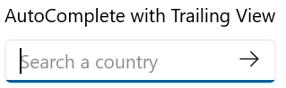

# Leading  and Trailing View in WinUI AutoComplete (SfAutoComplete)

This section explains about the Leading and Trailing view support available in [AutoComplete](https://help.syncfusion.com/cr/winui/Syncfusion.UI.Xaml.Editors.SfAutoComplete.html).The `Leadingview` appears before the `AutoComplete` selection area and `Trailingview` appears after the `AutoComplete` selection area. Any content, such as an icon, image, button, or other control, can be displayed in the `Leadingview` and `Trailingview`.

## Leading View 

The below code shows how to include the `Leadingview` in `AutoComplete`.




 <editors:SfAutoComplete Header="AutoComplete with Leading View"
                         PlaceholderText="Search a country">
         <editors:SfAutoComplete.LeadingView>
                <Viewbox Height="16"
                         Width="16"
                         Margin="4,0,0,0">
                    <SymbolIcon Symbol="Find" />
                </Viewbox>
         </editors:SfAutoComplete.LeadingView>
 </editors:SfAutoComplete>




## Trailing View 

The below code shows how to include the `Trailingview` in `AutoComplete`.




<editors:SfAutoComplete Header="AutoComplete with Trailing View"
                        PlaceholderText="Search a country">
        <editors:SfAutoComplete.TrailingView>
                <Button>
                    <Viewbox Height="16"
                             Width="16">
                        <FontIcon Glyph="&#xEBE7;" />
                    </Viewbox>
                </Button>
        </editors:SfAutoComplete.TrailingView>
</editors:SfAutoComplete>




## Both Leading and Trailing View 

The below code shows how to include both the `Leadingview` and `Trailingview` in `AutoComplete`.




<editors:SfAutoComplete Header="AutoComplete with Leading and Trailing View"
                        PlaceholderText="Search a country">
        <editors:SfAutoComplete.LeadingView>
                    <editors:SfComboBox Margin="0,4,0,4">
                            <editors:SfComboBoxItem Content="Asia" />
                            <editors:SfComboBoxItem Content="Africa" />
                            <editors:SfComboBoxItem Content="North America"/>
                            <editors:SfComboBoxItem Content="South America" />
                            <editors:SfComboBoxItem Content="Europe" />
                            <editors:SfComboBoxItem Content="All Countries"
                                                    IsSelected="True"/>
                    </editors:SfComboBox>
        </editors:SfAutoComplete.LeadingView>
        <editors:SfAutoComplete.TrailingView>
                    <Viewbox Height="16"
                             Width="16"
                             Margin="0,0,8,0">
                        <SymbolIcon Symbol="Find" />
                    </Viewbox>
        </editors:SfAutoComplete.TrailingView>
</editors:SfAutoComplete>




