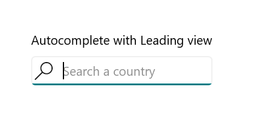
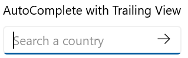

# Leading and Trailing View in WinUI AutoComplete (SfAutoComplete)

This section explains the leading and trailing view support available in [SfAutoComplete](https://help.syncfusion.com/cr/winui/Syncfusion.UI.Xaml.Editors.SfAutoComplete.html). The `LeadingView` appears before the `AutoComplete` selection area, and `TrailingView` appears after the `AutoComplete` selection area. Any content, such as an icon, image, button, or control, can be displayed in the `LeadingView` and `TrailingView`.

> **Requirements**: WinUI 3, Syncfusion WinUI Editors package.

Both `LeadingView` and `TrailingView` are of type `object` and accept any `UIElement` as content. For best alignment of icons, wrap them in a `View box` and set an explicit `Height` and `Width`.

## Leading view

The following code shows how to include the `LeadingView` in the AutoComplete control.




 <editors:SfAutoComplete Header="AutoComplete with Leading View"
                         PlaceholderText="Search a country">
         <editors:SfAutoComplete.LeadingView>
                <Viewbox Height="16"
                         Width="16"
                         Margin="4,0,0,0">
                    <SymbolIcon Symbol="Find" />
                </Viewbox>
         </editors:SfAutoComplete.LeadingView>
 </editors:SfAutoComplete>




## Trailing view

The following code shows how to include the `TrailingView` in the AutoComplete control. The `AlternateCloseButtonStyle` gives the button a chromeless appearance, and `AllowFocusOnInteraction="False"` prevents focus from leaving the AutoComplete when the button is pressed.




<editors:SfAutoComplete Header="AutoComplete with Trailing View"
                        PlaceholderText="Search a country">
        <editors:SfAutoComplete.TrailingView>
              <Button Style="{ThemeResource AlternateCloseButtonStyle}"
                      Height="30"
                      AllowFocusOnInteraction="False">
                    <Viewbox Height="16"
                             Width="16">
                        <FontIcon Glyph="&#xEBE7;" />
                    </Viewbox>
              </Button>
        </editors:SfAutoComplete.TrailingView>
</editors:SfAutoComplete>



## Leading and trailing view

Use both properties together when you need content on both sides of the selection area. The following code shows how to include both `LeadingView` and `TrailingView` in the AutoComplete control.




<editors:SfAutoComplete Header="AutoComplete with Leading and Trailing View"
                        PlaceholderText="Search a country">
    <editors:SfAutoComplete.LeadingView>
        <editors:SfComboBox Margin="0,4,0,4">
            <editors:SfComboBoxItem Content="Asia" />
            <editors:SfComboBoxItem Content="Africa" />
            <editors:SfComboBoxItem Content="North America" />
            <editors:SfComboBoxItem Content="South America" />
            <editors:SfComboBoxItem Content="Europe" />
            <editors:SfComboBoxItem Content="All Countries"
                                    IsSelected="True" />
        </editors:SfComboBox>
    </editors:SfAutoComplete.LeadingView>
    <editors:SfAutoComplete.TrailingView>
        <Viewbox Height="16"
                 Width="16"
                 Margin="0,0,8,0">
            <SymbolIcon Symbol="Find" />
        </Viewbox>
    </editors:SfAutoComplete.TrailingView>
</editors:SfAutoComplete>



## Troubleshooting

* **Content is not aligned**: Wrap icons in a `View box` and set an explicit `Height` and `Width` so the content scales correctly.
* **Trailing view button steals focus**: Set `AllowFocusOnInteraction="False"` on the button so the AutoComplete retains focus.
* **Content overflows the control**: Reduce the `Height` and `Width` of the `View box`, or set `Margin` values to create space within the control.
