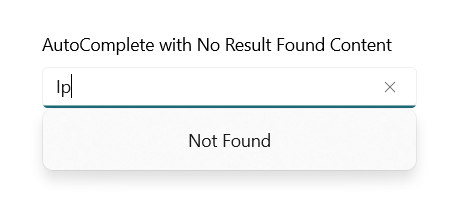

# No Result Found in WinUI AutoComplete (SfAutoComplete)

When the entered text does not match any item in the suggestion list, the SfAutoComplete control displays a message indicating that no search results are found. The desired text or UI can be set by using the `NoResultsFoundContent` and `NoResultsFoundTemplate` properties.

> **Requirements**: WinUI 3, Syncfusion WinUI Editors package.

* Use `NoResultsFoundContent` to display simple text.
* Use `NoResultsFoundTemplate` to display custom UI, such as styled text or an icon.

When both `NoResultsFoundContent` and `NoResultsFoundTemplate` are set, priority is given to `NoResultsFoundTemplate`. If neither property is set, the default text is displayed.

The no-result content is shown only when the drop-down is open and the typed text does not match any item in the `ItemsSource`. To see it, type a value that is not present in the bound list.

## NoResultsFoundContent

The `NoResultsFoundContent` property accepts an `object`, so a simple string can be assigned directly. The following code shows how to include the `NoResultsFoundContent` in the AutoComplete control.




 <editors:SfAutoComplete Header="AutoComplete with No Result Found Text"
                          PlaceholderText="Search a country"
                          DisplayMemberPath="Country"
                          TextMemberPath="Country"
                          Width="300"
                          NoResultsFoundContent="Not Found"
                          ItemsSource="{Binding ContinentList }">
 </editors:SfAutoComplete>




## NoResultsFoundTemplate

The `NoResultsFoundTemplate` property is a `DataTemplate` that lets you customize the appearance of the no-result content. The following code shows how to include the `NoResultsFoundTemplate` in the AutoComplete control.



<editors:SfAutoComplete Header="AutoComplete with No Result Found Template"
                        PlaceholderText="Search a country"
                        DisplayMemberPath="Country"
                        TextMemberPath="Country"
                        Width="300"
                        ItemsSource="{Binding ContinentList}">
    <editors:SfAutoComplete.NoResultsFoundTemplate>
        <DataTemplate>
            <TextBlock Text="Not Found"
                       Foreground="Red"
                       FontStyle="Italic"
                       FontSize="20" />
        </DataTemplate>
    </editors:SfAutoComplete.NoResultsFoundTemplate>
</editors:SfAutoComplete>



