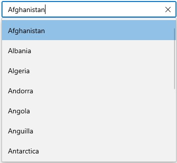

# WinUI AutoComplete Overview

The [WinUI AutoComplete control] control provides you with the live drop-down hints as you enter the text in AutoComplete Textbox. It guides you by displaying the list of items from the Data Source. You can then select any item from the list instead of entering the whole text again.

## Control structure

## Key features

* **Data binding** – Support to bind various type of data sources.
* **Selection mode** – Support to select single or multiple values from the drop-down list.
* **Filtering** – The AutoComplete filters items based on the entered text and auto fills with the first suggestion.
* **Searching** – Highlights the matching item in the drop-down list based on the provided input. 
* **Watermark** – Display placeholder text inside the control until the user enters text.
* **Styling and Template support** – SelectionBox and Drop-Down list items can be customized with an image or custom control using templates in `AutoComplete` control.
