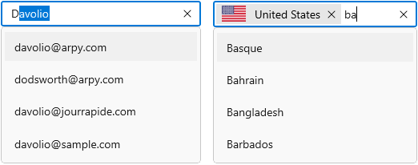

# WinUI AutoComplete Overview

The [WinUI AutoComplete](https://help.syncfusion.com/cr/winui/Syncfusion.UI.Xaml.Editors.SfAutoComplete.html) is highly optimized to quickly load and populate suggestions from a large volume of data based on the characters entered by the user. It allows users to select one or more items from the suggestion list. It can display the selected items in the input view with images, text, and close buttons to remove items as needed.

## Control structure

The following diagram illustrates the structure of the AutoComplete control.

## Key features

* **Data binding** – Supports binding various types of data sources.
* **Selection mode** – Supports selecting single or multiple values from the drop-down list.
* **Filtering** – The AutoComplete filters items based on the entered text and auto-fills with the first suggestion.
* **Searching** – Highlights the matching item in the drop-down list based on the provided input. 
* **Watermark** – Displays placeholder text inside the control until the user enters text.
* **Styling and template support** – The selection box and drop-down list items can be customized with an image or custom control using templates.
* **Leading and trailing views** – Displays custom content, such as icons or buttons, before and after the selection area.
* **No result found** – Displays a custom message or template when the typed text does not match any item.
* **Keyboard support** – Provides shortcut keys for drop-down, navigation, and token operations.
