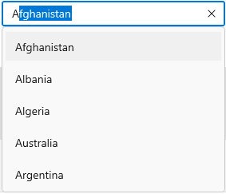

# WinUI AutoComplete Overview

The `WinUI AutoComplete` is highly optimized to quickly load and populate suggestions from a large volume of data based on the users’ input characters. It allows users to select one or more items from the suggestion list. It can display the selected items in the input view with images, text, and close buttons to remove items as needed.

## Control structure

## Key features

* **Data binding** – Provided support to bind various types of data sources.
* **Selection mode** – Provided support to select single or multiple values from the drop-down list.
* **Filtering** – The AutoComplete filters items based on the entered text and auto-fills with the first suggestion.
* **Searching** – Highlights the matching item in the drop-down list based on the provided input. 
* **Watermark** – Display placeholder text inside the control until the user enters text.
* **Styling and Template support** – SelectionBox and Drop-down list items can be customized with an image or custom control using the templates in `AutoComplete` control.
