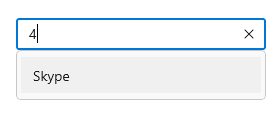
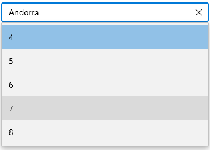
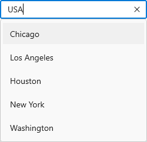
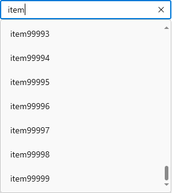

# Searching and Filtering in WinUI AutoComplete (SfAutoComplete)

The [SfAutoComplete](https://help.syncfusion.com/cr/winui/Syncfusion.UI.Xaml.Editors.SfAutoComplete.html) control supports rich searching and filtering.

## Searching based on member path

The `TextMemberPath` and `DisplayMemberPath` properties of the AutoComplete control specify the property path by which the searching is done when custom data is bound to the `ItemsSource` property.

[TextMemberPath](https://help.syncfusion.com/cr/winui/Syncfusion.UI.Xaml.Editors.DropDownListBase.html?tabs=tabid-1#Syncfusion_UI_Xaml_Editors_DropDownListBase_TextMemberPath) - Specifies the property path whose value is used to perform searching based on user input received in the selection box portion of the `AutoComplete` control. The default value is `string.Empty`. When `TextMemberPath` is `null` or `string.Empty`, searching will be performed based on `DisplayMemberPath`.

[DisplayMemberPath](https://help.syncfusion.com/cr/winui/Syncfusion.UI.Xaml.Editors.DropDownListBase.html#Syncfusion_UI_Xaml_Editors_DropDownListBase_DisplayMemberPath) - Specifies the property path whose value is displayed as text in the drop-down menu. The default value is `string.Empty`.

N> `DisplayMemberPath` and `TextMemberPath` are effective when the bound item has two or more properties.

N> When both the `TextMemberPath` and `DisplayMemberPath` properties have a `null` or `string.Empty` value, searching will be performed based on the class name with namespace of the item.

### Searching based on TextMemberPath

Searching will be performed based on the `TextMemberPath` property while entering the text into the selection box. If `TextMemberPath` is `null` or `string.Empty`, searching will be performed based on `DisplayMemberPath`.



//Model.cs
public class SocialMedia
{
    public string Name { get; set; }
    public int ID { get; set; }
}

//ViewModel.cs
public class SocialMediaViewModel
{
    public ObservableCollection<SocialMedia> SocialMedias { get; set; }
    public SocialMediaViewModel()
    {
        this.SocialMedias = new ObservableCollection<SocialMedia>();
        this.SocialMedias.Add(new SocialMedia() { Name = "Facebook", ID = 0 });
        this.SocialMedias.Add(new SocialMedia() { Name = "Google Plus", ID = 1 });
        this.SocialMedias.Add(new SocialMedia() { Name = "Instagram", ID = 2 });
        this.SocialMedias.Add(new SocialMedia() { Name = "LinkedIn", ID = 3 });
        this.SocialMedias.Add(new SocialMedia() { Name = "Skype", ID = 4 });
        this.SocialMedias.Add(new SocialMedia() { Name = "Telegram", ID = 5 });
        this.SocialMedias.Add(new SocialMedia() { Name = "Televzr", ID = 6 });
        this.SocialMedias.Add(new SocialMedia() { Name = "Tik Tok", ID = 7 });
        this.SocialMedias.Add(new SocialMedia() { Name = "Tout", ID = 8 });
        this.SocialMedias.Add(new SocialMedia() { Name = "Tumblr", ID = 9 });
        this.SocialMedias.Add(new SocialMedia() { Name = "Twitter", ID = 10 });
        this.SocialMedias.Add(new SocialMedia() { Name = "Vimeo", ID = 11 });
        this.SocialMedias.Add(new SocialMedia() { Name = "WhatsApp", ID = 12 });
        this.SocialMedias.Add(new SocialMedia() { Name = "YouTube", ID = 13 });
    }
}







<editors:SfAutoComplete
    ItemsSource="{Binding SocialMedias}"
    TextMemberPath="ID"
    DisplayMemberPath="Name" 
    Width="250"
    x:Name="autoComplete"/>





autoComplete.TextMemberPath = "ID";




For example, after typing `5` in the selection box:

### Searching based on DisplayMemberPath

Searching will be performed based on the `DisplayMemberPath` property while entering the text into the selection box when `TextMemberPath` is `null` or `string.Empty`.




<editors:SfAutoComplete ItemsSource="{Binding SocialMedias}"
                        DisplayMemberPath="Name" />





autoComplete.DisplayMemberPath = "Name";




For example, after typing `T` in the selection box, social media items that start with `T` will be listed in the drop-down.

N> `DisplayMemberPath` cannot be used when `ItemTemplate` is specified.

## Filtering mode

The [TextSearchMode](https://help.syncfusion.com/cr/winui/Syncfusion.UI.Xaml.Editors.SfAutoComplete.html#Syncfusion_UI_Xaml_Editors_SfAutoComplete_TextSearchMode) property of the `AutoComplete` control regulates how the control behaves when it receives user input. The default text filtering type is `StartsWith`, which ignores accents and is case-insensitive. The available text filter modes are:

* StartsWith
* Contains

### Filter with beginning text
Set the `TextSearchMode` property to `StartsWith` to filter matching items based on the starting text. The first item in the drop-down list that matches the user input will be highlighted.




<editors:SfAutoComplete 
    TextSearchMode="StartsWith"
    ItemsSource="{Binding SocialMedias}"
    DisplayMemberPath="Name"
    TextMemberPath="Name"
    Width="250"
    x:Name="autoComplete">
</editors:SfAutoComplete>





autoComplete.TextSearchMode = AutoCompleteTextSearchMode.StartsWith;




### Filter with contains text

Set the `TextSearchMode` property to `Contains` to filter matching items that contain the typed text. The first item in the drop-down list that matches the user input will be highlighted.




<editors:SfAutoComplete 
    TextSearchMode="Contains"
    ItemsSource="{Binding SocialMedias}"
    DisplayMemberPath="Name"
    TextMemberPath="Name"
    Width="250"
    x:Name="autoComplete">
</editors:SfAutoComplete>





autoComplete.TextSearchMode = AutoCompleteTextSearchMode.Contains;




### Custom filtering

The `AutoComplete` control supports custom filter logic to suggest items based on your own filter criteria by using the [FilterBehavior](https://help.syncfusion.com/cr/winui/Syncfusion.UI.Xaml.Editors.SfAutoComplete.html#Syncfusion_UI_Xaml_Editors_SfAutoComplete_FilterBehavior) and [SearchBehavior](https://help.syncfusion.com/cr/winui/Syncfusion.UI.Xaml.Editors.SfAutoComplete.html#Syncfusion_UI_Xaml_Editors_SfAutoComplete_SearchBehavior) properties. The default value of `FilterBehavior` and `SearchBehavior` is `null`.

The following `CityInfo` model is used by the custom filtering and searching samples below.




//Model.cs
public class CityInfo
{
    public string CityName { get; set; }
    public string CountryName { get; set; }
    public bool IsCapital { get; set; }
}




Follow these steps to apply a custom filter to the `AutoComplete` control:

**Step 1:** Create a class that derives from the [IAutoCompleteFilterBehavior](https://help.syncfusion.com/cr/winui/Syncfusion.UI.Xaml.Editors.AutoCompleteFilterBehavior.html) interface.




/// 

/// Represents a custom filtering behavior for the AutoComplete control.
/// 

public class CityFilteringBehavior : IAutoCompleteFilterBehavior
{

}




**Step 2:** Implement the [GetMatchingItemsAsync](https://help.syncfusion.com/cr/winui/Syncfusion.UI.Xaml.Editors.AutoCompleteFilterBehavior.html#Syncfusion_UI_Xaml_Editors_AutoCompleteFilterBehavior_GetMatchingItemsAsync_Syncfusion_UI_Xaml_Editors_SfAutoComplete_Syncfusion_UI_Xaml_Editors_AutoCompleteFilterInfo_) method of the `IAutoCompleteFilterBehavior` interface to create your own suggestion list based on the text entered in the `AutoComplete` control. The method returns an `object` that is expected to be an `IEnumerable` of items displayed in the drop-down. The `GetMatchingItemsAsync` method contains the following arguments:

* [source](https://help.syncfusion.com/cr/winui/Syncfusion.UI.Xaml.Editors.SfAutoComplete.html) - The owner of the filter behavior, which holds information about the `ItemsSource`, `Items` properties, and so on.
* [filterInfo](https://help.syncfusion.com/cr/winui/Syncfusion.UI.Xaml.Editors.AutoCompleteFilterInfo.html) - Contains details about the text entered in the `AutoComplete` control. Using this text, you can prepare the suggestion list that gets displayed in the drop-down list.




public class CityFilteringBehavior : IAutoCompleteFilterBehavior
{
    public async Task<object> GetMatchingItemsAsync(SfAutoComplete source, AutoCompleteFilterInfo filterInfo)
    {
         IEnumerable itemsSource = source.ItemsSource as IEnumerable;
         var filteredItems = (from CityInfo item in itemsSource
                             where item.CountryName.StartsWith(filterInfo.Text, StringComparison.CurrentCultureIgnoreCase) ||
                                   item.CityName.StartsWith(filterInfo.Text, StringComparison.CurrentCultureIgnoreCase)
                             select item);
         return await Task.FromResult(filteredItems);
    }
}




**Step 3:** Apply the custom filtering to the `AutoComplete` control by using the `FilterBehavior` property.




<editors:SfAutoComplete 
    TextMemberPath="CityName"
    DisplayMemberPath="CityName"
    ItemsSource="{Binding Cities}">
    <editors:SfAutoComplete.FilterBehavior>
        <local:CityFilteringBehavior/>
    </editors:SfAutoComplete.FilterBehavior>
</editors:SfAutoComplete>




The following image demonstrates how to display cities in the drop-down based on the country name entered in the `AutoComplete` control.

### Choose default item to select

When searching, the first item in the drop-down will be highlighted by default. Use the [SearchBehavior](https://help.syncfusion.com/cr/winui/Syncfusion.UI.Xaml.Editors.SfAutoComplete.html#Syncfusion_UI_Xaml_Editors_SfAutoComplete_SearchBehavior) property to customize the default highlighting behavior with custom selection logic. The default value of `SearchBehavior` is `null`.

**Step 1:** Create a class that derives from the [IAutoCompleteSearchBehavior](https://help.syncfusion.com/cr/winui/Syncfusion.UI.Xaml.Editors.AutoCompleteSearchBehavior.html) interface.




/// 

/// Represents a custom searching behavior for the AutoComplete control.
/// 

public class CapitalCitySearchingBehavior : IAutoCompleteSearchBehavior
{

}




**Step 2:** Implement the [GetHighlightIndex](https://help.syncfusion.com/cr/winui/Syncfusion.UI.Xaml.Editors.AutoCompleteSearchBehavior.html#Syncfusion_UI_Xaml_Editors_AutoCompleteSearchBehavior_GetHighlightIndex_Syncfusion_UI_Xaml_Editors_SfAutoComplete_Syncfusion_UI_Xaml_Editors_AutoCompleteSearchInfo_) method of the `IAutoCompleteSearchBehavior` interface to select an item from the filtered list in the `AutoComplete` control drop-down. The method returns a zero-based index of the item to highlight; a negative value highlights the first item. The `GetHighlightIndex` method contains the following arguments:

* [source](https://help.syncfusion.com/cr/winui/Syncfusion.UI.Xaml.Editors.SfAutoComplete.html) - The owner of the search behavior, which holds information about the `ItemsSource`, `Items` properties, and so on.
* [searchInfo](https://help.syncfusion.com/cr/winui/Syncfusion.UI.Xaml.Editors.AutoCompleteSearchInfo.html) - Contains information about the filtered items based on the text entered in the `AutoComplete` control. You can select an item from the drop-down list using this list.

The following code demonstrates how to select an item from the filtered list of the drop-down in the `AutoComplete` control. When entering a country's name, the matching capital city will be selected.




public class CapitalCitySearchingBehavior : IAutoCompleteSearchBehavior
{
    public int GetHighlightIndex(SfAutoComplete source, AutoCompleteSearchInfo searchInfo)
    {
         var filteredCapitals = from CityInfo cityInfo in searchInfo.FilteredItems
                                where cityInfo.IsCapital
                                select searchInfo.FilteredItems.IndexOf(cityInfo);
         if (filteredCapitals.Count() > 0)
             return filteredCapitals.FirstOrDefault();

         return 0;
    }
}




**Step 3:** Apply the custom searching to the `AutoComplete` control by using the `SearchBehavior` property. The following XAML applies both the `SearchBehavior` and the `FilterBehavior` defined earlier so that the filtered items are narrowed to matching cities and the capital city is highlighted.




<editors:SfAutoComplete 
    TextMemberPath="CityName"
    DisplayMemberPath="CityName"
    ItemsSource="{Binding Cities}">    
    <editors:SfAutoComplete.SearchBehavior>
        <local:CapitalCitySearchingBehavior/>
    </editors:SfAutoComplete.SearchBehavior>
    <editors:SfAutoComplete.FilterBehavior>
        <local:CityFilteringBehavior/>
    </editors:SfAutoComplete.FilterBehavior>
</editors:SfAutoComplete>




The following gif demonstrates how to select the capital city from the drop-down based on the country name entered in the `AutoComplete` control.

## Load asynchronous items

Load data dynamically at runtime based on typed input. This dynamic loading can be done while performing custom filtering by using the `FilterBehavior` property.

The `GetMatchingItemsAsync` method of `IAutoCompleteFilterBehavior` lets you perform filtering operations on a background thread without blocking the current thread by using `await Task.Run()`.

> The following sample does not bind an `ItemsSource` because the suggestion list is generated entirely within the filter behavior at runtime.

**Step 1:** Create a class that derives from the `IAutoCompleteFilterBehavior` interface and add your custom filter logic in the `GetMatchingItemsAsync` method to load runtime items based on typed input.




public class CustomAsyncFilter : IAutoCompleteFilterBehavior
{
    /// 

    /// Gets the cancellation token source.
    /// 

    CancellationTokenSource cancellationTokenSource;

    public async Task<object> GetMatchingItemsAsync(SfAutoComplete source, AutoCompleteFilterInfo filterInfo)
    {
        if (this.cancellationTokenSource != null)
        {
            this.cancellationTokenSource.Cancel();
            this.cancellationTokenSource.Dispose();
        }

        this.cancellationTokenSource = new CancellationTokenSource();
        CancellationToken token = this.cancellationTokenSource.Token;

        return await Task.Run(() =>
        {
            List<string> list = new List<string>();
            for (int i = 0; i < 100000; i++)
            {
                list.Add(filterInfo.Text + i);
            }

            return list;
        }, token);
    }
}




**Step 2:** Apply the `CustomAsyncFilter` to the `AutoComplete` control by using the `FilterBehavior` property.




<editors:SfAutoComplete
    TextSearchMode="Contains"
    SelectionMode="Multiple"
    x:Name="autoComplete">
    <editors:SfAutoComplete.FilterBehavior>
        <local:CustomAsyncFilter/>
    </editors:SfAutoComplete.FilterBehavior>
</editors:SfAutoComplete>




The following image shows 1 lakh of data being loaded asynchronously in a drop-down at runtime based on typed input.

