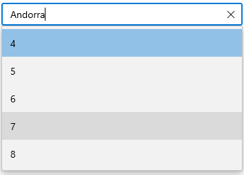

# Searching and Filtering in WinUI AutoComplete (SfAutoComplete)

The [AutoComplete](https://help.syncfusion.com/cr/winui/Syncfusion.UI.Xaml.Editors.SfAutoComplete.html) control provides rich text searching and filtering functionality.

## Search based on member path

The `TextMemberPath` and `DisplayMemberPath` properties of `AutoComplete` control specifies the property path, by which the searching must be done when a custom data is bound to the `ItemsSource` property.

[TextMemberPath](https://help.syncfusion.com/cr/winui/Syncfusion.UI.Xaml.Editors.SfDropDownListBase.html#Syncfusion_UI_Xaml_Editors_SfDropDownListBase_TextMemberPath) - Specifies the property path, by which searching must be done when user input is received in the selection box portion of the `AutoComplete` control. The default value is `String.Empty`.

[DisplayMemberPath](https://help.syncfusion.com/cr/winui/Syncfusion.UI.Xaml.Editors.SfDropDownListBase.html#Syncfusion_UI_Xaml_Editors_SfDropDownListBase_DisplayMemberPath) - Specifies the property path, by which searching must be done when user input is received in the drop-down portion of the `AutoComplete` control. The default value is `String.Empty`.

N> `TextMemberPath` and `DisplayMemberPath` will be effective for the collection item that holds two or more properties in it.

### Searching based on TextMemberPath

Searching will be performed based on the `TextMemberPath` property while entering the text into the selection box. If `TextMemberPath` is set to `null`, searching will be disabled.




//Model.cs
public class SocialMedia
{
    public string Name { get; set; }
    public int ID { get; set; }
}

//ViewModel.cs
public class SocialMediaViewModel
{
    public ObservableCollection<SocialMedia> SocialMedias { get; set; }
    public SocialMediaViewModel()
    {
        this.SocialMedias = new ObservableCollection<SocialMedia>();
        this.SocialMedias.Add(new SocialMedia() { Name = "Facebook", ID = 0 });
        this.SocialMedias.Add(new SocialMedia() { Name = "Google Plus", ID = 1 });
        this.SocialMedias.Add(new SocialMedia() { Name = "Instagram", ID = 2 });
        this.SocialMedias.Add(new SocialMedia() { Name = "LinkedIn", ID = 3 });
        this.SocialMedias.Add(new SocialMedia() { Name = "Skype", ID = 4 });
        this.SocialMedias.Add(new SocialMedia() { Name = "Telegram", ID = 5 });
        this.SocialMedias.Add(new SocialMedia() { Name = "Televzr", ID = 6 });
        this.SocialMedias.Add(new SocialMedia() { Name = "Tik Tok", ID = 7 });
        this.SocialMedias.Add(new SocialMedia() { Name = "Tout", ID = 8 });
        this.SocialMedias.Add(new SocialMedia() { Name = "Tumblr", ID = 9 });
        this.SocialMedias.Add(new SocialMedia() { Name = "Twitter", ID = 10 });
        this.SocialMedias.Add(new SocialMedia() { Name = "Vimeo", ID = 11 });
        this.SocialMedias.Add(new SocialMedia() { Name = "WhatsApp", ID = 12 });
        this.SocialMedias.Add(new SocialMedia() { Name = "YouTube", ID = 13 });
    }
}







<editors:SfAutoComplete
    ItemsSource="{Binding SocialMedias}"
    TextMemberPath="ID"
    DisplayMemberPath="Name" 
    Width="250"
    x:Name="autoComplete"/>





autoComplete.TextMemberPath = "ID";




For e.g. After typing `4` in selection box.

### Searching based on DisplayMemberPath

Searching will be performed based on the `DisplayMemberPath` property while entering the text into the selection box. If `DisplayMemberPath` is `null`, searching will be disabled. 




<editors:SfAutoComplete x:Name="autoComplete"
    Width="250"
    ItemsSource="{Binding SocialMedias}"
    TextMemberPath="Name"
    DisplayMemberPath="ID" />





autoComplete.DisplayMemberPath = "ID";




For e.g. After typing `T` in drop-down, social medias which have starting letter `T` will be listed in dropdown.

N> If `TextMemberPath` and `DisplayMemberPath` are `null`, searching will be performed based on the class name with namespace of the item.

## Filtering Mode

The [TextSearchMode](https://help.syncfusion.com/cr/winui/Syncfusion.UI.Xaml.Editors.SfAutoComplete.html#Syncfusion_UI_Xaml_Editors_SfAutoComplete_SelectionMode) property of the `AutoComplete` can be used to regulate how the control behaves when it receives user input. The default text filtering type is `StartsWith`, ignoring accent and it is case insensitive. The available text filter modes are,

* StartsWith
* Contains

### Filter with beginning text

To filter the matching items based on the starting text, set the `TextSearchMode` property value is `StartWith`. The first item which fits the user input in the drop-down list, will be highlighted. 




<editors:SfAutoComplete 
    TextSearchMode="StartsWith"
    ItemsSource="{Binding SocialMedias}"
    DisplayMemberPath="Name"
    TextMemberPath="Name"
    Width="250"
    x:Name="autoComplete">
</editors:SfAutoComplete>





autoComplete.TextSearchMode = AutoCompleteTextSearchMode.StartsWith;




### Filter with contains text

To filter the matching items based on the containing specific text, set the `TextSearchMode` property value is `Contains`. The first item which fits the user input in the drop-down list, will be highlighted. 




<editors:SfAutoComplete 
    TextSearchMode="Contains"
    ItemsSource="{Binding SocialMedias}"
    DisplayMemberPath="Name"
    TextMemberPath="Name"
    Width="250"
    x:Name="autoComplete">
</editors:SfAutoComplete>





autoComplete.TextSearchMode = AutoCompleteTextSearchMode.Contains;




### Custom filtering

The `AutoComplete` control provides support to apply your own custom filter logic to suggests the items based on your filter criteria by using the [FilterBehavior](https://help.syncfusion.com/cr/winui/Syncfusion.UI.Xaml.Editors.SfAutoComplete.html#Syncfusion_UI_Xaml_Editors_SfAutoComplete_FilterBehavior) and [SearchBehavior](https://help.syncfusion.com/cr/winui/Syncfusion.UI.Xaml.Editors.SfAutoComplete.html#Syncfusion_UI_Xaml_Editors_SfAutoComplete_SearchBehavior) property. The default value of `FilterBehavior` and `SearchBehavior` is `null`. 

Now, lets create custom filtering and searching class to apply our own filter logic to `AutoComplete` control by following steps.

**Step 1:** Create a class that derives from the [IAutoCompleteFilterBehavior](https://help.syncfusion.com/cr/winui/Syncfusion.UI.Xaml.Editors.AutoCompleteFilterBehavior.html) interface.




/// 

/// Represents a custom filtering behavior for `AutoComplete` control. 
/// 

public class CityFilteringBehavior : IAutoCompleteFilterBehavior
{

}




**Step 2:** Then, implement the [GetMatchingIndexes](https://help.syncfusion.com/cr/winui/Syncfusion.UI.Xaml.Editors.AutoCompleteFilterBehavior.html#Syncfusion_UI_Xaml_Editors_AutoCompleteFilterBehavior_GetMatchingItemsAsync_Syncfusion_UI_Xaml_Editors_SfAutoComplete_Syncfusion_UI_Xaml_Editors_AutoCompleteFilterInfo_) method of `IAutoCompleteFilterBehavior` interface to create your own suggestion list (containing the indices of the filtered items) based on the text entered in the `AutoComplete` control that needs to be shown in drop-down. The `GetMatchingIndexes` method contains following arguments.

* [source](https://help.syncfusion.com/cr/winui/Syncfusion.UI.Xaml.Editors.SfAutoComplete.html) - The owner of the filter behavior, which holds information about `ItemsSource`, `Items` properties, and so on.
* [filterInfo](https://help.syncfusion.com/cr/winui/Syncfusion.UI.Xaml.Editors.AutoCompleteFilterInfo.html) - Contains details about the text entered in `AutoComplete` control. Using this text, you can prepare suggestion list which gets displayed in drop down list. 

The following code demonstrates how to filter the cities based on the city or country name entered in `AutoComplete` control.




public class CustomFilter : IAutoCompleteFilterBehavior
{
    /// 

    /// Gets the cancellation token source.
    /// 

    //CancellationTokenSource cancellationTokenSource;

    public async Task<object> GetMatchingItemsAsync(SfAutoComplete source, AutoCompleteFilterInfo filterInfo)
    {
        IEnumerable itemssource = source.ItemsSource as IEnumerable;
        List<object> list = new List<object>();
        list.AddRange(from CityInfo item in itemssource
                      let filterItem = this.GetStringFromMemberPath(item, nameof(item.CountryName))
                      where filterItem.StartsWith(filterInfo.Text, StringComparison.CurrentCultureIgnoreCase)
                      select item);
        list.AddRange(from CityInfo item in itemssource
                      let filterItem = this.GetStringFromMemberPath(item, nameof(item.CityName))
                      where filterItem.StartsWith(filterInfo.Text, StringComparison.CurrentCultureIgnoreCase)
                      select item);

        return list;
    }

    private string GetStringFromMemberPath(object item, string path)
    {
        string value = item.ToString();
        if (!string.IsNullOrEmpty(path))
        {
            value = item.GetType()?.GetRuntimeProperty(path)?.GetValue(item).ToString();
        }

        return value;
    }
}




**Step 3:** Create a class that derives from the [IAutoCompleteSearchBehavior](https://help.syncfusion.com/cr/winui/Syncfusion.UI.Xaml.Editors.AutoCompleteSearchBehavior.html) interface.




/// 

/// Represents a custom searching behavior for `AutoComplete` control. 
/// 

public class CapitalCitySearchingBehavior : IAutoCompleteSearchBehavior
{

}




**Step 4:** Then, implement the [GetHighlightIndex](https://help.syncfusion.com/cr/winui/Syncfusion.UI.Xaml.Editors.AutoCompleteSearchBehavior.html#Syncfusion_UI_Xaml_Editors_AutoCompleteSearchBehavior_GetHighlightIndex_Syncfusion_UI_Xaml_Editors_SfAutoComplete_Syncfusion_UI_Xaml_Editors_AutoCompleteSearchInfo_) method of `IAutoCompleteSearchBehavior` interface to initially select any item from filtered list in the `AutoComplete` control drop-down. The `GetHighlightIndex` method contains following arguments.

* [source](https://help.syncfusion.com/cr/winui/Syncfusion.UI.Xaml.Editors.SfAutoComplete.html) - The owner of the search behavior, which holds information about `ItemsSource`, `Items` properties, and so on.
* [searchInfo](https://help.syncfusion.com/cr/winui/Syncfusion.UI.Xaml.Editors.AutoCompleteSearchInfo.html) - Contains details about the filtered items based on the text entered in `AutoComplete` control. Using this list, you can selected item which is displayed in drop down list. 

The following code demonstrates initially which item to be selected from the filtered list of drop-down in the `AutoComplete` control. Here, the capital cities will be selected while entering its country name.




public class CapitalCitySearchingBehavior : IAutoCompleteSearchBehavior
{
    public int GetHighlightIndex(SfAutoComplete source, AutoCompleteSearchInfo searchInfo)
    {
        List<int> list = new List<int>();

        CityInfo firstitem = searchInfo.FilteredItems[0] as CityInfo;
        if (firstitem.CountryName == "India")
        {
            list.AddRange(from CityInfo item in searchInfo.FilteredItems
                          let filterItem = this.GetStringFromMemberPath(item, "CityName")
                          where filterItem == "Delhi"
                          select searchInfo.FilteredItems.IndexOf(item));
        }
        else if (firstitem.CountryName == "USA")
        {
            list.AddRange(from CityInfo item in searchInfo.FilteredItems
                          let filterItem = this.GetStringFromMemberPath(item, "CityName")
                          where filterItem == "Washington"
                          select searchInfo.FilteredItems.IndexOf(item));
        }
        else if (firstitem.CountryName == "England")
        {
            list.AddRange(from CityInfo item in searchInfo.FilteredItems
                          let filterItem = this.GetStringFromMemberPath(item, "CityName")
                          where filterItem == "London"
                          select searchInfo.FilteredItems.IndexOf(item));
        }
        else if (firstitem.CountryName == "Canada")
        {
            list.AddRange(from CityInfo item in searchInfo.FilteredItems
                          let filterItem = this.GetStringFromMemberPath(item, "CityName")
                          where filterItem == "Ottawa"
                          select searchInfo.FilteredItems.IndexOf(item));
        }
        else if (firstitem.CountryName == "Indonesia")
        {
            list.AddRange(from CityInfo item in searchInfo.FilteredItems
                          let filterItem = this.GetStringFromMemberPath(item, "CityName")
                          where filterItem == "Jakarta"
                          select searchInfo.FilteredItems.IndexOf(item));
        }
        else if (firstitem.CountryName == "Germany")
        {
            list.AddRange(from CityInfo item in searchInfo.FilteredItems
                          let filterItem = this.GetStringFromMemberPath(item, "CityName")
                          where filterItem == "Berlin"
                          select searchInfo.FilteredItems.IndexOf(item));
        }

        return list.Count > 0 ? list[0] : 0;
    }

    private string GetStringFromMemberPath(object item, string path)
    {
        string value = item.ToString();
        if (!string.IsNullOrEmpty(path))
        {
            value = item.GetType()?.GetRuntimeProperty(path)?.GetValue(item).ToString();
        }
        return value;
    }
}




**Step5:** Applying custom filtering and searching to `AutoComplete` control by using the `FilterBehavior` and `SearchBehavior` property. 




<editors:SfAutoComplete 
    TextMemberPath="CityName"
    DisplayMemberPath="CityName"
    ItemsSource="{Binding Cities}">
    <editors:SfAutoComplete.FilterBehavior>
        <local:CityFilteringBehavior/>
    </editors:SfAutoComplete.FilterBehavior>
    <editors:SfAutoComplete.SearchBehavior>
        <local:CapitalCitySearchingBehavior/>
    </editors:SfAutoComplete.SearchBehavior>
</editors:SfAutoComplete>




The following gif demonstrates displaying the cities in drop-down based on the country name entered in the `AutoComplete` control.

