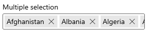

# Selection in WinUI AutoComplete (SfAutoComplete)

The [AutoComplete] allows user to select single or multiple items from the drop-down list or by clicking `Tab` key. The selection mode can be set by using the [SelectionMode] property. There are two different selection modes: `Single`, and `Multiple`.

## Single selection

The `AutoComplete` allows user to select a single item from the drop-down list of by enter the `Tab` key.

### UI Selection 

The selected item can be changed interactively by entering the value using keyboard then select from the drop-down list or clicking the `Enter` key or clicking the `Tab` key. The selected item can be retrieved from the [SelectedItem] property of `AutoComplete` control.




<editors:SfAutoComplete
    Width="250"
    ItemsSource="{Binding Countries}"
    DisplayMemberPath="Name"
    TextMemberPath="Name"
    x:Name="autoComplete" />




### Programmatic selection 

The selected item can be changed programmatically by using the `SelectedItem`property of `AutoComplete` control. 




<editors:SfAutoComplete
    Width="250"
    ItemsSource="{Binding Countries}"
    DisplayMemberPath="Name"
    TextMemberPath="Name"
    x:Name="autoComplete" />





if (autoComplete != null)
            {
                autoComplete.SelectedItem = viewModel.Countries[3];
            }




## Multiple selection

The `AutoComplete` allows user to select multiple values from the drop-down list or clicking `Tab` key. The multi-select `AutoComplete` mode can be enabled by setting the `SelectionMode` property as `Multiple`.

### UI selection 

The selected items can be changed interactively by using keyboard or by selecting from a drop-down list. The selected items can be retrieved from the [SelectedItems] property of `AutoComplete` control.




<editors:SfAutoComplete
    Width="250"
    ItemsSource="{Binding Countries}"
    SelectionMode="Multiple"
    DisplayMemberPath="Name"
    TextMemberPath="Name"
    x:Name="autoComplete" />




### Programmatic selection 

The selected items can be changed programmatically by using the `SelectedItems` property of `AutoComplete` control.  




if (autoComplete != null)
            {
                autoComplete.SelectedItems.Add(viewModel.Countries[0]);
                autoComplete.SelectedItems.Add(viewModel.Countries[1]);
                autoComplete.SelectedItems.Add(viewModel.Countries[2]);
                autoComplete.SelectedItems.Add(viewModel.Countries[3]);
                autoComplete.SelectedItems.Add(viewModel.Countries[4]);
                autoComplete.SelectedItems.Add(viewModel.Countries[5]);
            }




## Selection changed event

When selecting an item from the drop-down list, the [SelectionChanged] event is triggered. The `SelectionChanged` event contains the newly selected and removed items in the AddedItems and RemovedItems properties. The `SelectionChanged` contains the following properties:

 * `AddedItems` - Contains the items that were selected.
 * `RemovedItems` - Contains the items that were unselected.




<editors:SfAutoComplete x:Name="autoComplete"
                    Width="250"
                    TextMemberPath="Name"
                    DisplayMemberPath="Name"
                    ItemsSource="{Binding Countries}"
                    SelectionChanged="OnSelectionChanged" />





autoComplete.SelectionChanged += OnSelectionChanged;




The SelectionChanged event can be handled as follows.




private void OnSelectionChanged(object sender, AutoCompleteSelectionChangedEventArgs e)
{
    if (SelectedItemTextBlock != null)
            {
                SelectedItemTextBlock.Text = Extension.GetMemberValue(sfautocomplete.SelectedItem, sfautocomplete.TextMemberPath);
            }
            viewModel.AddedItems.Clear();
            viewModel.RemovedItems.Clear();

}



