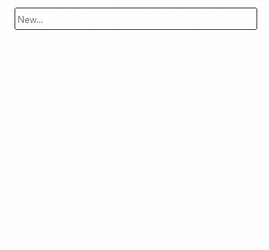
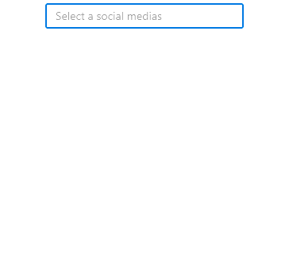
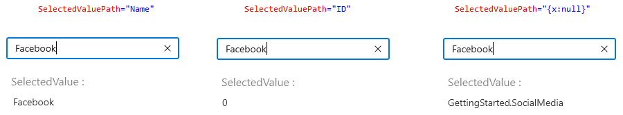
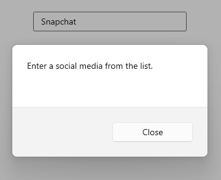

# Selection in WinUI AutoComplete (SfAutoComplete)

The [AutoComplete](https://help.syncfusion.com/cr/winui/Syncfusion.UI.Xaml.Editors.SfAutoComplete.html) allows user to select single or multiple items. The selection mode can be set by using the [SelectionMode](https://help.syncfusion.com/cr/winui/Syncfusion.UI.Xaml.Editors.SfAutoComplete.html#Syncfusion_UI_Xaml_Editors_SfAutoComplete_SelectionMode) property. There are two different selection modes: `Single`, and `Multiple`.

## Single selection

The `AutoComplete` allows user to select a single item by entering the value using keyboard then select from the drop-down list and clicking the `Enter` key or clicking the `Tab` key. The selected item can be retrieved from the [SelectedItem](https://help.syncfusion.com/cr/winui/Syncfusion.UI.Xaml.Editors.DropDownListBase.html#Syncfusion_UI_Xaml_Editors_DropDownListBase_SelectedItem) property.




//Model.cs
public class SocialMedia
{
    public string Name { get; set; }
    public int ID { get; set; }
}

//ViewModel.cs
public class SocialMediaViewModel
{
    public ObservableCollection<SocialMedia> SocialMedias { get; set; }
    public SocialMediaViewModel()
    {
        this.SocialMedias = new ObservableCollection<SocialMedia>();
        this.SocialMedias.Add(new SocialMedia() { Name = "Facebook", ID = 0 });
        this.SocialMedias.Add(new SocialMedia() { Name = "Google Plus", ID = 1 });
        this.SocialMedias.Add(new SocialMedia() { Name = "Instagram", ID = 2 });
        this.SocialMedias.Add(new SocialMedia() { Name = "LinkedIn", ID = 3 });
        this.SocialMedias.Add(new SocialMedia() { Name = "Skype", ID = 4 });
        this.SocialMedias.Add(new SocialMedia() { Name = "Telegram", ID = 5 });
        this.SocialMedias.Add(new SocialMedia() { Name = "Televzr", ID = 6 });
        this.SocialMedias.Add(new SocialMedia() { Name = "Tik Tok", ID = 7 });
        this.SocialMedias.Add(new SocialMedia() { Name = "Tout", ID = 8 });
        this.SocialMedias.Add(new SocialMedia() { Name = "Tumblr", ID = 9 });
        this.SocialMedias.Add(new SocialMedia() { Name = "Twitter", ID = 10 });
        this.SocialMedias.Add(new SocialMedia() { Name = "Vimeo", ID = 11 });
        this.SocialMedias.Add(new SocialMedia() { Name = "WhatsApp", ID = 12 });
        this.SocialMedias.Add(new SocialMedia() { Name = "YouTube", ID = 13 });
    }
}







<editors:SfAutoComplete
    SelectionMode="Single"
    ItemsSource="{Binding SocialMedias}"
    DisplayMemberPath="Name"
    TextMemberPath="Name"
    Width="250"
    x:Name="autoComplete" />




autoComplete.SelectionMode = AutoCompleteSelectionMode.Single;




## Multiple selection

The `AutoComplete` allows user to select multiple values by start to entering the input and select items from the drop-down list. The multi-select `AutoComplete` mode can be enabled by setting the `SelectionMode` property as `Multiple`. Selected items will be displayed with a customizable token representation and each tokenized items can be removed by clicking their close button. The selected items can be retrieved from the [SelectedItems](https://help.syncfusion.com/cr/winui/Syncfusion.UI.Xaml.Editors.DropDownListBase.html#Syncfusion_UI_Xaml_Editors_DropDownListBase_SelectedItems) property.




<editors:SfAutoComplete
    SelectionMode="Multiple"
    ItemsSource="{Binding SocialMedias}"
    DisplayMemberPath="Name"
    TextMemberPath="Name"    
    Width="250"
    x:Name="autoComplete" />




autoComplete.SelectionMode = AutoCompleteSelectionMode.Multiple;




## Selection changed event

When selecting an item from the drop-down list, the [SelectionChanged](https://help.syncfusion.com/cr/winui/Syncfusion.UI.Xaml.Editors.SfAutoComplete.html#Syncfusion_UI_Xaml_Editors_SfAutoComplete_SelectionChanged) event is triggered. The `SelectionChanged` event contains the newly selected and removed items in the `AddedItems` and `RemovedItems` properties. The `SelectionChanged` contains the following properties:

 * [AddedItems](https://help.syncfusion.com/cr/winui/Syncfusion.UI.Xaml.Editors.AutoCompleteSelectionChangedEventArgs.html#Syncfusion_UI_Xaml_Editors_AutoCompleteSelectionChangedEventArgs_AddedItems) - Contains the items that were selected.
 * [RemovedItems](https://help.syncfusion.com/cr/winui/Syncfusion.UI.Xaml.Editors.AutoCompleteSelectionChangedEventArgs.html#Syncfusion_UI_Xaml_Editors_AutoCompleteSelectionChangedEventArgs_RemovedItems) - Contains the items that were unselected.




<editors:SfAutoComplete 
    SelectionChanged="OnSelectionChanged"
    TextMemberPath="Name"
    DisplayMemberPath="Name"
    ItemsSource="{Binding SocialMedias}" 
    Width="250"
    x:Name="autoComplete"/>





autoComplete.SelectionChanged += OnSelectionChanged;




The `SelectionChanged` event can be handled as follows.




private async void OnSelectionChanged(object sender, AutoCompleteSelectionChangedEventArgs e)
{
    var cd = new ContentDialog
    {
        Content = "Selected item was changed.",
        CloseButtonText = "Close"
    };

    cd.XamlRoot = this.Content.XamlRoot;
    var result = await cd.ShowAsync();
}




## Get the selected value

Value of the `SelectedItem` can be retrieved by using the [SelectedValue](https://help.syncfusion.com/cr/winui/Syncfusion.UI.Xaml.Editors.DropDownListBase.html#Syncfusion_UI_Xaml_Editors_DropDownListBase_SelectedValue) property. It returns the property value bind to the [SelectedValuePath](https://help.syncfusion.com/cr/winui/Syncfusion.UI.Xaml.Editors.DropDownListBase.html#Syncfusion_UI_Xaml_Editors_DropDownListBase_SelectedValuePath) property. If the `SelectedValuePath` is not initialized, it will return the root data item. The default value of `SelectedValue` and `SelectedValuePath` is `null`.




<editors:SfAutoComplete 
    SelectedValuePath="Name"
    x:Name="autoComplete"
    TextMemberPath="Name"   
    DisplayMemberPath="Name"
    ItemsSource="{Binding SocialMedias}" 
    SelectionChanged="OnSelectionChanged"/>

<TextBlock Text="SelectedValue :"/>
<TextBlock x:Name="selectedValue"/>



{

autoComplete.SelectionChanged += OnSelectionChanged;







private void OnSelectionChanged(object sender, AutoCompleteSelectionChangedEventArgs e)
{
    selectedValue.Text = autoComplete.SelectedValue.ToString();
}




## Handle invalid input 

The [InputSubmitted](https://help.syncfusion.com/cr/winui/Syncfusion.UI.Xaml.Editors.SfAutoComplete.html#Syncfusion_UI_Xaml_Editors_SfAutoComplete_InputSubmitted) event is triggered, when entered text is submitted that does not correspond to an item in the drop-down list. [AutoCompleteInputSubmittedEventArgs](https://help.syncfusion.com/cr/winui/Syncfusion.UI.Xaml.Editors.AutoCompleteInputSubmittedEventArgs.html) has following members which provides information for `InputSubmitted` event.

[Text](https://help.syncfusion.com/cr/winui/Syncfusion.UI.Xaml.Editors.AutoCompleteInputSubmittedEventArgs.html#Syncfusion_UI_Xaml_Editors_AutoCompleteInputSubmittedEventArgs_Text) - Gets the text entered in `AutoComplete`.

[Item](https://help.syncfusion.com/cr/winui/Syncfusion.UI.Xaml.Editors.AutoCompleteInputSubmittedEventArgs.html#Syncfusion_UI_Xaml_Editors_AutoCompleteInputSubmittedEventArgs_Item) - This property can be used to add the item to selected item(s) or set to selected item which gets assigned.
      If no item is assigned, then in single selection entered text gets assigned to selected item. In multiple selection, no text will be added to selected items.

[Handled](https://help.syncfusion.com/cr/winui/Syncfusion.UI.Xaml.Editors.AutoCompleteInputSubmittedEventArgs.html#Syncfusion_UI_Xaml_Editors_AutoCompleteInputSubmittedEventArgs_Handled) - When set to `true`, the framework will not automatically update the selected item or selected item(s) of the `AutoComplete` to the new value.

By using the following code sample, a dialogue box will be displayed when submitting input that does not contain in drop-down list.




<editors:SfAutoComplete 
    InputSubmitted="OnAutoCompleteInputSubmitted"
    ItemsSource="{Binding SocialMedias}"
    DisplayMemberPath="Name"
    TextMemberPath="Name"    
    x:Name="autoComplete"
    Width="250">
</editors:SfAutoComplete>





autoComplete.InputSubmitted += OnAutoCompleteInputSubmitted;




The `InputSubmitted` event can be handled as follows.




/// 

/// Occurs when the user submits some text that does not correspond to an item in the `AutoComplete` drop-down list.
/// 

private async void OnAutoCompleteInputSubmitted(object sender, Syncfusion.UI.Xaml.Editors.AutoCompleteInputSubmittedEventArgs e)
{
    var cd = new ContentDialog
    {
        Content = "Enter a social media from the list.",
        CloseButtonText = "Close"
    };

    cd.XamlRoot = this.Content.XamlRoot;
    var result = await cd.ShowAsync();
}




## Hide clear button in the editor

By default, the clear button `X` will be displayed in the editor of the `AutoComplete` control, which can be used to clear the entered input. Hide the clear button in `AutoComplete` control using the [ShowClearButton](https://help.syncfusion.com/cr/winui/Syncfusion.UI.Xaml.Editors.DropDownListBase.html#Syncfusion_UI_Xaml_Editors_DropDownListBase_ShowClearButton) property. The default value of `ShowClearButton` property value is `true`.




<editors:SfAutoComplete 
    ShowClearButton="false"
    ItemsSource="{Binding SocialMedias}"
    DisplayMemberPath="Name"
    TextMemberPath="Name"    
    x:Name="autoComplete"
    Width="250">
</editors:SfAutoComplete>





autoComplete.ShowClearButton = false;




