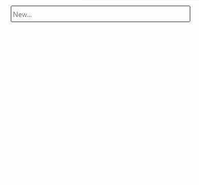
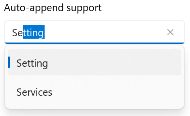
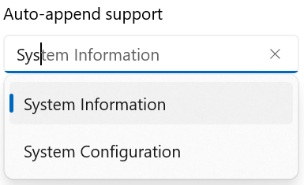
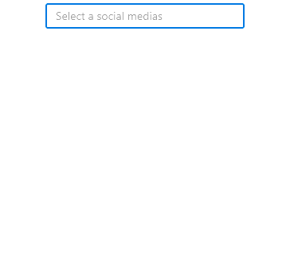
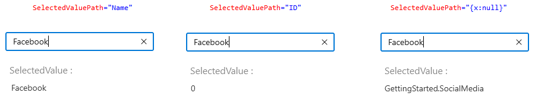
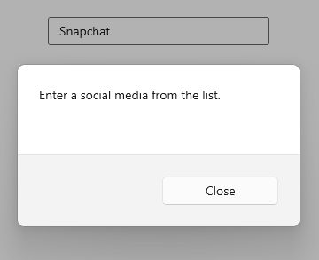

# Selection in WinUI AutoComplete (SfAutoComplete)

The [SfAutoComplete](https://help.syncfusion.com/cr/winui/Syncfusion.UI.Xaml.Editors.SfAutoComplete.html) allows users to select single or multiple items. The selection mode can be set by using the [SelectionMode](https://help.syncfusion.com/cr/winui/Syncfusion.UI.Xaml.Editors.SfAutoComplete.html#Syncfusion_UI_Xaml_Editors_SfAutoComplete_SelectionMode) property. There are two selection modes: `Single` and `Multiple`.

> **Requirements**: WinUI 3, Syncfusion WinUI Editors package.

## Single selection

The `AutoComplete` allows users to select a single item by entering the value using the keyboard and then selecting from the drop-down list. Press the `Enter` key or the `Tab` key to confirm the selection. The selected item can be retrieved from the [SelectedItem](https://help.syncfusion.com/cr/winui/Syncfusion.UI.Xaml.Editors.DropDownListBase.html#Syncfusion_UI_Xaml_Editors_DropDownListBase_SelectedItem) property.




//Model.cs
public class SocialMedia
{
    public string Name { get; set; }
    public int ID { get; set; }
}

//ViewModel.cs
public class SocialMediaViewModel
{
    public ObservableCollection<SocialMedia> SocialMedias { get; set; }
    public SocialMediaViewModel()
    {
        this.SocialMedias = new ObservableCollection<SocialMedia>();
        this.SocialMedias.Add(new SocialMedia() { Name = "Facebook", ID = 0 });
        this.SocialMedias.Add(new SocialMedia() { Name = "Google Plus", ID = 1 });
        this.SocialMedias.Add(new SocialMedia() { Name = "Instagram", ID = 2 });
        this.SocialMedias.Add(new SocialMedia() { Name = "LinkedIn", ID = 3 });
        this.SocialMedias.Add(new SocialMedia() { Name = "Skype", ID = 4 });
        this.SocialMedias.Add(new SocialMedia() { Name = "Telegram", ID = 5 });
        this.SocialMedias.Add(new SocialMedia() { Name = "Televzr", ID = 6 });
        this.SocialMedias.Add(new SocialMedia() { Name = "Tik Tok", ID = 7 });
        this.SocialMedias.Add(new SocialMedia() { Name = "Tout", ID = 8 });
        this.SocialMedias.Add(new SocialMedia() { Name = "Tumblr", ID = 9 });
        this.SocialMedias.Add(new SocialMedia() { Name = "Twitter", ID = 10 });
        this.SocialMedias.Add(new SocialMedia() { Name = "Vimeo", ID = 11 });
        this.SocialMedias.Add(new SocialMedia() { Name = "WhatsApp", ID = 12 });
        this.SocialMedias.Add(new SocialMedia() { Name = "YouTube", ID = 13 });
    }
}







<editors:SfAutoComplete
    SelectionMode="Single"
    ItemsSource="{Binding SocialMedias}"
    DisplayMemberPath="Name"
    TextMemberPath="Name"
    Width="250"
    x:Name="autoComplete" />




autoComplete.SelectionMode = AutoCompleteSelectionMode.Single;




## Multiple selection

The `AutoComplete` allows users to select multiple values by entering input and selecting items from the drop-down list. Multi-select mode can be enabled by setting the `SelectionMode` property to `Multiple`. Selected items are displayed with a customizable token representation. Each tokenized item can be removed by clicking its close button. The selected items can be retrieved from the [SelectedItems](https://help.syncfusion.com/cr/winui/Syncfusion.UI.Xaml.Editors.DropDownListBase.html#Syncfusion_UI_Xaml_Editors_DropDownListBase_SelectedItems) property.




<editors:SfAutoComplete
    SelectionMode="Multiple"
    ItemsSource="{Binding SocialMedias}"
    DisplayMemberPath="Name"
    TextMemberPath="Name"    
    Width="250"
    x:Name="autoComplete" />




autoComplete.SelectionMode = AutoCompleteSelectionMode.Multiple;




## Auto-append UI

The AutoComplete control provides auto-append support with text selection or as plain text. The auto-append UI is defined by using the `AppendType` property. There are two auto-append UI types: `TextWithSelection` and `Text`. When the auto-append UI is set to `Text`, the appended text appears with a faded foreground, similar to Windows 11. The default value of `AppendType` is `TextWithSelection`.

### Auto-append UI as TextWithSelection

When entering text in the selection box, if the `AppendType` property is set to `TextWithSelection`, the appended text appears with the selection.




<editors:SfAutoComplete AppendType="TextWithSelection">
</editors:SfAutoComplete>




### Auto-append UI as Text

When entering text in the selection box, if the `AppendType` property is set to `Text`, the appended text appears with a faded foreground.




<editors:SfAutoComplete AppendType="Text">
</editors:SfAutoComplete>




## Selection changed notification

When an item is selected from the drop-down list, the [SelectionChanged](https://help.syncfusion.com/cr/winui/Syncfusion.UI.Xaml.Editors.SfAutoComplete.html#Syncfusion_UI_Xaml_Editors_SfAutoComplete_SelectionChanged) event is triggered. The `AutoCompleteSelectionChangedEventArgs` contains the newly selected and removed items in the `AddedItems` and `RemovedItems` properties. The `AutoCompleteSelectionChangedEventArgs` contains the following properties:

 * [AddedItems](https://help.syncfusion.com/cr/winui/Syncfusion.UI.Xaml.Editors.AutoCompleteSelectionChangedEventArgs.html#Syncfusion_UI_Xaml_Editors_AutoCompleteSelectionChangedEventArgs_AddedItems) - Contains the items that were selected.
 * [RemovedItems](https://help.syncfusion.com/cr/winui/Syncfusion.UI.Xaml.Editors.AutoCompleteSelectionChangedEventArgs.html#Syncfusion_UI_Xaml_Editors_AutoCompleteSelectionChangedEventArgs_RemovedItems) - Contains the items that were unselected.




<editors:SfAutoComplete 
    SelectionChanged="OnSelectionChanged"
    TextMemberPath="Name"
    DisplayMemberPath="Name"
    ItemsSource="{Binding SocialMedias}" 
    Width="250"
    x:Name="autoComplete"/>





autoComplete.SelectionChanged += OnSelectionChanged;




The `SelectionChanged` event can be handled as follows.




private async void OnSelectionChanged(object sender, AutoCompleteSelectionChangedEventArgs e)
{
    var cd = new ContentDialog
    {
        Content = "Selected item was changed.",
        CloseButtonText = "Close"
    };

    cd.XamlRoot = this.Content.XamlRoot;
    var result = await cd.ShowAsync();
}




## Get the selected value

The [SelectedValuePath](https://help.syncfusion.com/cr/winui/Syncfusion.UI.Xaml.Editors.DropDownListBase.html#Syncfusion_UI_Xaml_Editors_DropDownListBase_SelectedValuePath) property allows you to specify a [SelectedValue](https://help.syncfusion.com/cr/winui/Syncfusion.UI.Xaml.Editors.DropDownListBase.html#Syncfusion_UI_Xaml_Editors_DropDownListBase_SelectedValue) for a `AutoComplete`'s `SelectedItem`. The `SelectedItem` represents an object in the `Items` collection, and the `AutoComplete` displays the value of the selected item's single property. The `SelectedValuePath` property specifies the path to the property that is used to determine the `SelectedValue` property's value. The default value of `SelectedValue` and `SelectedValuePath` is `null`.

For example, when you select any `SocialMedia.Name` in the `AutoComplete`, the `SelectedItem` property returns the `SocialMedia` data item that corresponds to the selected `SocialMedia.Name`. However, because the `SelectedValuePath` of this `AutoComplete` is set to `SocialMedia.ID`, the `SelectedValue` is set to the `SocialMedia.ID`.




<editors:SfAutoComplete 
    SelectedValuePath="ID"
    x:Name="autoComplete"
    TextMemberPath="Name"   
    DisplayMemberPath="Name"
    ItemsSource="{Binding SocialMedias}" 
    SelectionChanged="OnSelectionChanged"/>

<TextBlock Text="SelectedValue :"/>
<TextBlock x:Name="selectedValue"/>




autoComplete.SelectedValuePath = "ID";
autoComplete.SelectionChanged += OnSelectionChanged;







private void OnSelectionChanged(object sender, AutoCompleteSelectionChangedEventArgs e)
{
    selectedValue.Text = autoComplete.SelectedValue.ToString();
}




## Handle invalid input 

When the submitted text does not match any drop-down list item, the [InputSubmitted](https://help.syncfusion.com/cr/winui/Syncfusion.UI.Xaml.Editors.SfAutoComplete.html#Syncfusion_UI_Xaml_Editors_SfAutoComplete_InputSubmitted) event is triggered. The members of [AutoCompleteInputSubmittedEventArgs](https://help.syncfusion.com/cr/winui/Syncfusion.UI.Xaml.Editors.AutoCompleteInputSubmittedEventArgs.html) provide information about the entered text.

[Text](https://help.syncfusion.com/cr/winui/Syncfusion.UI.Xaml.Editors.AutoCompleteInputSubmittedEventArgs.html#Syncfusion_UI_Xaml_Editors_AutoCompleteInputSubmittedEventArgs_Text) - Gets the text entered in `AutoComplete`.

[Item](https://help.syncfusion.com/cr/winui/Syncfusion.UI.Xaml.Editors.AutoCompleteInputSubmittedEventArgs.html#Syncfusion_UI_Xaml_Editors_AutoCompleteInputSubmittedEventArgs_Item) - This property can be used to add the item to the selected item(s) or set to selected item which gets assigned.
If no item is assigned, then in single selection, entered text gets assigned to selected item. In multiple selection, no text will be added to selected items.

[Handled](https://help.syncfusion.com/cr/winui/Syncfusion.UI.Xaml.Editors.AutoCompleteInputSubmittedEventArgs.html#Syncfusion_UI_Xaml_Editors_AutoCompleteInputSubmittedEventArgs_Handled) - When set to `true`, the framework will not automatically update the selected item or selected item(s) of the `AutoComplete` to the new value.

By using the following code sample, you will display a dialog when submitting input ("Snap chat") that does not match the assigned `ItemsSource`.




<editors:SfAutoComplete 
    InputSubmitted="OnAutoCompleteInputSubmitted"
    ItemsSource="{Binding SocialMedias}"
    DisplayMemberPath="Name"
    TextMemberPath="Name"    
    x:Name="autoComplete"
    Width="250">
</editors:SfAutoComplete>





autoComplete.InputSubmitted += OnAutoCompleteInputSubmitted;




The `InputSubmitted` event can be handled as follows.




/// 

/// Occurs when the user submits some text that does not correspond to an item in the `AutoComplete` drop-down list.
/// 

private async void OnAutoCompleteInputSubmitted(object sender, Syncfusion.UI.Xaml.Editors.AutoCompleteInputSubmittedEventArgs e)
{
    var cd = new ContentDialog
    {
        Content = "Enter a social media from the list.",
        CloseButtonText = "Close"
    };

    cd.XamlRoot = this.Content.XamlRoot;
    var result = await cd.ShowAsync();
}




## Hide clear button in the editor

By default, the clear button `X` will be displayed in the editor of the `AutoComplete` control, which can be used to clear the entered input. You can hide the clear button by using the [ShowClearButton](https://help.syncfusion.com/cr/winui/Syncfusion.UI.Xaml.Editors.DropDownListBase.html#Syncfusion_UI_Xaml_Editors_DropDownListBase_ShowClearButton) property. The default value of the `ShowClearButton` property is `true`.




<editors:SfAutoComplete 
    ShowClearButton="False"
    ItemsSource="{Binding SocialMedias}"
    DisplayMemberPath="Name"
    TextMemberPath="Name"    
    x:Name="autoComplete"
    Width="250">
</editors:SfAutoComplete>





autoComplete.ShowClearButton = false;




## Troubleshooting

* **Selection does not update**: Ensure `SelectionMode` is set correctly and that the bound `ItemsSource` contains the expected items.
* **Tokens cannot be removed**: Confirm that `SelectionMode="Multiple"` is set; tokens only appear in multiple selection mode.
* **Clear button is always visible**: Set `ShowClearButton="False"` to hide the clear button.
* **`SelectionChanged` does not fire**: Verify that the event handler is wired up in XAML (`SelectionChanged="OnSelectionChanged"`) or in C# (`autoComplete.SelectionChanged += OnSelectionChanged;`).