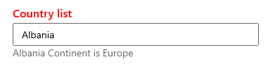

# UI Customization in WinUI AutoComplete (SfAutoComplete)

This section explains different UI customization available in [AutoComplete].

## Header for AutoComplete

The `AutoComplete` control header can be changed by using the [Header] or [HeaderTemplate] properties. The default value of `HeaderTemplate` is `null` and `Header` is `null`.




<editors:SfAutoComplete
    Width="250"
    Header="Favourite Country"
    ItemsSource="{Binding Countries}"
    DisplayMemberPath="Name"
    TextMemberPath="Name"
    SelectedIndex="2"
    x:Name="autoComplete">
    <editors:SfAutoComplete.HeaderTemplate>
        <DataTemplate>
            <TextBlock
                Foreground="Red"
                FontWeight="SemiBold"
                FontSize="16"
                Text="{Binding}" />
        </DataTemplate>
    </editors:SfAutoComplete.HeaderTemplate>
</editors:SfAutoComplete>




## Description for AutoComplete

The `AutoComplete` control description can be changed by using the [Description] property. The default value of `Description` is `null`.




<editors:SfAutoComplete
    Width="280"
    Header="Favourite Country"
    ItemsSource="{Binding Coutries}"
    DisplayMemberPath="Name"
    TextMemberPath="Name"
    Description="Favourite Country list"
    x:Name="autoComplete">
    <editors:SfAutoComplete.HeaderTemplate>
        <DataTemplate>
            <TextBlock
                Foreground="Red"
                FontWeight="SemiBold"
                FontSize="16"
                Text="{Binding}" />
        </DataTemplate>
    </editors:SfAutoComplete.HeaderTemplate>
</editors:SfAutoComplete>




## Placeholder text

You can prompt the user with any information by using the [PlaceholderText] property. This text will be displayed only when no item is selected or edit text is empty. The default value of `PlaceholderText` property is `string.Empty` (No string will be displayed).




<editors:SfAutoComplete
    Width="250"
    ItemsSource="{Binding Countries}"
    DisplayMemberPath="Name"
    TextMemberPath="Name"
    PlaceholderText="Select a country"
    x:Name="autoComplete"/>




autoComplete.PlaceholderText = "Select a country";




### Change foreground of placeholder text

The placeholder texts’ foreground can be changed by using the [PlaceholderForeground] property. The default value of `PlaceholderForeground` property is `null`.




<editors:SfAutoComplete
    Width="250"
    ItemsSource="{Binding Countries}"
    DisplayMemberPath="Name"
    TextMemberPath="Name"
    PlaceholderForeground="Red"
    PlaceholderText="Select a country"
    x:Name="autoComplete"/>




autoComplete.PlaceholderForeground = new SolidColorBrush(Colors.Red);




## Customize the edit mode TextBox

The appearance of the edit mode textbox in `Au` control can be customized by using the [TextBoxStyle] property. The default value of `TextBoxStyle` is `null`.

N> `TextBoxStyle` will only have an effect in single selection editable mode.




<editors:SfAutoComplete
    Width="250"
    SelectionMode="Single"
    ItemsSource="{Binding Countries}"
    DisplayMemberPath="Name"
    TextMemberPath="Name"
    ShowClearButton="False"
    x:Name="autoComplete">
    <editors:SfAutoComplete.TextBoxStyle>
        
    </editors:SfAutoComplete.TextBoxStyle>
</editors:SfAutoComplete>




## Customize AutoCompleteItem 

The [ItemTemplate] property helps you to decorate drop-down items using the custom templates. The default value of `ItemTemplate` is `null`. The following example shows how to customize drop-down items using templates.




<editor:SfAutoComplete x:Name="AutoCompleteItemTemplate"
                           Width="280"
                           Margin="10"
                           Header="ItemTemplate customization"
                           Grid.Row="2"
                           TextMemberPath="Name"
                           Grid.Column="0"
                           ItemsSource="{Binding Countries}">
            <editor:SfAutoComplete.ItemTemplate>
                <DataTemplate>
                    <StackPanel Orientation="Horizontal">
                        <TextBlock x:Name="product" 
                                   VerticalAlignment="Center" 
                                   Foreground="Red" 
                                   Text="{Binding Name}" />
                    </StackPanel>
                </DataTemplate>
            </editor:SfAutoComplete.ItemTemplate>
        </editor:SfAutoComplete>




### Customize AutoCompleteItem based on condition

The [ItemTemplateSelector] property helps you to decorate drop-down items conditionally based on its content using the custom templates. The default value of `ItemTemplateSelector` is `null`.




public class ListViewModel : NotificationObject
    {
        private ObservableCollection<Employee> employees;

        public ListViewModel()
        {
            this.SelectionMode = AutoCompleteSelectionMode.Multiple;
            this.PopulateEmployeesData();
        }

        public ObservableCollection<Employee> Employees
        {
            get
            {
                return employees;
            }
            set
            {
                employees = value;
                this.RaisePropertyChanged(nameof(this.Employees));
            }
        }

        private void PopulateEmployeesData()
        {
            this.Employees = new ObservableCollection<Employee>();
            this.Employees.Add(new Employee
            {
                Name = "Anne Dodsworth",
                ProfilePicture = new BitmapImage(new Uri(@"ms-appx:///Assets/ComboBox/Employees/Employee1.png", UriKind.RelativeOrAbsolute)),
                Designation= "Developer",
                Country= "USA",
            });
            this.Employees.Add(new Employee
            {
                Name = "Andrew Fuller",
                ProfilePicture = new BitmapImage(new Uri(@"ms-appx:///Assets/ComboBox/Employees/Employee7.png", UriKind.RelativeOrAbsolute)),
                Designation = "Team Lead",
                Country = "England",
            });
            this.Employees.Add(new Employee
            {
                Name = "Emilio Alvaro",
                ProfilePicture = new BitmapImage(new Uri(@"ms-appx:///Assets/ComboBox/Employees/Employee5.png", UriKind.RelativeOrAbsolute)),
                Designation = "Product Manager",
                Country = "England",
            });
            this.Employees.Add(new Employee
            {
                Name = "Janet Leverling",
                ProfilePicture = new BitmapImage(new Uri(@"ms-appx:///Assets/ComboBox/Employees/Employee3.png", UriKind.RelativeOrAbsolute)),
                Designation = "HR",
                Country = "USA",
            });
            this.Employees.Add(new Employee
            {
                Name = "Laura Callahan",
                ProfilePicture = new BitmapImage(new Uri(@"ms-appx:///Assets/ComboBox/Employees/Employee2.png", UriKind.RelativeOrAbsolute)),
                Designation = "Product Manager",
                Country = "USA",
            });
            this.Employees.Add(new Employee
            {
                Name = "Margaret Peacock",
                ProfilePicture = new BitmapImage(new Uri(@"ms-appx:///Assets/ComboBox/Employees/Employee6.png", UriKind.RelativeOrAbsolute)),
                Designation = "Developer",
                Country = "USA",
            });
            this.Employees.Add(new Employee
            {
                Name = "Michael Suyama",
                ProfilePicture = new BitmapImage(new Uri(@"ms-appx:///Assets/ComboBox/Employees/Employee9.png", UriKind.RelativeOrAbsolute)),
                Designation = "Team Lead",
                Country = "USA",
            });
            this.Employees.Add(new Employee
            {
                Name = "Nancy Davolio",
                ProfilePicture = new BitmapImage(new Uri(@"ms-appx:///Assets/ComboBox/Employees/Employee4.png", UriKind.RelativeOrAbsolute)),
                Designation = "Developer",
                Country = "USA",
            });
            this.Employees.Add(new Employee
            {
                Name = "Robert King",
                ProfilePicture = new BitmapImage(new Uri(@"ms-appx:///Assets/ComboBox/Employees/Employee8.png", UriKind.RelativeOrAbsolute)),
                Designation = "Developer",
                Country = "England",
            });
            this.Employees.Add(new Employee
            {
                Name = "Steven Buchanan",
                ProfilePicture = new BitmapImage(new Uri(@"ms-appx:///Assets/ComboBox/Employees/Employee10.png", UriKind.RelativeOrAbsolute)),
                Designation = "CEO",
                Country = "England",
            });
        }

    }







<Grid>
    <editors:SfAutoComplete x:Name="sfautocomplete1"
                           Width="280"
                           Margin="10"
                           HorizontalAlignment="Center"
                           VerticalAlignment="Center"
                           TextMemberPath="Name"   
                           PlaceholderText="Select a employee"
                           SelectedItem="{Binding SelectedEmployee,Mode=TwoWay}"  TextSubmitted="sfautocomplete1_TextSubmitted"               
                           ItemsSource="{Binding Employees}" SelectionChanged="sfautocomplete1_SelectionChanged">

                        <editors:SfAutoComplete.ItemTemplate>
                            <DataTemplate>
                                <Grid
                                    Margin="0,5"
                                    HorizontalAlignment="Stretch"
                                    VerticalAlignment="Stretch">
                                    <Grid.ColumnDefinitions>
                                        <ColumnDefinition Width="48"/>
                                        <ColumnDefinition Width="*"/>
                                    </Grid.ColumnDefinitions>
                                    <Image 
                                        Grid.Column="0"
                                        HorizontalAlignment="Center"
                                        VerticalAlignment="Center" 
                                        Source="{Binding ProfilePicture}" 
                                        Stretch="Uniform"/>
                                    <StackPanel
                                        Grid.Column="1"
                                        Margin="15,0,0,0"
                                        HorizontalAlignment="Left"
                                        VerticalAlignment="Center">
                                        <TextBlock 
                                            Opacity="0.87"
                                            FontSize="14"
                                            Text="{Binding Name}"/>
                                        <TextBlock 
                                            Opacity="0.54"
                                            FontSize="12"
                                            Text="{Binding Designation}"/>
                                    </StackPanel>
                                </Grid>
                            </DataTemplate>
                        </editors:SfAutoComplete.ItemTemplate>
                    </editors:SfAutoComplete>
</Grid>




## How to change DropDown MaxHeight

The maximum height of the drop-down can be changed by using the [MaxDropDownHeight] property of `AutoComplete` control. The default value of `MaxDropDownHeight` property is `288`. 

 N> If the `MaxDropDownHeight` is too small compared to the populated items, scroll viewer will be automatically shown to navigate the hidden items.




<editors:SfAutoComplete x:Name="autoComplete"
                    Width="250"
                    MaxDropDownHeight="200"
                    ItemsSource="{Binding Countries}"
                    DisplayMemberPath="Name"
                    TextMemberPath="Name">
</editors:SfAutoComplete>




autoComplete.MaxDropDownHeight = 200;




