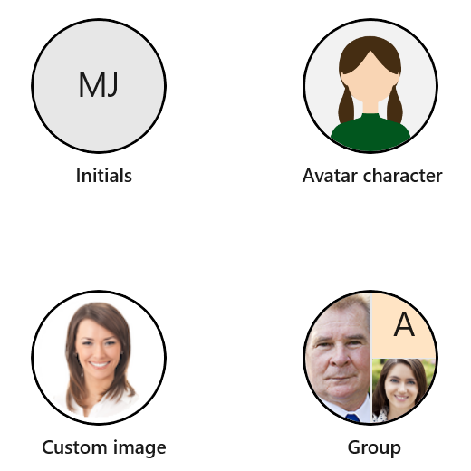

# WinUI Avatar View (SfAvatarView) Overview

The AvatarView control provides a graphical representation of user image that allows you to customize the view by adding image, background color, icon, text, etc.

## Key features

* Supports for adding image, initials and group.
* Customizes the Height, Width, BorderBrush, Background, FontSize and CornerRadius of the view.
* `GroupView`: Supports to add maximum three custom images or initials in a single view.
* Supports different types of visual styles. 