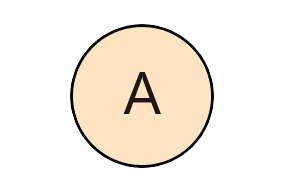
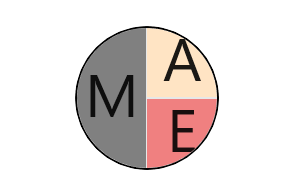

# Content Types in WinUI AvatarView

## Content Types

The `AvatarView` control allows you to display the view in five different ways:

* `Default` - Displays the default avatar character when initializing without any other source such as image, initials or group.

* `Initials` - Displays the initials in the view.

* `AvatarCharacter` - Displays the avatar character image in the view.

* `CustomImage` - Displays a custom image in the view.

* `Group` - Displays a maximum of three images or initials in a single view.

## Default

Default content type is used for displaying the default avatar character when initializing without the initials, custom image, or group view types.Refer to the Getting Started Documentation in SfAvatarView.

## Initials 

When using the `ContentType` as initials, you need to set the initial character using the following properties:

* `InitialsType` - Defines the type of characters to be displayed.  
* `AvatarName` - Defines the initials to be displayed.

### InitialsType

The `InitialsType` contains the following two types:

* SingleCharacter
* DoubleCharacter

You must set the `AvatarName` string property for displaying the initial value in the AvatarView.

#### SingleCharacter

The `SingleCharacter` is used for displaying the first character in the string you have set in the `AvatarName` property.




<syncfusion:SfAvatarView ContentType="Initials"
                         AvatarSize="ExtraLarge"
                         AvatarName="Alex"
                         Background="Bisque"
                         BorderBrush="Black">
</syncfusion:SfAvatarView>



             
SfAvatarView avatarView = new SfAvatarView();
avatarView.AvatarName = "Alex";
avatarView.ContentType = AvatarContentType.Initials;
avatarView.AvatarSize = AvatarSize.ExtraLarge;
avatarView.Background = new SolidColorBrush(Colors.Bisque);
avatarView.BorderBrush = new SolidColorBrush(Colors.Black);




### DoubleCharacter

The `DoubleCharacter` is used for displaying a two-characters text you have set in the `AvatarName` property. If the initials contain one word, it shows the first and last letters of the single string. If it contains two or more words, it displays the first letter of the first string and first letter of the second string.




<syncfusion:SfAvatarView ContentType="Initials"
                         AvatarSize="ExtraLarge"
                         AvatarName="Alex"
                         InitialsType="DoubleCharacter"
                         Background="Bisque"
                         BorderBrush="Black">
</syncfusion:SfAvatarView>



          
SfAvatarView avatarView = new SfAvatarView();
avatarView.AvatarName = "Alex";
avatarView.ContentType = AvatarContentType.Initials;
avatarView.AvatarSize = AvatarSize.ExtraLarge;
avatarView.InitialsType = AvatarInitialsType.DoubleCharacter;
avatarView.Background = new SolidColorBrush(Colors.Bisque);
avatarView.BorderBrush = new SolidColorBrush(Colors.Black);




## Custom image

You can add a custom image by setting the `ImageSource` property. Refer to the Getting Started Documentation in SfAvatarView.

## Avatar characters

You can set the default images that already present in avatar view by setting the `AvatarCharacter` property.




<syncfusion:SfAvatarView ContentType="AvatarCharacter"
                         AvatarSize="ExtraLarge"
                         AvatarCharacter="Avatar15"
                         BorderBrush="Black">
</syncfusion:SfAvatarView>



            
SfAvatarView avatarView = new SfAvatarView();
avatarView.ContentType = AvatarContentType.AvatarCharacter;
avatarView.AvatarSize = AvatarSize.ExtraLarge;
avatarView.AvatarCharacter = AvatarCharacter.Avatar15;
avatarView.BorderBrush = new SolidColorBrush(Colors.Black);
            



## GroupView 

You can add maximum three images or initials in the same view using a GroupView type.

`InitialsMemberPath`: Displays the initials in the group view.
`ImageSourceMemberPath`: Displays the images in the group view.
`BackgroundColorMemberPath`: Sets the background color of the group view.
`InitialsColorMemberPath`: Sets the color for the initials in the group view.



public class Employee
{
   private string name;

   public string Name
   {
      get { return name; }
      set { name = value; }
   }

   private string imagesource;

   public string ImageSource
   {
      get { return imagesource; }
      set { imagesource = value; }
   }

   private Color colors;

   public Color Colors
   {
      get { return colors; }
      set { colors = value; }
   }

   private Color initialsColors;

   public Color InitialsColors
   {
      get { return initialsColors; }
      set { initialsColors = value; }
   }

}

public class EmployeeViewModel
{
   private ObservableCollection<Employee> collectionimage;

   public ObservableCollection<Employee> CollectionImage
   {
      get { return collectionimage; }
      set { collectionimage = value; }
   }

   public EmployeeViewModel()
   {
      CollectionImage = new ObservableCollection<Employee>();
      CollectionImage.Add(new Employee { Name="Mike" , ImageSource = "mike.png",Colors=Colors.Gray });
      CollectionImage.Add(new Employee { Name="Alex",ImageSource= "alex.png", Colors = Colors.Bisque });
      CollectionImage.Add(new Employee { Name="Ellanaa", ImageSource= "ellanaa.png",Colors=Colors.LightCoral });
   }

}






<Page.DataContext>
    <local:EmployeeViewModel/>
</Page.DataContext>

<syncfusion:SfAvatarView ContentType="Group"   
                         GroupSource="{Binding CollectionImage}"
                         InitialsMemberPath="Name"
                         BackgroundColorMemberPath="Colors"
                         ImageSourceMemberPath="ImageSource"
                         AvatarSize="ExtraLarge"
                         BorderBrush="Black">
</syncfusion:SfAvatarView>




public partial class MainWindow : Window
{
   EmployeeViewModel emp;
   public MainPage()
   {
      emp = new EmployeeViewModel();
      SfAvatarView avatarView = new SfAvatarView();
      avatarView.ContentType = AvatarContentType.Group;
      avatarView.GroupSource = emp.CollectionImage;
      avatarView.ImageSourceMemberPath = "ImageSource";
      avatarView.InitialsMemberPath = "Name";
      avatarView.BackgroundColorMemberPath = "Colors";
      avatarView.AvatarSize = AvatarSize.ExtraLarge;
      avatarView.BorderBrush = new SolidColorBrush(Colors.Black);
      page.DataContext = emp;
   }
}




## Add initials only in GroupView

You can set the initials only in the group view by setting the `InitialsMemberPath` alone. It is demonstrated in the following code sample.





<ContentPage.BindingContext>
    <local:EmployeeViewModel/>
</ContentPage.BindingContext>

<syncfusion:SfAvatarView ContentType="Group"   
                         GroupSource="{Binding CollectionImage}"
                         InitialsMemberPath="Name"
                         BackgroundColorMemberPath="Colors"
                         InitialsColorMemberPath="InitialsColors"
                         AvatarSize="ExtraLarge"
                         BorderBrush="Black">
</syncfusion:SfAvatarView>





public partial class MainWindow : Window
{
   EmployeeViewModel emp;
   public MainPage()
   {
      emp = new EmployeeViewModel();
      SfAvatarView avatarView = new SfAvatarView();
      avatarView.ContentType = AvatarContentType.Group;
      avatarView.GroupSource = emp.CollectionImage;
      avatarView.InitialsMemberPath = "Name";
      avatarView.InitialsColorMemberPath = "InitialsColors";
      avatarView.BackgroundColorMemberPath = "Colors";
      avatarView.AvatarSize = AvatarSize.ExtraLarge;
      avatarView.BorderBrush = new SolidColorBrush(Colors.Black);
      page.DataContext = emp;
   }
}




## Add both image and initials in a GroupView

You have to set both the image and initials based on what should be added in the collection. If the image needs to be added, set `ImageSourceMemberPath`, or if initials need to be added, set `InitialsMemberPath`. This is demonstrated in the following code snippet.




public class EmployeeViewModel
{
   public EmployeeViewModel()
   {
      CollectionImage = new ObservableCollection<Employee>();
      CollectionImage.Add(new Employee { ImageSource="mike.png" });
      CollectionImage.Add(new Employee { Name= "alex", Colors=Colors.White });
      CollectionImage.Add(new Employee { ImageSource= "ellanaa.png" });
   }     
}




