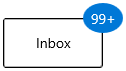
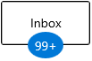
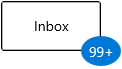
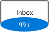
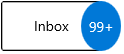

# Alignment and positioning of WinUI Badge (SfBadge)

This section explains the alignment and positioning functionalities available in the WinUI [Badge](https://help.syncfusion.com/cr/winui/Syncfusion.UI.Xaml.Notifications.SfBadge.html) control.

## Structure of Badge control

## Alignment of Badge

you can align the `Badge` either horizontally or vertically by using the `HorizontalAlignment` or `VerticalAlignment` properties. The default value of `HorizontalAlignment` property is `Right` and `VerticalAlignment` property is `Top`.

<table>

<tr>
<td class="invisible" ></td>
<th style="text-align:center" colspan = "4">HorizontalAlignment</th>
</tr>

<tr>
<th>VerticalAlignment</th>
<td>Left</td>
<td>Center</td>
<td>Right</td>
<td>Stretch</td>
</tr>

<tr>
<td>Top</td>
<td></td>
<td></td>
<td></td>
<td></td>
</tr>

<tr>
<td>Center</td>
<td></td>
<td></td>
<td></td>
<td></td>
</tr>

<tr>
<td>Bottom</td>
<td></td>
<td></td>
<td></td>
<td></td>
</tr>

<tr>
<td>Stretch</td>
<td></td>
<td></td>
<td></td>
<td></td>
</tr>
</table>




<syncfusion:BadgeContainer Name="badgeContainer"  >
    <syncfusion:BadgeContainer.Badge>
        <syncfusion:SfBadge HorizontalAlignment="Left"
                            VerticalAlignment="Center"
                            Content="99+"
                            Name="badge"/>
    </syncfusion:BadgeContainer.Badge>
    <syncfusion:BadgeContainer.Content>
        <Button Content="Inbox">
        </Button>
    </syncfusion:BadgeContainer.Content>
</syncfusion:BadgeContainer>




badge.HorizontalAlignment = HorizontalAlignment.Left;
badge.VerticalAlignment = VerticalAlignment.Center;
badge.Content = "99+";




N> Download demo application from [GitHub](https://github.com/SyncfusionExamples/syncfusion-winui-badge-control-examples/blob/master/Samples/Badge_Features)

## Positioning of Badge

You can change the horizontal or vertical position of the `Badge` either inside, outside or in the middle by using the [HorizontalAnchor](https://help.syncfusion.com/cr/winui/Syncfusion.UI.Xaml.Notifications.SfBadge.html#Syncfusion_UI_Xaml_Notifications_SfBadge_HorizontalAnchor) and [VerticalAnchor](https://help.syncfusion.com/cr/winui/Syncfusion.UI.Xaml.Notifications.SfBadge.html#Syncfusion_UI_Xaml_Notifications_SfBadge_VerticalAnchor) properties. The default value of `HorizontalAnchor` and `VerticalAnchor` properties is `Center`.




<syncfusion:BadgeContainer Name="badgeContainer"  >
    <syncfusion:BadgeContainer.Badge>
        <syncfusion:SfBadge HorizontalAnchor="Outside"
                            VerticalAnchor="Center"
                            Content="99+"
                            Name="badge"/>
    </syncfusion:BadgeContainer.Badge>
    <syncfusion:BadgeContainer.Content>
        <Button Content="Inbox">
        </Button>
    </syncfusion:BadgeContainer.Content>
</syncfusion:BadgeContainer>




badge.HorizontalAnchor = BadgeAnchor.Outside;
badge.VerticalAnchor = BadgeAnchor.Center;
badge.Content = "99+";




N> Download demo application from [GitHub](https://github.com/SyncfusionExamples/syncfusion-winui-badge-control-examples/blob/master/Samples/Badge_Features)

## Badge content alignment

you can place the `Badge` content either horizontally or vertically by using the `HorizontalContentAlignment` or `VerticalContentAlignment` properties. The default value of `HorizontalContentAlignment` and `VerticalContentAlignment` properties is `Center`.




<syncfusion:BadgeContainer Name="badgeContainer"  >
    <syncfusion:BadgeContainer.Badge>
        <syncfusion:SfBadge HorizontalContentAlignment="Right"
                            VerticalContentAlignment="Top"
                            Content="99+"
                            Name="badge"/>
    </syncfusion:BadgeContainer.Badge>
    <syncfusion:BadgeContainer.Content>
        <Button Content="Inbox">
        </Button>
    </syncfusion:BadgeContainer.Content>
</syncfusion:BadgeContainer>




badge.HorizontalContentAlignment = HorizontalAlignment.Right;
badge.VerticalContentAlignment = VerticalAlignment.Top;
badge.Content = "99+";




N> Download demo application from [GitHub](https://github.com/SyncfusionExamples/syncfusion-winui-badge-control-examples/blob/master/Samples/Badge_Features)