# Alignment and positioning in WinUI Badge

This section explains the alignment and positioning functionalities available in the WinUI [Badge](https://help.syncfusion.com/cr/winui/Syncfusion.UI.Xaml.Notifications.SfBadge.html) control.

## Alignment of Badge

you can align the `Badge` either horizontally or vertically by using the `HorizontalAlignment` or `VerticalAlignment` properties. The default value of `HorizontalAlignment` property is `Right` and `VerticalAlignment` property is `Top`.

<table>

<tr>
<td class="invisible" ></td>
<th colspan = "4">HorizontalAlignment</th>
</tr>

<tr>
<th>VerticalAlignment</th>
<td>Left</td>
<td>Center</td>
<td>Right</td>
<td>Stretch</td>
</tr>

<tr>
<td>Top</td>
<td>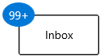</td>
<td>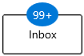</td>
<td></td>
<td>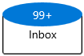</td>
</tr>

<tr>
<td>Center</td>
<td>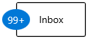</td>
<td>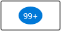</td>
<td>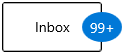</td>
<td>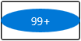</td>
</tr>

<tr>
<td>Bottom</td>
<td>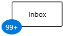</td>
<td></td>
<td></td>
<td></td>
</tr>

<tr>
<td>Stretch</td>
<td>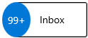</td>
<td>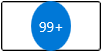</td>
<td></td>
<td>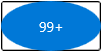</td>
</tr>
</table>




<notification:BadgeContainer Name="badgeContainer"  >
    <notification:BadgeContainer.Badge>
        <notification:SfBadge HorizontalAlignment="Left"
                              VerticalAlignment="Center"
                              Content="99+"
                              Name="badge"/>
    </notification:BadgeContainer.Badge>
    <notification:BadgeContainer.Content>
        <Button Content="Inbox">
        </Button>
    </notification:BadgeContainer.Content>
</notification:BadgeContainer>




badge.HorizontalAlignment = HorizontalAlignment.Left;
badge.VerticalAlignment = VerticalAlignment.Center;
badge.Content = "99+";




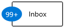

N> Download demo application from [GitHub](https://github.com/SyncfusionExamples/syncfusion-winui-badge-control-examples/blob/master/Samples/Badge_Features)

## Positioning of Badge

You can change the horizontal or vertical position of the `Badge` either inside, outside or in the middle by using the [HorizontalAnchor](https://help.syncfusion.com/cr/winui/Syncfusion.UI.Xaml.Notifications.SfBadge.html#Syncfusion_UI_Xaml_Notifications_SfBadge_HorizontalAnchor) and [VerticalAnchor](https://help.syncfusion.com/cr/winui/Syncfusion.UI.Xaml.Notifications.SfBadge.html#Syncfusion_UI_Xaml_Notifications_SfBadge_VerticalAnchor) properties. It will be placed based on the value of `HorizontalAlignment` and `VerticalAlignment` properties. The default value of `HorizontalAnchor` and `VerticalAnchor` properties is `Center`.

For example, you will see how the `HorizontalAnchor` and  `VerticalAnchor` values working based on the `HorizontalAlignment` and `VerticalAlignment` values. Here, the value of `HorizontalAlignment` properties is `Right` and `VerticalAlignment` property is `Top`.

<table>

<tr>
<td class="invisible" ></td>
<th colspan = "4">HorizontalAnchor</th>
</tr>

<tr>
<th>VerticalAnchor</th>
<td>Inside</td>
<td>Center</td>
<td>OutSide</td>
</tr>

<tr>
<td>Inside</td>
<td></td>
<td>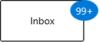</td>
<td></td>
</tr>

<tr>
<td>Center</td>
<td>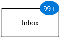</td>
<td>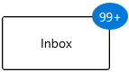</td>
<td></td>
</tr>

<tr>
<td>Outside</td>
<td></td>
<td>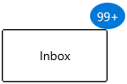</td>
<td></td>
</tr>
</table>




<notification:BadgeContainer Name="badgeContainer"  >
    <notification:BadgeContainer.Badge>
        <notification:SfBadge HorizontalAnchor="Outside"
                              VerticalAnchor="Center"
                              Content="99+"
                              Name="badge"/>
    </notification:BadgeContainer.Badge>
    <notification:BadgeContainer.Content>
        <Button Content="Inbox">
        </Button>
    </notification:BadgeContainer.Content>
</notification:BadgeContainer>




badge.HorizontalAnchor = BadgeAnchor.Outside;
badge.VerticalAnchor = BadgeAnchor.Center;
badge.Content = "99+";




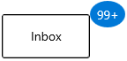

N> Download demo application from [GitHub](https://github.com/SyncfusionExamples/syncfusion-winui-badge-control-examples/blob/master/Samples/Badge_Features)

## Place the Badge any where on the container

If you want to place the `Badge` anywhere on the container, use the [HorizontalPosition](https://help.syncfusion.com/cr/winui/Syncfusion.UI.Xaml.Notifications.SfBadge.html#Syncfusion_UI_Xaml_Notifications_SfBadge_HorizontalPosition) or [VerticalPosition](https://help.syncfusion.com/cr/winui/Syncfusion.UI.Xaml.Notifications.SfBadge.html#Syncfusion_UI_Xaml_Notifications_SfBadge_VerticalPosition) properties. The value range for `HorizontalPosition` and `VerticalPosition` properties is `0` to `1`. The default value of `HorizontalPosition` property is `1` and `VerticalPosition` property is `0`.




<notification:BadgeContainer>
    <notification:BadgeContainer.Content> 
        <PersonPicture Width="100"
                       Height="100"
                       ProfilePicture="/Images/avatar.png"/>    
    </notification:BadgeContainer.Content>
    <notification:BadgeContainer.Badge>
        <notification:SfBadge x:Name="badge3"
                              Shape="None"
                              HorizontalPosition="0.9"
                              VerticalPosition="0.8">
            <Ellipse Width="20" Height="20" Fill="LimeGreen"/>
        </notification:SfBadge>
    </notification:BadgeContainer.Badge>
</notification:BadgeContainer>




badge.HorizontalPosition = 0.9;
badge.VerticalPosition = 0.8;




## Custom alignment and positioning of Badge

By using the `HorizontalAlignment`, `VerticalAlignment`, `HorizontalAnchor` and `VerticalAnchor` properties, you can place `Badge` only at particular position. If you want to place the `Badge` at custom position, use the `HorizontalPosition` & `VerticalPosition` properties and [HorizontalAnchorPosition](https://help.syncfusion.com/cr/winui/Syncfusion.UI.Xaml.Notifications.SfBadge.html#Syncfusion_UI_Xaml_Notifications_SfBadge_HorizontalAnchorPosition) & [VerticalAnchorPosition](https://help.syncfusion.com/cr/winui/Syncfusion.UI.Xaml.Notifications.SfBadge.html#Syncfusion_UI_Xaml_Notifications_SfBadge_VerticalAnchorPosition) properties. This will effective only on by setting the `HorizontalAnchor` and `VerticalAnchor` properties value as `Custom`.  The value range for `HorizontalAnchorPosition` and `VerticalAnchorPosition` properties is `0` to`1`. The default value of `HorizontalAnchorPosition`and `VerticalAnchorPosition` properties is `0`.

For example, you will see how the  `HorizontalPosition` and `HorizontalAnchorPosition` values working based on the `VerticalAnchorPosition` and `VerticalPosition` values. Here,  `VerticalPosition` and `VerticalAnchorPosition` properties value is `0`.

<table>

<tr>
<td class="invisible" ></td>
<th colspan = "3">HorizontalAnchorPosition
</th>
</tr>

<tr>
<th>HorizontalPosition</th>
<td>0</td>
<td >0.5</td>
<td>1</td>
</tr>

<tr>
<td>0</td>
<td></td>
<td></td>
<td></td>
</tr>

<tr>
<td>0.5</td>
<td></td>
<td>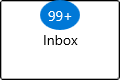</td>
<td></td>
</tr>

<tr>
<td>1</td>
<td></td>
<td></td>
<td></td>
</tr>
</table>




<notification:BadgeContainer Name="badgeContainer"  >
    <notification:BadgeContainer.Badge>
        <notification:Badge HorizontalAnchorPosition="0.2"
                            VerticalAnchorPosition="0" 
                            HorizontalAnchor="Custom"
                            VerticalAnchor="Custom"
                            HorizontalPosition="0"
                            VerticalPosition="0"
                            Content="99+"
                            Name="badge"/>
    </notification:BadgeContainer.Badge>
    <notification:BadgeContainer.Content>
        <Button Content="Inbox">
        </Button>
    </notification:BadgeContainer.Content>
</notification:BadgeContainer>




badge.HorizontalAnchor = BadgeAnchor.Custom;
badge.VerticalAnchor = BadgeAnchor.Custom;
badge.HorizontalAnchorPosition = 0.2;
badge.VerticalAnchorPosition = 0;
badge.HorizontalPosition = 0;
badge.VerticalPosition  0;
badge.Content = "99+";




## Badge content alignment

you can place the `Badge` content either horizontally or vertically by using the `HorizontalContentAlignment` or `VerticalContentAlignment` properties. The default value of `HorizontalContentAlignment` and `VerticalContentAlignment` properties is `Center`.




<notification:BadgeContainer Name="badgeContainer"  >
    <notification:BadgeContainer.Badge>
        <notification:SfBadge HorizontalContentAlignment="Right"
                              VerticalContentAlignment="Top"
                              Content="99+"
                              Name="badge"/>
    </notification:BadgeContainer.Badge>
    <notification:BadgeContainer.Content>
        <Button Content="Inbox">
        </Button>
    </notification:BadgeContainer.Content>
</notification:BadgeContainer>




badge.HorizontalContentAlignment = HorizontalAlignment.Right;
badge.VerticalContentAlignment = VerticalAlignment.Top;
badge.Content = "99+";




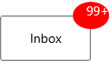

N> Download demo application from [GitHub](https://github.com/SyncfusionExamples/syncfusion-winui-badge-control-examples/blob/master/Samples/Badge_Features)

## Padding for Badge content

By default, `Badge` control size automatically assigned based on its content. You can change the left, right, top, bottom content spacing of a `Badge` control by using the `Padding` property. The default value of `Padding` property is `0,0,0,0`.




<notification:BadgeContainer Name="badgeContainer">
    <notification:BadgeContainer.Badge>
        <notification:SfBadge Padding="10"
                              Content="10"
                              Name="badge"/>
    </notification:BadgeContainer.Badge>
    <notification:BadgeContainer.Content>
        <Button Content="Inbox">
        </Button>
    </notification:BadgeContainer.Content>
</notification:BadgeContainer>




badge.Padding = new Thickness() { Bottom = 10, Left = 10, Right = 10, Top = 10 };
badge.Content = "10";




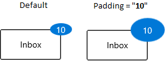

N> Download demo application from [GitHub](https://github.com/SyncfusionExamples/syncfusion-winui-badge-control-examples/blob/master/Samples/Badge_Features)

## Auto re-positioning support

If you change the container size, `Badge` will be repositioned automatically to the existing position on the container.




<notification:BadgeContainer Name="badgeContainer">
    <notification:BadgeContainer.Badge>
        <notification:SfBadge Content="99+"
                              Name="badge"/>
    </notification:BadgeContainer.Badge>
    <notification:BadgeContainer.Content>
        <Button Content="Inbox">
        </Button>
    </notification:BadgeContainer.Content>
</notification:BadgeContainer>




badge.Content = "10";




