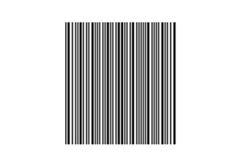

# Barcode Customization
## Background
The Barcode background color can be changed using [Background](https://docs.microsoft.com/en-us/dotnet/api/system.windows.controls.control.background?view=netcore-3.1#System_Windows_Controls_Control_Background) property.




<syncfusion:SfBarcode x:Name="barcode" Background="Orange" Value="1010111011" Height="150" />


 

## Foreground
The Barcode foreground color can be changed using [Foreground](https://docs.microsoft.com/en-us/dotnet/api/system.windows.controls.control.foreground?view=netcore-3.1#System_Windows_Controls_Control_Foreground) property.




<syncfusion:SfBarcode x:Name="barcode" Foreground="White" Value="1010111011" Height="150" />


 

## Module
 The width ratio of the wide and narrow bars can be customized using [Module](https://help.syncfusion.com/cr/winui/Syncfusion.UI.Xaml.Controls.Barcode.SfBarcode.html#Syncfusion_UI_Xaml_Controls_Barcode_SfBarcode_Module) property. The following code snippet explains that how the [Module](https://help.syncfusion.com/cr/winui/Syncfusion.UI.Xaml.Controls.Barcode.SfBarcode.html#Syncfusion_UI_Xaml_Controls_Barcode_SfBarcode_Module) property is used,




<syncfusion:SfBarcode x:Name="barcode" Module="1" Value="48625310" ShowValue="False" Height="150" />




