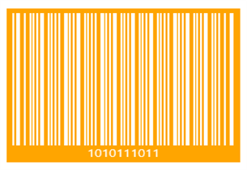

# Barcode customization

## Background
The Barcode background color can be changed using [Background](https://docs.microsoft.com/en-us/dotnet/api/system.windows.controls.control.background?view=netcore-3.1#System_Windows_Controls_Control_Background) property.




<syncfusion:SfBarcode x:Name="barcode" Background="Orange" Value="1010111011" Height="150" Width="250">  
<syncfusion:SfBarcode.Symbology>  
    <syncfusion:CodabarBarcode />  
</syncfusion:SfBarcode.Symbology>  
</syncfusion:SfBarcode>


 

## Foreground
The Barcode foreground color can be changed using [Foreground](https://docs.microsoft.com/en-us/dotnet/api/system.windows.controls.control.foreground?view=netcore-3.1#System_Windows_Controls_Control_Foreground) property.




<syncfusion:SfBarcode x:Name="barcode" Foreground="White" Value="1010111011" Height="150" Width="250">  
<syncfusion:SfBarcode.Symbology>  
    <syncfusion:CodabarBarcode />  
</syncfusion:SfBarcode.Symbology>  
</syncfusion:SfBarcode>


 

N> In order for a barcode symbol to be recognized by a scanner, there must be an adequate contrast between the dark bars and the light spaces and not all the barcode scanners have support for colored barcodes.

## Module
 The width ratio of the wide and narrow bars can be customized using [Module](https://help.syncfusion.com/cr/winui/Syncfusion.UI.Xaml.Barcode.SfBarcode.html#Syncfusion_UI_Xaml_Barcode_SfBarcode_Module) property. 




<syncfusion:SfBarcode x:Name="barcode" Module="1" Value="48625310" ShowValue="False" Height="150">  
<syncfusion:SfBarcode.Symbology>  
    <syncfusion:CodabarBarcode />  
</syncfusion:SfBarcode.Symbology>  
</syncfusion:SfBarcode>




## AutoModule
The [QRBarcode](https://help.syncfusion.com/cr/winui/Syncfusion.UI.Xaml.Barcode.QRBarcode.html) and [DataMatrixBarcode](https://help.syncfusion.com/cr/winui/Syncfusion.UI.Xaml.Barcode.DataMatrixBarcode.html) can be rendered based on the available control size if [AutoModule](https://help.syncfusion.com/cr/winui/Syncfusion.UI.Xaml.Barcode.SfBarcode.html#Syncfusion_UI_Xaml_Barcode_SfBarcode_AutoModule) is set to **True**.




<syncfusion:SfBarcode x:Name="barcode" Width="400" Height="400"
AutoModule="True" ShowValue="False" Value="QRBarcode">
<syncfusion:SfBarcode.Symbology>   
    <syncfusion:QRBarcode />   
</syncfusion:SfBarcode.Symbology>   
</syncfusion:SfBarcode>                      




