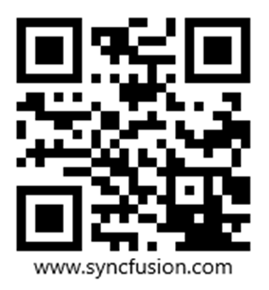
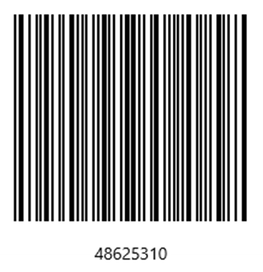
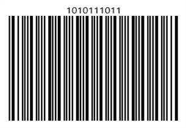

# Getting Started with WinUI Barcode

This section provides a quick overview for getting started with the [Barcode](https://help.syncfusion.com/cr/winui/Syncfusion.UI.Xaml.Controls.Barcode.SfBarcode.html) for WinUI. Walk through the entire process of creating a real world of this control.

## Creating an application with WinUI Barcode

1. Create a simple project using the instructions given in the [Getting Started with your first WinUI app](https://docs.microsoft.com/en-us/windows/apps/winui/winui3/get-started-winui3-for-uwp) documentation.
2. Add reference to [Syncfusion.Barcode.WinUI](https://www.nuget.org/packages/Syncfusion.Barcode.WinUI) NuGet. 
3. Import the control namespace `using Syncfusion.UI.Xaml.Controls.Barcode` in XAML or C# code.
4. Initialize the SfBarCode control.




<Page x:Class="syncfusion.barcodedemos.winui.GettingStartedPage "
                xmlns="http://schemas.microsoft.com/winfx/2006/xaml/presentation"
                xmlns:x="http://schemas.microsoft.com/winfx/2006/xaml"
                xmlns:d="http://schemas.microsoft.com/expression/blend/2008"
                xmlns:mc="http://schemas.openxmlformats.org/markup-compatibility/2006"
                xmlns:syncfusion="using:Syncfusion.UI.Xaml.Controls.Barcode"
                xmlns:local="using:syncfusion.barcodedemos.winui"
                Background="{ThemeResource ApplicationPageBackgroundThemeBrush}"
                NavigationCacheMode="Disabled">
                <Grid>
                        <syncfusion:SfBarcode x:Name="barcode" Value="48625310"/>
                </Grid>

</Page>



 

using Microsoft.UI.Xaml.Controls;
using Syncfusion.UI.Xaml.Controls.Barcode;

public sealed partial class GettingStartedPage : Page
{
    /// 

    /// Interaction logic for GettingStartedPage.xaml
    /// 

    public GettingStartedPage()
    {
        this.InitializeComponent();
        SfBarcode barcode = new SfBarcode();
        Root_Grid.Children.Add(barcode);
    }
}


 

## Symbology

You can set the required symbology to the barcode based on input value by initializing the respective symbology instance using [Symbology](https://help.syncfusion.com/cr/winui/Syncfusion.UI.Xaml.Controls.Barcode.SfBarcode.html#Syncfusion_UI_Xaml_Controls_Barcode_SfBarcode_Symbology) property. In the following code snippet, the QR code has been set as the barcode symbology.




<Page xmlns:syncfusion="using:Syncfusion.UI.Xaml.Controls.Barcode">

        <Grid>
                <syncfusion:SfBarcode x:Name="barcode" Value="http://www.syncfusion.com">
                        <syncfusion:SfBarcode.Symbology>
                                <syncfusion:QRBarcode />
                        </syncfusion:SfBarcode.Symbology>
                </syncfusion:SfBarcode>
        </Grid>

</Page>




## Text customization

The Barcode text can be customized by using below properties,

### Value

The text to be encoded can be set using the [Value](https://help.syncfusion.com/cr/winui/Syncfusion.UI.Xaml.Controls.Barcode.SfBarcode.html#Syncfusion_UI_Xaml_Controls_Barcode_SfBarcode_Value) property. By default, this original text will be displayed at the bottom of the bar code. 




<syncfusion:SfBarcode x:Name="barcode" Value="48625310" Height="150"/>
               



### TextSpacing

The space between barcode and text can be increased/decreased by using [TextSpacing](https://help.syncfusion.com/cr/winui/Syncfusion.UI.Xaml.Controls.Barcode.SfBarcode.html#Syncfusion_UI_Xaml_Controls_Barcode_SfBarcode_TextSpacing) property. 




<syncfusion:SfBarcode x:Name="barcode" Value="10110111" Height="150" TextSpacing="7"/>




### ShowValue

The visibility of the Barcode text can be changed using [ShowValue](https://help.syncfusion.com/cr/winui/Syncfusion.UI.Xaml.Controls.Barcode.SfBarcode.html#Syncfusion_UI_Xaml_Controls_Barcode_SfBarcode_ShowValue) property in Barcode. 




<syncfusion:SfBarcode x:Name="barcode" Value="10110111" Height="150" ShowValue="False"/>




### HorizontalTextAlignment

The horizontal alignment of the Barcode text can be changed using [HorizontalTextAlignment](https://help.syncfusion.com/cr/winui/Syncfusion.UI.Xaml.Controls.Barcode.SfBarcode.html#Syncfusion_UI_Xaml_Controls_Barcode_SfBarcode_HorizontalTextAlignment) property in Barcode.




<syncfusion:SfBarcode x:Name="barcode" Value="10110111" Height="150" HorizontalTextAlignment="Right" />




### VerticalTextAlignment

The vertical alignment of the Barcode text can be changed using [VerticalTextAlignment](https://help.syncfusion.com/cr/winui/Syncfusion.UI.Xaml.Controls.Barcode.SfBarcode.html#Syncfusion_UI_Xaml_Controls_Barcode_SfBarcode_VerticalTextAlignment) property in Barcode.




<syncfusion:SfBarcode x:Name="barcode" Value="10110111" Height="150" VerticalTextAlignment="Top" />




N> [View sample in GitHub](https://github.com/SyncfusionExamples/syncfusion-winui-barcode-examples)
