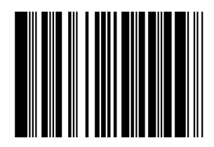

# Types of Barcode Symbology
Barcode Symbology supports 12 variants of one dimensional and 3 variants of two dimensional barcodes.

## One Dimensional Barcodes
One Dimensional barcode is also called as linear barcode. The bars and spaces for each symbol in one dimensional barcodes are grouped in such a way to represent a specific ASCII character.

The following table represents supported one dimensional barcode symbologies

<table>
<tr>
<th>Symbology</th>
<th>Class</th>
<th>Supported characters</th>
</tr>
<tr>
<td>
Codabar
</td>
<td>
[Codabar](https://help.syncfusion.com/cr/winui/Syncfusion.UI.Xaml.Barcode.CodabarBarcode.html)
</td>
<td>
[0-9]; [- $ : / . +]
</td>
</tr>
<tr>
<td>
Code11
</td>
<td>
[Code 11](https://help.syncfusion.com/cr/winui/Syncfusion.UI.Xaml.Barcode.Code11Barcode.html)
</td>
<td>
[0-9]; [-]
</td>
</tr>
<tr>
<td>
Code32
</td>
<td>
[Code 32](https://help.syncfusion.com/cr/winui/Syncfusion.UI.Xaml.Barcode.Code32Barcode.html)
</td>
<td>
[0-9]
</td>
</tr>
<tr>
<td>
Code39
</td>
<td>
[Code 39](https://help.syncfusion.com/cr/winui/Syncfusion.UI.Xaml.Barcode.Code39Barcode.html)
</td>
<td>
[0-9]; [A-Z]; [- . $ / + % SPACE]
</td>
</tr>
<tr>
<td>
Code39Extended
</td>
<td>
[Code 39 Extended](https://help.syncfusion.com/cr/winui/Syncfusion.UI.Xaml.Barcode.Code39ExtendedBarcode.html)
</td>
<td>
[0-9]; [A-Z]; [a-z]
</td>
</tr>
<tr>
<td>
Code93
</td>
<td>
[Code 93](https://help.syncfusion.com/cr/winui/Syncfusion.UI.Xaml.Barcode.Code93Barcode.html)
</td>
<td>
[0-9]; [A-Z]; [- . $ / + % SPACE]
</td>
</tr>
<tr>
<td>
Code93Extended
</td>
<td>
[Code 93 Extended](https://help.syncfusion.com/cr/winui/Syncfusion.UI.Xaml.Barcode.Code93ExtendedBarcode.html)
</td>
<td>
All 128 ASCII characters
</td>
</tr>
<tr>
<td>
Code128A
</td>
<td>
[Code128A](https://help.syncfusion.com/cr/winui/Syncfusion.UI.Xaml.Barcode.Code128ABarcode.html)
</td>
<td>
[0-9]; [A-Z]; [NUL (0x00) SOH (0x01) STX (0x02) ETX (0x03) EOT(0x04) ENQ (0x05) ACK (0x06) BEL (0x07) BS (0x08) HT (0x09) LF (0x0A) VT(0x0B) FF (0x0C) CR (0x0D) SO (0x0E) SI (0x0F) DLE (0x10) DC1 (0x11) DC2(0x12) DC3 (0x13) DC4 (0x14) NAK (0x15) SYN (0x16) ETB (0x17) CAN(0x18) EM (0x19) SUB (0x1A) ESC (0x1B) FS (0x1C) GS (0x1D) RS (0x1E) US(0x1F) SPACE (0x20)]; [" ! # $ % & ' ( ) * + , - . / ; &lt; = &gt; ? @ [ / ]^ _ ]
</td>
</tr>
<tr>
<td>
Code128B
</td>
<td>
[Code 128B](https://help.syncfusion.com/cr/winui/Syncfusion.UI.Xaml.Barcode.Code128BBarcode.html)
</td>
<td>
[0-9]; [A-Z]; [a-z]; [SPACE (0x20) ! " # $ % & ' ( ) * + , - . / :; &lt; = &gt; ? @ [ / ]^ _ `  { | } ~ DEL (•) ]
</td>
</tr>
<tr>
<td>
Code128C
</td>
<td>
[Code 128C](https://help.syncfusion.com/cr/winui/Syncfusion.UI.Xaml.Barcode.Code128CBarcode.html)
</td>
<td>
ASCII 00-99(encodes each two digit with one code)
</td>
</tr>
<tr>
<td>
UPCBarcode
</td>
<td>
[UPCBarcode](https://help.syncfusion.com/cr/winui/Syncfusion.UI.Xaml.Barcode.UpcBarcode.html)
</td>
<td>
[0-9]
</td>
</tr>
<tr>
<td>
GS1Code128Barcode
</td>
<td>
[GS1Code128Barcode](https://help.syncfusion.com/cr/winui/Syncfusion.UI.Xaml.Barcode.GS1Code128Barcode.html)
</td>
<td>
ASCII 00-99(encodes each two digit with one code)
</td>
</tr>
</table>

### Codabar
The [CodabarBarcode](https://help.syncfusion.com/cr/winui/Syncfusion.UI.Xaml.Barcode.CodabarBarcode.html) is a discrete numerical symbology that is used in libraries, blood banks and a variety of other information processing applications.

* Encodes only numeric characters and some special characters like dash (-), colon (:), slash (/), plus (+).
* Each character has three bars and four spaces.
* Uses characters of A, B, C, D as start and stop characters.




<syncfusion:SfBarcode.Symbology>   
    <syncfusion:CodabarBarcode />    
</syncfusion:SfBarcode.Symbology>




### Code 11
The [Code11Barcode](https://help.syncfusion.com/cr/winui/Syncfusion.UI.Xaml.Barcode.Code11Barcode.html) Symbology is used primarily for labeling the telecommunications equipment and it has the following structure.

* Allows character set of digits (0-9), dash (-).
* Each character is encoded with 3 bars and 2 spaces.
* Of these five elements, there may be two wide and three narrow elements or one wide and four narrow elements.




<syncfusion:SfBarcode.Symbology>   
    <syncfusion:Code11Barcode />   
</syncfusion:SfBarcode.Symbology>




### Code 32
The [Code32Barcode](https://help.syncfusion.com/cr/winui/Syncfusion.UI.Xaml.Barcode.Code32Barcode.html) is primarily used for coding pharmaceuticals, cosmetics, dietetics and it has the following structure:

* Starts with ‘A’ character (ASCII 65) that is not really encoded.
* Encodes only the character set of length 8.
* One digit for Checksum module 10 that is automatically calculated.




<syncfusion:SfBarcode.Symbology>   
    <syncfusion:Code32Barcode />   
</syncfusion:SfBarcode.Symbology>




### Code 39
The [Code39Barcode](https://help.syncfusion.com/cr/winui/Syncfusion.UI.Xaml.Barcode.Code39Barcode.html) is a Barcode Symbology that encodes alphanumeric characters into a series of bars. It may be of any length, although more than 25 characters begin to push the bounds. This Symbology is the only type of the Barcode in common use that does not require a checksum.

* Allows character set of digits (0-9), upper case alphabets (A-Z), and symbols like space, minus (-), plus (+), period (.), dollar sign ($), slash (/), and percent (%).
* Always starts and ends with an asterisk (*) symbol, termed as start and stop character.
* Each character is encoded with 5 bars and 4 spaces where 3 are wide and 6 are narrow.




<syncfusion:SfBarcode.Symbology>   
    <syncfusion:Code39Barcode />   
</syncfusion:SfBarcode.Symbology>




### Code 39 Extended
The [Code39ExtendedBarcode](https://help.syncfusion.com/cr/winui/Syncfusion.UI.Xaml.Barcode.Code39ExtendedBarcode.html) Symbology is an extended version of [Code39Barcode](https://help.syncfusion.com/cr/winui/Syncfusion.UI.Xaml.Barcode.Code39Barcode.html) which supports the full ASCII character set. It encodes lower case alphabets (a-z) as well as special characters in the keyboard.




<syncfusion:SfBarcode.Symbology>   
    <syncfusion:Code39ExtendedBarcode />   
</syncfusion:SfBarcode.Symbology>




### Code 93
The [Code93Barcode](https://help.syncfusion.com/cr/winui/Syncfusion.UI.Xaml.Barcode.Code93Barcode.html) is designed to complement and improve upon [Code39Barcode](https://help.syncfusion.com/cr/winui/Syncfusion.UI.Xaml.Barcode.Code39Barcode.html). It represents the full ASCII character set by using the combination of 2 characters. It is a continuous, variable-length symbology that produces a denser code.

* Encodes character set of uppercase alphabets (A-Z), digits (0-9), and special characters like asterisk (*), dash (-), dollar ($), percent (%), Space, dot (.), slash (/), and plus (+).
* The asterisk (*) is not a true encoding character, but it is the start and stop symbol for [Code93Barcode](https://help.syncfusion.com/cr/winui/Syncfusion.UI.Xaml.Barcode.Code93Barcode.html) [Symbology](https://help.syncfusion.com/cr/winui/Syncfusion.UI.Xaml.Barcode.SfBarcode.html#Syncfusion_UI_Xaml_Barcode_SfBarcode_Symbology).




<syncfusion:SfBarcode.Symbology>   
    <syncfusion:Code93Barcode />   
</syncfusion:SfBarcode.Symbology>




### Code 93 Extended
The [Code93ExtendedBarcode](https://help.syncfusion.com/cr/winui/Syncfusion.UI.Xaml.Barcode.Code93ExtendedBarcode.html) is designed to complement and improve upon Code 39. It represents the full ASCII character set by using the combination of 2 characters. It is a continuous, variable-length Symbology that produces a denser code.

* Encodes character set of uppercase alphabets (A-Z), digits (0-9), and special characters like asterisk (*), dash (-), dollar ($), percent (%), Space, dot (.), slash (/), and plus (+).
* The asterisk (*) is not a true encoding character, but it is the start and stop symbol for Code 93 symbology.




<syncfusion:SfBarcode.Symbology>   
    <syncfusion:Code93ExtendedBarcode />   
</syncfusion:SfBarcode.Symbology>




#### Code 128A
The [Code128ABarcode](https://help.syncfusion.com/cr/winui/Syncfusion.UI.Xaml.Barcode.Code128ABarcode.html) (or Chars Set A) includes all the standard upper case U.S. alphanumeric keyboard characters and punctuation characters together with the control characters, (characters with ASCII values from 0 to 95 inclusive), and seven special characters.




<syncfusion:SfBarcode.Symbology>  
    <syncfusion:Code128ABarcode />  
</syncfusion:SfBarcode.Symbology>




#### Code128B
The [Code128BBarcode](https://help.syncfusion.com/cr/winui/Syncfusion.UI.Xaml.Barcode.Code128BBarcode.html) (or Chars Set B) includes all the standard upper case alphanumeric keyboard characters and punctuation characters together with the lower case alphabetic characters (characters with ASCII values from 32 to 127 inclusive), and seven special characters.




<syncfusion:SfBarcode.Symbology>  
    <syncfusion:Code128BBarcode />   
</syncfusion:SfBarcode.Symbology>




#### Code128C
The [Code128CBarcode](https://help.syncfusion.com/cr/winui/Syncfusion.UI.Xaml.Barcode.Code128CBarcode.html) (or Chars Set C) includes a set of 100 digit pairs from 00 to 99 inclusive, as well as three special characters. This allows numeric data to be encoded as two data digits per symbol character effectively twice the density of standard data.




<syncfusion:SfBarcode.Symbology>  
    <syncfusion:Code128CBarcode />   
</syncfusion:SfBarcode.Symbology>




### UPC
The [UPCBarcode](https://help.syncfusion.com/cr/winui/Syncfusion.UI.Xaml.Barcode.UpcBarcode.html)(Universal Product Code), also known as UPC-A. It encodes 12 numeric digits. UPC barcode symbology mostly used in trade items.




<syncfusion:SfBarcode.Symbology>   
    <syncfusion:UpcBarcode />  
</syncfusion:SfBarcode.Symbology>




### GS1Code128Barcode
The [GS1Code128Barcode](https://help.syncfusion.com/cr/winui/Syncfusion.UI.Xaml.Barcode.GS1Code128Barcode.html) also known as EAN-128 barcode. It is commonly used in shipping and supply chain entities.




<syncfusion:SfBarcode.Symbology>   
    <syncfusion:GS1Code128Barcode />  
</syncfusion:SfBarcode.Symbology>




## Two Dimensional Barcodes
Two Dimensional Barcode is a way to represent information via two-dimensional approach. It is similar to One Dimensional Barcode, but can represent more data per unit area.

The following table represents the supported two dimensional barcode symbologies

<table>
<tr>
<th>Symbology</th>
<th>Class</th>
<th>Supported characters</th>
</tr>
<tr>
<td>
QRBarcode
</td>
<td>
[QR Barcode](https://help.syncfusion.com/cr/winui/Syncfusion.UI.Xaml.Barcode.QRBarcode.html)
</td>
<td>
[0–9]; [A–Z (upper-case only)]; [space $ % * + - . / , :]; [Shift JIS characters]
</td>
</tr>
<tr>
<td>
DataMatrixBarcode
</td>
<td>
[DataMatrixBarcode](https://help.syncfusion.com/cr/winui/Syncfusion.UI.Xaml.Barcode.DataMatrixBarcode.html)
</td>
<td>
All ASCII characters
</td>
</tr>
<tr>
<td>
Pdf417Barcode
</td>
<td>
[Pdf417Barcode](https://help.syncfusion.com/cr/winui/Syncfusion.UI.Xaml.Barcode.Pdf417Barcode.html)
</td>
<td>
All ASCII characters
</td>
</tr>
</table>

### QR Code
The [QRBarcode](https://help.syncfusion.com/cr/winui/Syncfusion.UI.Xaml.Barcode.QRBarcode.html) is a two dimensional barcode symbology that is popularly used in automotive industry. It is known for fast readability and greater storage capacity.




<syncfusion:SfBarcode.Symbology>   
    <syncfusion:QRBarcode />   
</syncfusion:SfBarcode.Symbology>




### Data Matrix
The [DataMatrixBarcode](https://help.syncfusion.com/cr/winui/Syncfusion.UI.Xaml.Barcode.DataMatrixBarcode.html) is widely used in printed media such as labels and letters. It can be read easily by a Barcode reader and also by mobile phones. It consists of a grid of dark and light dots or blocks forming square or rectangular symbol. The data encoded in the Barcode can be either number or alphanumeric.




<syncfusion:SfBarcode.Symbology>  
    <syncfusion:DataMatrixBarcode />  
</syncfusion:SfBarcode.Symbology>




### Pdf417Barcode
The [Pdf417Barcode](https://help.syncfusion.com/cr/winui/Syncfusion.UI.Xaml.Barcode.Pdf417Barcode.html) is a two dimensional barcode and it can able to encode text, numbers, files and actual data bytes. It is mainly used in a variety of applications such as transport, identification cards, and inventory management.
 



<syncfusion:SfBarcode.Symbology>   
    <syncfusion:Pdf417Barcode />  
</syncfusion:SfBarcode.Symbology>




