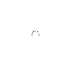
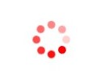

# Customization in WinUI Busy Indicator

This section explains the customization features available in the WinUI Busy Indicator control.

## Size

The indicator size can be customized by using the [SizeFactor](https://help.syncfusion.com/cr/winui/Syncfusion.UI.Xaml.Notifications.SfBusyIndicator.html#Syncfusion_UI_Xaml_Notifications_SfBusyIndicator_SizeFactor) property. Its default value is 0.5 and ranges from 0 to 1.




<notification:SfBusyIndicator IsActive="True"
    AnimationType="DottedCircularFluent"
    SizeFactor="0.2">
</notification:SfBusyIndicator>




SfBusyIndicator busyIndicator = new SfBusyIndicator();
busyIndicator.IsActive = true;
busyIndicator.AnimationType = BusyIndicatorAnimationType.DottedCircularFluent;
busyIndicator.SizeFactor = 0.2;




## Duration

The indicator animation speed can be customized by using the [DurationFactor](https://help.syncfusion.com/cr/winui/Syncfusion.UI.Xaml.Notifications.SfBusyIndicator.html#Syncfusion_UI_Xaml_Notifications_SfBusyIndicator_DurationFactor) property. Its default value is 0.5 and ranges from 0 to 1.




<notification:SfBusyIndicator IsActive="True"
    AnimationType="DottedCircularFluent"
    DurationFactor="0.9">
</notification:SfBusyIndicator>




SfBusyIndicator busyIndicator = new SfBusyIndicator();
busyIndicator.IsActive = true;
busyIndicator.AnimationType = BusyIndicatorAnimationType.DottedCircularFluent;
busyIndicator.DurationFactor = 0.9;




## Color

The indicator color can be customized by using the [Color](https://help.syncfusion.com/cr/winui/Syncfusion.UI.Xaml.Notifications.SfBusyIndicator.html#Syncfusion_UI_Xaml_Notifications_SfBusyIndicator_Color) property.




<notification:SfBusyIndicator IsActive="True"
    AnimationType="DottedCircle"
    Color="Red">
</notification:SfBusyIndicator>




SfBusyIndicator busyIndicator = new SfBusyIndicator();
busyIndicator.IsActive = true;
busyIndicator.AnimationType = BusyIndicatorAnimationType.DottedCircle;
busyIndicator.Color = new SolidColorBrush(Colors.Red);




