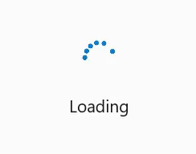

# Getting Started with WinUI BusyIndicator

This section explains the steps required to add the BusyIndicator control and covers only the basic features needed to get started with Syncfusion `BusyIndicator` control.

## Creating an application with WinUI BusyIndicator control

1. Create a [WinUI 3 desktop app for C# and .NET 5](https://docs.microsoft.com/en-us/windows/apps/winui/winui3/get-started-winui3-for-desktop).
2. Add reference to [Syncfusion.Notifications.WinUI](https://www.nuget.org/packages/Syncfusion.Notifications.WinUI) NuGet. 
3. Import the control namespace `Syncfusion.UI.Xaml.Notifications` in XAML or C# code.
4. Initialize the SfBusyIndicator control.




<Page
    x:Class="GettingStarted.MainPage"
    xmlns="http://schemas.microsoft.com/winfx/2006/xaml/presentation"
    xmlns:x="http://schemas.microsoft.com/winfx/2006/xaml"
    xmlns:local="using:GettingStarted"
    xmlns:d="http://schemas.microsoft.com/expression/blend/2008"
    xmlns:mc="http://schemas.openxmlformats.org/markup-compatibility/2006"
    xmlns:notification="using:Syncfusion.UI.Xaml.Notifications"
    mc:Ignorable="d"
    Background="{ThemeResource ApplicationPageBackgroundThemeBrush}">
    <Grid>
      <notification:SfBusyIndicator IsActive="True"/>
    </Grid>
</Page>




// Creating an instance of the BusyIndicator control.
SfBusyIndicator busyIndicator = new SfBusyIndicator();

// Activating the SfBusyIndicator.
busyIndicator.IsActive = true;




## Setting Animation Type in BusyIndicator

The BusyIndicator control provides 7 predefined animation types like `DottedCircularFluent`, `DottedCircle`, `DottedLinear`, and so on. Users can select any one of the animation types using the `AnimationType` property.




<notification:SfBusyIndicator IsActive="True"
     AnimationType="DottedCircularFluent">
</notification:SfBusyIndicator>




SfBusyIndicator busyIndicator = new SfBusyIndicator();
busyIndicator.IsActive = true;
busyIndicator.AnimationType = BusyIndicatorAnimationType.DottedCircularFluent;




## Adding Content in BusyIndicator

The BusyIndicator control provides option to set the content that indicates the busy status of the control to the users by using the `BusyContent` property.




<notification:SfBusyIndicator IsActive="True"
     BusyContent="Loading">
</notification:SfBusyIndicator>




SfBusyIndicator busyIndicator = new SfBusyIndicator();
busyIndicator.IsActive = true;
busyIndicator.BusyContent = "Loading";




The following code example gives you the complete code of above configurations:




<notification:SfBusyIndicator IsActive="True"
     AnimationType="DottedCircularFluent"
     BusyContent="Loading">
</notification:SfBusyIndicator>




SfBusyIndicator busyIndicator = new SfBusyIndicator();
busyIndicator.IsActive = true;
busyIndicator.AnimationType = BusyIndicatorAnimationType.DottedCircularFluent;
busyIndicator.BusyContent = "Loading";




