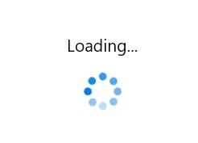

# Content in WinUI BusyIndicator

The BusyIndicator control provides option to set the content that indicates the busy status of the control to the users by using the `BusyContent` property.




<notification:SfBusyIndicator IsActive="True"
     AnimationType="DottedCircle"
     BusyContent="Loading">
</notification:SfBusyIndicator>




SfBusyIndicator busyIndicator = new SfBusyIndicator();
busyIndicator.IsActive = true;
busyIndicator.AnimationType = BusyIndicatorAnimationType.DottedCircle;
busyIndicator.BusyContent = "Loading";




## BusyContentPosition

The BusyIndicator control provides options to set the `BusyContent` at the Top, Bottom, Left and Right of the Busy Indicator. The `BusyContent` can be set using the `BusyContentPosition` property.




<notification:SfBusyIndicator IsActive="True"
     AnimationType="DottedCircle"
     BusyContent="Loading"
     BusyContentPosition="Top">
</notification:SfBusyIndicator>




SfBusyIndicator busyIndicator = new SfBusyIndicator();
busyIndicator.IsActive = true;
busyIndicator.AnimationType = BusyIndicatorAnimationType.DottedCircle;
busyIndicator.BusyContent = "Loading";
busyIndicator.BusyContentPosition = BusyIndicatorContentPosition.Top;




## BusyContentTemplate

The BusyIndicator control provides options to set the `BusyContent` section as to change the template by using the `BusyContentTemplate` property.




<notification:SfBusyIndicator IsActive="True" AnimationType="DottedCircle">
    <notification:SfBusyIndicator.BusyContentTemplate>
        <DataTemplate>
            <TextBlock Text="Loading..." FontSize="18" FontStyle="Italic" FontWeight="Bold" Foreground="Red"/>
        </DataTemplate>
    </notification:SfBusyIndicator.BusyContentTemplate>
</notification:SfBusyIndicator>




