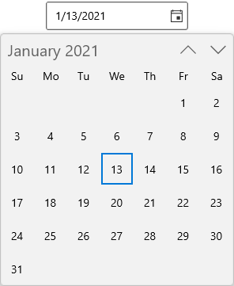

# UI customization in WinUI Calendar Date Picker (SfCalendarDatePicker)

This section describes how to select a date from dropdown Calendar and its customization options in [SfCalendarDatePicker](https://help.syncfusion.com/cr/winui/Syncfusion.UI.Xaml.Calendar.SfCalendarDatePicker.html) control.

## Change dropdown alignment

You can change the alignment of the dropdown calendar as full, center, left, right, top or bottom edge by using the [DropDownPlacement](https://help.syncfusion.com/cr/winui/Syncfusion.UI.Xaml.Editors.SfDropDownBase.html#Syncfusion_UI_Xaml_Editors_SfDropDownBase_DropDownPlacement) property. The default value of `DropDownPlacement` property is `Auto`.

N> If you change the dropdown alignment by using `DropDownPlacement` property and there is not sufficient space, then `Calendar Date Picker` smartly shifts the dropdown calendar alignment.




<calendar:SfCalendarDatePicker DropDownPlacement="Right" 
                             x:Name="sfCalendarDatePicker"/>




SfCalendarDatePicker sfCalendarDatePicker = new SfCalendarDatePicker();
sfCalendarDatePicker.DropDownPlacement = FlyoutPlacementMode.Right;




N> Download demo application from [GitHub](https://github.com/SyncfusionExamples/syncfusion-winui-tools-calendardatepicker-examples/blob/main/Samples/DropDown)

## Change dropdown size

You can change the size of dropdown calendar by using [DropDownWidth](https://help.syncfusion.com/cr/winui/Syncfusion.UI.Xaml.Calendar.SfCalendarDatePicker.html#Syncfusion_UI_Xaml_Calendar_SfCalendarDatePicker_DropDownWidth) and [DropDownHeight](https://help.syncfusion.com/cr/winui/Syncfusion.UI.Xaml.Editors.SfDropDownBase.html#Syncfusion_UI_Xaml_Editors_SfDropDownBase_DropDownHeight) property. The default value of `DropDownHeight` and `DropDownWidth` properties is `NaN`.




<calendar:SfCalendarDatePicker DropDownWidth="400"
                               DropDownHeight="500"
                               x:Name="sfCalendarDatePicker"/>




SfCalendarDatePicker sfCalendarDatePicker = new SfCalendarDatePicker();
sfCalendarDatePicker.DropDownWidth = 400;
sfCalendarDatePicker.DropDownHeight = 500;




N> Download demo application from [GitHub](https://github.com/SyncfusionExamples/syncfusion-winui-tools-calendardatepicker-examples/blob/main/Samples/DropDown)

## Hide days that is out of scope

You can hide the days that are out-of-scope of current view in dropdown calendar by setting the [OutOfScopeVisibility](https://help.syncfusion.com/cr/winui/Syncfusion.UI.Xaml.Calendar.SfCalendarDatePicker.html#Syncfusion_UI_Xaml_Calendar_SfCalendarDatePicker_OutOfScopeVisibility) property value as **Hidden**. The default value of `OutOfScopeVisibility` property is **Enabled**.




<calendar:SfCalendarDatePicker OutOfScopeVisibility="Hidden"
                               x:Name="sfCalendarDatePicker"/>




SfCalendarDatePicker sfCalendarDatePicker = new SfCalendarDatePicker();
sfCalendarDatePicker.OutOfScopeVisibility = OutOfScopeVisibility.Hidden;




N> Download demo application from [GitHub](https://github.com/SyncfusionExamples/syncfusion-winui-tools-calendardatepicker-examples/blob/main/Samples/Restriction)

## Customize individual items in Calendar

You can change the UI of specific cells in `Calendar Date Picker` dropdown calendar by using the [AttachedFlyout](https://docs.microsoft.com/en-us/uwp/api/windows.ui.xaml.controls.primitives.flyoutbase.attachedflyout?view=winrt-19041) and `DropDownFlyout` properties.

1. Create a **EventDataConverter** class and set the special dates for specific events. 




public class EventDataConverter : IValueConverter
{
    Dictionary<DateTimeOffset, string> SpecialDates;
    public EventDataConverter()
    {
        SpecialDates = new Dictionary<DateTimeOffset, string>();
        SpecialDates.Add(DateTimeOffset.Now.AddMonths(-1).AddDays(1), "SingleEvent_1");
        SpecialDates.Add(DateTimeOffset.Now.AddMonths(-1).AddDays(5), "DoubleEvent_1");
        SpecialDates.Add(DateTimeOffset.Now.AddMonths(-1).AddDays(-2), "TripleEvent_2");
        SpecialDates.Add(DateTimeOffset.Now.AddDays(1), "TripleEvent_1");
        SpecialDates.Add(DateTimeOffset.Now.AddDays(5), "SingleEvent_2");
        SpecialDates.Add(DateTimeOffset.Now.AddDays(7), "DoubleEvent_2");
        SpecialDates.Add(DateTimeOffset.Now.AddDays(9), "SingleEvent_1");
        SpecialDates.Add(DateTimeOffset.Now.AddDays(12), "TripleEvent_2");
        SpecialDates.Add(DateTimeOffset.Now.AddDays(-4), "DoubleEvent_1");
        SpecialDates.Add(DateTimeOffset.Now.AddMonths(1).AddDays(1), "DoubleEvent_3");
        SpecialDates.Add(DateTimeOffset.Now.AddMonths(1).AddDays(3), "SingleEvent_2");
        SpecialDates.Add(DateTimeOffset.Now.AddMonths(1).AddDays(-5), "DoubleEvent_2");
    }
    public object Convert(object value, Type targetType, object parameter, string language)
    {
        DateTimeOffset dateTimeOffset = SpecialDates.Keys.FirstOrDefault(x => x.Date == (DateTime)value);

        if (dateTimeOffset != DateTimeOffset.MinValue)
        {
            string template = SpecialDates[dateTimeOffset];
            StackPanel stackPanel;
            switch (template)
            {
                case "SingleEvent_1":
                    return new List<Brush>() { new SolidColorBrush(Colors.DeepPink) };
                case "SingleEvent_2":
                    return new List<Brush>() { new SolidColorBrush(Colors.Cyan) };
                case "DoubleEvent_1":
                    return new List<Brush>() { new SolidColorBrush(Colors.Violet), new SolidColorBrush(Colors.Orange) };
                case "DoubleEvent_2":
                    return new List<Brush>() { new SolidColorBrush(Colors.Gold), new SolidColorBrush(Colors.Green) };
                case "DoubleEvent_3":
                    return new List<Brush>() { new SolidColorBrush(Colors.Brown), new SolidColorBrush(Colors.Blue) };
                case "TripleEvent_1":
                    return new List<Brush>() { new SolidColorBrush(Colors.Green), new SolidColorBrush(Colors.DeepSkyBlue), new SolidColorBrush(Colors.Orange) };
                case "TripleEvent_2":
                    return new List<Brush>() { new SolidColorBrush(Colors.Red), new SolidColorBrush(Colors.Green), new SolidColorBrush(Colors.Gold) };
            }
        }
        return null;
    }

    public object ConvertBack(object value, Type targetType, object parameter, string language)
    {
        return null;
    }
}




2. Create a **DataTemplate** to customize the date cells of Calendar. Now add the `Calendar` control inside the `FlyoutBase.AttachedFlyout` property and `DropDownFlyout` control.




<Page.Resources>
    <local:EventDataConverter x:Key="EventDataConverterKey" />
    <DataTemplate x:Key="customTemplate">
        <ItemsControl ItemsSource="{Binding Path=Date, Converter={StaticResource EventDataConverterKey}}">
            <ItemsControl.ItemTemplate>
                <DataTemplate >
                    <Ellipse MinHeight="4" MinWidth="4" Margin="2" Fill="{Binding}"/>
                </DataTemplate>
            </ItemsControl.ItemTemplate>
            <ItemsControl.ItemsPanel>
                <ItemsPanelTemplate>
                    <StackPanel Orientation="Horizontal"/>
                </ItemsPanelTemplate>
            </ItemsControl.ItemsPanel>
        </ItemsControl>
    </DataTemplate>
</Page.Resources>
<Grid>
    <calendar:SfCalendarDatePicker
                        x:Name="calendarDatePicker"
                        MinWidth="180"
                        HorizontalAlignment="Center"
                        VerticalAlignment="Center">
        <FlyoutBase.AttachedFlyout>
            <editors:DropDownFlyout>
                <calendar:SfCalendar SelectedDate="{x:Bind calendarDatePicker.SelectedDate, Mode=TwoWay}" >
                    <calendar:SfCalendar.Resources>
                        <ResourceDictionary>
                            <!--  Resources and color keys for Calendar Control  -->
                            <SolidColorBrush x:Key="SyncfusionCalendarItemOutOfScopeForeground"
                                                 Color="SlateGray" Opacity="0.5" />
                            <SolidColorBrush x:Key="SyncfusionCalendarWeekItemForeground"
                                                 Color="{ThemeResource SystemBaseMediumLowColor}" />
                            <x:Double x:Key="SyncfusionSubtitleAltFontSize">16</x:Double>
                            <Thickness x:Key="SyncfusionCalendarItemMargin">1</Thickness>
                            <x:Double x:Key="SyncfusionBodyFontSize">13</x:Double>

                            
                        </ResourceDictionary>
                    </calendar:SfCalendar.Resources>
                </calendar:SfCalendar>
            </editors:DropDownFlyout>
        </FlyoutBase.AttachedFlyout>
    </calendar:SfCalendarDatePicker>
</Grid>




N> Download demo application from [GitHub](https://github.com/SyncfusionExamples/syncfusion-winui-tools-calendardatepicker-examples/blob/main/Samples/CustomUI)

## Customize using theme keys

You can customize the colors of day names and headers of month, year, decade and century by changing the theme keys values in a ResourceDictionary used in the `Calendar` control and by using the [`AttachedFlyout`](https://docs.microsoft.com/en-us/uwp/api/windows.ui.xaml.controls.primitives.flyoutbase.attachedflyout?view=winrt-19041) and `DropDownFlyout` properties.

<table>
<tr>
<th> Name of the key</th>
<th> Description </th>
</tr>
<tr>
<td>SyncfusionCalendarNavigationButtonForeground</td>
<td>Key to change the color of calendar navigation button foreground color.</td>
</tr>
<tr>
<td>SyncfusionCalendarWeekItemForeground</td>
<td>Key to change the color of calendar week days name foreground color.</td>
</tr>
<tr>
<td>SyncfusionCalendarTodayItemForeground</td>
<td>Key to change the color of calendar today date foreground color.</td>
</tr>
<tr>
<td>SyncfusionCalendarItemBackground</td>
<td>Key to change the color of calendar date cells background color except today date cell.</td>
</tr>
<tr>
<td>SyncfusionCalendarItemBorderBrush</td>
<td>Key to change the color of calendar date cells border brush.</td>
</tr>
<tr>
<td>SyncfusionCalendarTodayItemBackground</td>
<td>Key to change the color of calendar today date cell background color</td>
</tr>
<tr>
<td>SyncfusionCalendarTodayItemBorderBrush</td>
<td>Key to change the color of calendar today date cell border brush.</td>
</tr>
<tr>
<td>SyncfusionCalendarItemOutOfScopeForeground</td>
<td>Key to change the color of calendar date cells foreground color which are out of scope.</td>
</tr>
<tr>
<td>SyncfusionCalendarItemMargin</td>
<td>Key to change the margin of calendar item.</td>
</tr>
<tr>
<td>SyncfusionSubtitleAltFontSize</td>
<td>Key to change the font size of calendar header region.</td>
</tr>
<tr>
<td>SyncfusionBodyFontSize</td>
<td>Key to change the font size of calendar items region.</td>
</tr>
</table>




<calendar:SfCalendarDatePicker
                        x:Name="calendarDatePicker"
                        MinWidth="180"
                        HorizontalAlignment="Center"
                        VerticalAlignment="Center">
        <FlyoutBase.AttachedFlyout>
            <editors:DropDownFlyout>
                <calendar:SfCalendar SelectedDate="{x:Bind calendarDatePicker.SelectedDate, Mode=TwoWay}" >
                <calendar:SfCalendar.Resources>
                    <ResourceDictionary>
                        <SolidColorBrusx:Key="SyncfusionCalendarNavigationButtonForeground"
                                                     Color="#FF248D92" />
                        <SolidColorBrusx:Key="SyncfusionCalendarWeekItemForeground"
                                                     Color="#FF248D92" />
                        <SolidColorBrusx:Key="SyncfusionCalendarTodayItemForeground"
                                                     Color="{ThemeResourcSystemBaseHighColor}" />
                        <SolidColorBrusx:Key="SyncfusionCalendarItemBackground"
                                                     Color="{ThemeResourcSystemListLowColor}" />
                        <SolidColorBrusx:Key="SyncfusionCalendarItemBorderBrush"
                                                     Color="{ThemeResourcSystemListLowColor}"/>
                        <SolidColorBrusx:Key="SyncfusionCalendarTodayItemBackground"
                                                     Color="#FF9BC5ED" />
                        <SolidColorBrusx:Key="SyncfusionCalendarTodayItemBorderBrush"
                                                     Color="#FF9BC5ED" />
                        <SolidColorBrusx:Key="SyncfusionCalendarItemOutOfScopeForeground"
                                                     Color="SlateGrayOpacity="0.5" />
                        <Thickness x:Key="SyncfusionCalendarItemMargin">1Thickness>
                        <x:Double x:Key="SyncfusionBodyFontSize">13</x:Double>
                        <FontFamilx:Key="SyncfusionControlThemeFontFamily">SimSunFontFamily>
                        <x:Double x:Key="SyncfusionSubtitleAltFontSize">16x:Double
                        
                    </ResourceDictionary>
                </calendar:SfCalendar.Resources>
            </calendar:SfCalendar>
        </editor:DropDownFlyout>
    </FlyoutBase.AttachedFlyout>
</calendar:SfCalendarDatePicker>




