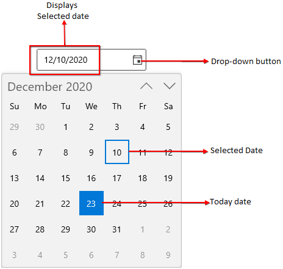
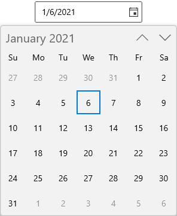
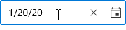
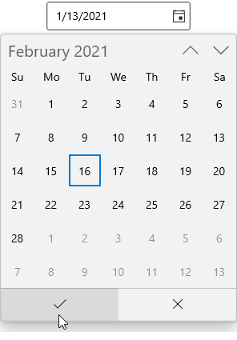
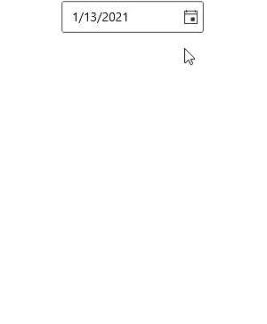

# Getting Started with WinUI Calendar Date Picker (SfCalendarDatePicker)

This section explains the steps required to add the [WinUI Calendar Date Picker](https://www.syncfusion.com/winui-controls/calendar-datepicker) control and its date selection options. This section covers only basic features needed to get started with Syncfusion `Calendar Date Picker` control.

## Structure of Calendar Date Picker control

## Creating an application with WinUI Calendar Date Picker

1. Create a [WinUI 3 desktop app for C# and .NET 5](https://docs.microsoft.com/en-us/windows/apps/winui/winui3/get-started-winui3-for-desktop) or [WinUI 3 app in UWP for C#](https://docs.microsoft.com/en-us/windows/apps/winui/winui3/get-started-winui3-for-uwp).
2. Add reference to [Syncfusion.Calendar.WinUI](https://www.nuget.org/packages/Syncfusion.Calendar.WinUI) NuGet. 
3. Import the control namespace `Syncfusion.UI.Xaml.Calendar` in XAML or C# code.
4. Initialize the `SfCalendarDatePicker` control.




<Page
    x:Class="GettingStarted.MainPage"
    xmlns="http://schemas.microsoft.com/winfx/2006/xaml/presentation"
    xmlns:x="http://schemas.microsoft.com/winfx/2006/xaml"
    xmlns:local="using:GettingStarted"
    xmlns:d="http://schemas.microsoft.com/expression/blend/2008"
    xmlns:mc="http://schemas.openxmlformats.org/markup-compatibility/2006"
    xmlns:calendar="using:Syncfusion.UI.Xaml.Calendar"
    mc:Ignorable="d"
    Background="{ThemeResource ApplicationPageBackgroundThemeBrush}">
    <Grid Name="grid">
        <!--Adding Calendar Date Picker control -->
        <calendar:SfCalendarDatePicker Name="sfCalendarDatePicker"/>
    </Grid>
</Page>




using Syncfusion.UI.Xaml.Calendar;

namespace GettingStarted
{
    /// 

    /// An empty page that can be used on its own or navigated to within a Frame.
    /// 

    public sealed partial class MainPage : Page
    {
        public MainPage()
        {
            this.InitializeComponent();
            // Creating an instance of the Calendar control
            SfCalendarDatePicker sfCalendarDatePicker = new SfCalendarDatePicker();

            grid.Children.Add(sfCalendarDatePicker);
        }
    }
}




N> Download demo application from [GitHub](https://github.com/SyncfusionExamples/syncfusion-winui-tools-calendardatepicker-examples/blob/main/Samples/Getting_started)

## Select the date programmatically

You can set or change the selected date programmatically by using [SelectedDate](https://help.syncfusion.com/cr/winui/Syncfusion.UI.Xaml.Calendar.SfCalendarDatePicker.html#Syncfusion_UI_Xaml_Calendar_SfCalendarDatePicker_SelectedDate) property. If you not assign any value for the `SelectedDate` property, `Calendar Date Picker` will automatically assign the current system date as `SelectedDate`.




SfCalendarDatePicker sfCalendarDatePicker= new SfCalendarDatePicker();
sfCalendarDatePicker.SelectedDate = new DateTimeOffset(new DateTime(2021, 01, 06));




N> Download demo application from [GitHub](https://github.com/SyncfusionExamples/syncfusion-winui-tools-calendardatepicker-examples/blob/main/Samples/Restriction)

## Select date interactively

You can change the selected date interactively by enter the date value using keyboard or select from drop down calendar spinner. You can get the selected date from the `SelectedDate` property.




<calendar:SfCalendarDatePicker Name="sfCalendarDatePicker" />




SfCalendarDatePicker sfCalendarDatePicker= new SfCalendarDatePicker();




N> Download demo application from [GitHub](https://github.com/SyncfusionExamples/syncfusion-winui-tools-calendardatepicker-examples/blob/main/Samples/Getting_started)

## Setting null value

If you want to set null value for the `Calendar Date Picker`, set the [AllowNullValue](https://help.syncfusion.com/cr/winui/Syncfusion.UI.Xaml.Calendar.SfCalendarDatePicker.html#Syncfusion_UI_Xaml_Calendar_SfCalendarDatePicker_AllowNullValue) property as `true` and set `SelectedDate` property as `null`. If `AllowNullValue` property is `false`, then the current system date is updated in `SelectedDate` property and displayed instead of `null`.




<calendar:SfCalendarDatePicker SelectedDate="{x:Null}"
                               AllowNullValue="True"
                               Name="sfCalendarDatePicker" />




SfCalendarDatePicker sfCalendarDatePicker= new SfCalendarDatePicker();
sfCalendarDatePicker.SelectedDate = null;
sfCalendarDatePicker.AllowNullValue = true;




N> Download demo application from [GitHub](https://github.com/SyncfusionExamples/syncfusion-winui-tools-calendardatepicker-examples/blob/main/Samples/Selection)

## Setting watermark text

You can prompt the user with some information by using the [PlaceHolderText](https://help.syncfusion.com/cr/winui/Syncfusion.UI.Xaml.Calendar.SfCalendarDatePicker.html#Syncfusion_UI_Xaml_Calendar_SfCalendarDatePicker_PlaceHolderText) property. This will be displayed only when the `Calendar Date Picker` contains the `SelectedDate` property as `null` and `AllowNullValue` property as `true`. If `AllowNullValue` property is `false`, then the current system date is updated in `SelectedDate` property and displayed instead of `PlaceHolderText`.




<calendar:SfCalendarDatePicker PlaceHolderText="Select the Date"
                               SelectedDate="{x:Null}"
                               AllowNullValue="True"
                               Name="sfCalendarDatePicker" />




SfCalendarDatePicker sfCalendarDatePicker= new SfCalendarDatePicker();
sfCalendarDatePicker.PlaceHolderText = "Select the Date";
sfCalendarDatePicker.SelectedDate = null;
sfCalendarDatePicker.AllowNullValue = true;




N> Download demo application from [GitHub](https://github.com/SyncfusionExamples/syncfusion-winui-tools-calendardatepicker-examples/blob/main/Samples/Selection)

## Selection changed notification

You will be notified when selected date is changed in `Calendar Date Picker` by using [SelectedDateChanged](https://help.syncfusion.com/cr/winui/Syncfusion.UI.Xaml.Calendar.SfCalendarDatePicker.html#Syncfusion_UI_Xaml_Calendar_SfCalendarDatePicker_SelectedDateChanged) event. The `SelectedDateChanged` event contains the old and newly selected date in the [OldDate](https://help.syncfusion.com/cr/winui/Syncfusion.UI.Xaml.Calendar.SelectedDateChangedEventArgs.html#Syncfusion_UI_Xaml_Calendar_SelectedDateChangedEventArgs_OldDate), [NewDate](https://help.syncfusion.com/cr/winui/Syncfusion.UI.Xaml.Calendar.SelectedDateChangedEventArgs.html#Syncfusion_UI_Xaml_Calendar_SelectedDateChangedEventArgs_NewDate) properties.

* `OldDate` - Gets a date which is previously selected.
* `NewDate` - Gets a date which is currently selected.




<calendar:SfCalendarDatePicker SelectedDateChanged="SfCalendarDatePicker_SelectedDateChanged" 
                               Name="sfCalendarDatePicker"/>




SfCalendarDatePicker sfCalendarDatePicker = new SfCalendarDatePicker();
sfCalendarDatePicker.SelectedDateChanged += SfCalendarDatePicker_SelectedDateChanged;




You can handle the event as follows:




private void SfCalendarDatePicker_SelectedDateChanged(object sender, SelectedDateChangedEventArgs e)
{
    var oldDate = e.OldDate;
    var newDate = e.NewDate;
}




## Edit date using free form editing

By default, user entering each input numbers are automatically validated with the `FormatString`'s formats and assigns the proper value for current field, then it will move to next input field of the date format.

If you want to perform the validation after the user completely entered their date inputs, set the [EditMode](https://help.syncfusion.com/cr/winui/Syncfusion.UI.Xaml.Calendar.SfCalendarDatePicker.html#Syncfusion_UI_Xaml_Calendar_SfCalendarDatePicker_EditMode) property value as **Normal**. Then the entered date value is validated with the `FormatString` property value by pressing the `Enter` key or lost focus. If entered value is not suit with `FormatString` property, the previously selected date value sets to `SelectedDate` property.




<calendar:SfCalendarDatePicker EditMode="Normal"
                               x:Name="sfCalendarDatePicker" />




SfCalendarDatePicker sfCalendarDatePicker = new SfCalendarDatePicker();
sfCalendarDatePicker.EditMode = DateTimeEditingMode.Normal;




N> Download demo application from [GitHub](https://github.com/SyncfusionExamples/syncfusion-winui-tools-calendardatepicker-examples/blob/main/Samples/Selection)

## Cancel a date that is being changed

The `DateChanging` event will be triggered, as soon as a date is selected but before `SelectedDate` property is updated. If the change is considered invalid, it can be canceled. The `DateChanging` event contains the following properties.

* `OldDate` - Gets a date which is previously selected.
* `NewDate` - Gets a date which is currently selected.
* `Cancel` - Gets or sets whether to cancel the selected date value update.

Users are restricted to select a blackout date from dropdown, however user can give text input through editor. As selecting a blackout date leads to crash, we can cancel the change using `DateChanging` event.

N> `DateChanging` event is called before the `SelectedDateChanged` event when a date is selected.




<calendar:SfCalendarDatePicker Height="30" Width="250" 
                               x:Name="SfCalendarDatePicker"
                               DateChanging="SfCalendarDatePicker_DateChanging" />




SfCalendarDatePicker sfCalendarDatePicker = new SfCalendarDatePicker();
sfCalendarDatePicker.DateChanging += SfCalendarDatePicker_DateChanging;




You can handle the event as follows:




 private void SfCalendarDatePicker_DateChanging(object sender, Syncfusion.UI.Xaml.Editors.DateChangingEventArgs e)
{
    var OldDate = e.OldDate;
    var NewDate = e.NewDate;

    //Cancel Selected date update
    e.Cancel = true;
}




## Hide the dropdown button

You can hide the dropdown button in `Calendar Date Picker` by setting the [ShowDropDownButton](https://help.syncfusion.com/cr/winui/Syncfusion.UI.Xaml.Editors.SfDropDownBase.html#Syncfusion_UI_Xaml_Editors_SfDropDownBase_ShowDropDownButton) property value as `false`. The default value of `ShowDropDownButton` property is `true`.

N> When the dropdown button is hidden, you can still open the dropdown calendar using `ALT + down` keyboard shortcut.




<calendar:SfCalendarDatePicker ShowDropDownButton="False" 
                               x:Name="sfCalendarDatePicker"/>




SfCalendarDatePicker sfCalendarDatePicker = new SfCalendarDatePicker();
sfCalendarDatePicker.ShowDropDownButton = false;




N> Download demo application from [GitHub](https://github.com/SyncfusionExamples/syncfusion-winui-tools-calendardatepicker-examples/blob/main/Samples/DropDown)

## Show submit button

If you want to select the date from drop down calendar only by clicking the `Ok` button, use the [ShowSubmitButtons](https://help.syncfusion.com/cr/winui/Syncfusion.UI.Xaml.Editors.SfDropDownBase.html#Syncfusion_UI_Xaml_Editors_SfDropDownBase_ShowSubmitButtons) property value as `true`. The default value of `ShowSubmitButtons` property is `false`.

N> When the submit buttons are hidden, `SelectedDate` property will be updated as soon you choose start and end date from dropdown.




<calendar:SfCalendarDatePicker ShowSubmitButtons="true"
                               x:Name="sfCalendarDatePicker"/>




SfCalendarDatePicker sfCalendarDatePicker = new SfCalendarDatePicker();
sfCalendarDatePicker.ShowSubmitButtons = true;




N> Download demo application from [GitHub](https://github.com/SyncfusionExamples/syncfusion-winui-tools-calendardatepicker-examples/blob/main/Samples/DropDown)

## Restrict selection

You can restrict users from:
* Selecting a date within a specific minimum and maximum range using [`MinDate`](https://help.syncfusion.com/cr/winui/Syncfusion.UI.Xaml.Calendar.SfCalendar.html#Syncfusion_UI_Xaml_Calendar_SfCalendar_MinDate) and [`MaxDate`](https://help.syncfusion.com/cr/winui/Syncfusion.UI.Xaml.Calendar.SfCalendar.html#Syncfusion_UI_Xaml_Calendar_SfCalendar_MaxDate) properties.
* Selecting a date from blocked dates using [`BlackoutDates`](https://help.syncfusion.com/cr/winui/Syncfusion.UI.Xaml.Calendar.SfCalendar.html#Syncfusion_UI_Xaml_Calendar_SfCalendar_BlackoutDates) property.
* Selecting a date from specifically blocked set of dates (example : blocking weekend dates) using [`ItemPrepared`](https://help.syncfusion.com/cr/winui/Syncfusion.UI.Xaml.Calendar.SfCalendar.html#Syncfusion_UI_Xaml_Calendar_SfCalendar_ItemPrepared) event. 

For further reference [click here](date-selection-and-restrict).

## Navigation between views

* You can navigate between month, year, decade and century views in `Calendar Date Picker` control.
* You can also restrict the users to navigate between specific views only (month and year selection for credit card) using [`MinDisplayMode`](https://help.syncfusion.com/cr/winui/Syncfusion.UI.Xaml.Calendar.SfCalendar.html#Syncfusion_UI_Xaml_Calendar_SfCalendar_MinDisplayMode) and [`MaxDisplayMode`](https://help.syncfusion.com/cr/winui/Syncfusion.UI.Xaml.Calendar.SfCalendar.html#Syncfusion_UI_Xaml_Calendar_SfCalendar_MaxDisplayMode) properties.

    

For further reference [click here](navigation).