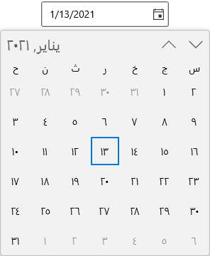
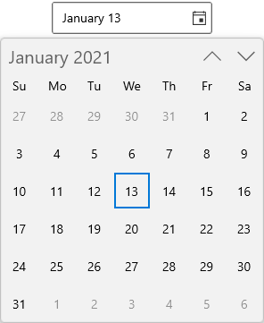
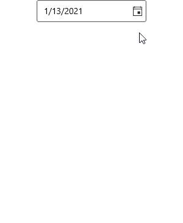
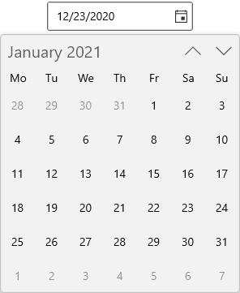
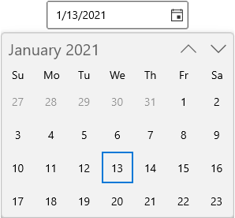

# Localization in WinUI Calendar Date Picker (SfCalendarDatePicker)

This section describes how to localize [Calendar Date Picker](https://help.syncfusion.com/cr/winui/Syncfusion.UI.Xaml.Calendar.SfCalendar.html) control using [`CalendarIdentifier`](https://help.syncfusion.com/cr/winui/Syncfusion.UI.Xaml.Calendar.SfCalendar.html#Syncfusion_UI_Xaml_Calendar_SfCalendar_CalendarIdentifier) and `Language` properties and to change the display formats.

## Types of calendar

The `Calendar Date Picker` control supports different type of calendars such as Gregorian, Julian, Hebrew, etc. You can change the calendar type by using [CalendarIdentifier](https://help.syncfusion.com/cr/winui/Syncfusion.UI.Xaml.Calendar.SfCalendarDatePicker.html#Syncfusion_UI_Xaml_Calendar_SfCalendarDatePicker_CalendarIdentifier) property. The default value of `CalendarIdentifier` property is **GregorianCalendar**.

You can select the required `CalendarIdentifier` value from below types.

 * JulianCalendar
 * GregorianCalendar
 * HebrewCalendar
 * HijriCalendar
 * KoreanCalendar
 * TaiwanCalendar
 * ThaiCalendar
 * UmAlQuraCalendar
 * PersianCalendar

N> Japanese and Lunar type calendars are not supported in `Calendar Date Picker` control.

N> When `CalendarIdentifier` and `FlowDirection` properties are set, `FlowDirection` property is given higher precedence.

N> `Calendar Date Picker` control updates the flow direction visually based on the `CalendarIdentifier` property value.




<calendar:SfCalendarDatePicker CalendarIdentifier="HebrewCalendar"
                               x:Name="sfCalendarDatePicker"/>




SfCalendarDatePicker sfCalendarDatePicker = new SfCalendarDatePicker();
sfCalendarDatePicker.CalendarIdentifier = "HebrewCalendar";




N> The value in `Calendar Date Picker` control textbox is updated based on `CalendarIdentifier` property calendar type.

N> Download demo application from [GitHub](https://github.com/SyncfusionExamples/syncfusion-winui-tools-calendardatepicker-examples/blob/main/Samples/Formatting)

## Change the language

If you want to localize the dropdown calendar, use the `Language` property. The default value of `Language` property is **en-US**.




<calendar:SfCalendarDatePicker Language="ar-AR"
                               x:Name="sfCalendarDatePicker"/>




SfCalendarDatePicker sfCalendarDatePicker = new SfCalendarDatePicker();
sfCalendarDatePicker.Language = "ar-AR";




N> Download demo application from [GitHub](https://github.com/SyncfusionExamples/syncfusion-winui-tools-calendardatepicker-examples/blob/main/Samples/Formatting)

## Change editor display format

 You can edit and display the selected date with various formatting like date, month and year formats by using the [FormatString](https://help.syncfusion.com/cr/winui/Syncfusion.UI.Xaml.Calendar.SfCalendarDatePicker.html#Syncfusion_UI_Xaml_Calendar_SfCalendarDatePicker_FormatString) property. The default value of `FormatString` property is **d**.




<calendar:SfCalendarDatePicker x:Name="sfCalendarDatePicker" 
                               FormatString="M"/>




SfCalendarDatePicker sfCalendarDatePicker = new SfCalendarDatePicker();
sfCalendarDatePicker.FormatString= "M";




N> Download demo application from [GitHub](https://github.com/SyncfusionExamples/syncfusion-winui-tools-calendardatepicker-examples/blob/main/Samples/Formatting)

## Change calendar display format

You can use different date formats such as abbreviated or full name for a day, month, week names or header name of month and year in dropdown calendar by using the [DateFormat](https://help.syncfusion.com/cr/winui/Syncfusion.UI.Xaml.Calendar.SfCalendarDatePicker.html#Syncfusion_UI_Xaml_Calendar_SfCalendarDatePicker_DateFormat), [MonthFormat](https://help.syncfusion.com/cr/winui/Syncfusion.UI.Xaml.Calendar.SfCalendarDatePicker.html#Syncfusion_UI_Xaml_Calendar_SfCalendarDatePicker_MonthFormat), [DayOfWeekFormat](https://help.syncfusion.com/cr/winui/Syncfusion.UI.Xaml.Calendar.SfCalendarDatePicker.html#Syncfusion_UI_Xaml_Calendar_SfCalendarDatePicker_DayOfWeekFormat) and [HeaderFormatInMonthView](https://help.syncfusion.com/cr/winui/Syncfusion.UI.Xaml.Calendar.SfCalendarDatePicker.html#Syncfusion_UI_Xaml_Calendar_SfCalendarDatePicker_HeaderFormatInMonthView) properties.

N> Refer [DateTimeFormatter](https://docs.microsoft.com/en-us/uwp/api/windows.globalization.datetimeformatting.datetimeformatter?view=winrt-19041) page to get more date formatting.




<calendar:SfCalendarDatePicker DateFormat="{}{day.integer(2)}"
                               MonthFormat="{}{month.full}"
                               DayOfWeekFormat="{}{dayofweek.abbreviated(3)}"
                               HeaderFormatInMonthView="{}{month.abbreviated} {year.abbreviated}‎"
                               x:Name="sfCalendarDatePicker"/>




SfCalendarDatePicker sfCalendarDatePicker = new SfCalendarDatePicker();
sfCalendarDatePicker.DateFormat = "{day.integer(2)}";
sfCalendarDatePicker.MonthFormat = "{month.full}";
sfCalendarDatePicker.DayOfWeekFormat = "{dayofweek.abbreviated(3)}";
sfCalendarDatePicker.HeaderFormatInMonthView = "{month.abbreviated} {year.abbreviated}‎";




N> Download demo application from [GitHub](https://github.com/SyncfusionExamples/syncfusion-winui-tools-calendardatepicker-examples/blob/main/Samples/Formatting)

## First day of week

You can change the first day of week in dropdown calendar using the [FirstDayOfWeek](https://help.syncfusion.com/cr/winui/Syncfusion.UI.Xaml.Calendar.SfCalendarDatePicker.html#Syncfusion_UI_Xaml_Calendar_SfCalendarDatePicker_FirstDayOfWeek) property value. The default value of `FirstDayOfWeek` property is **Sunday**.




<calendar:SfCalendarDatePicker x:Name="sfCalendarDatePicker" 
                               FirstDayOfWeek="Monday"/>




SfCalendarDatePicker sfCalendarDatePicker = new SfCalendarDatePicker();
sfCalendarDatePicker.FirstDayOfWeek = DayOfWeek.Monday;




N> Download demo application from [GitHub](https://github.com/SyncfusionExamples/syncfusion-winui-tools-calendardatepicker-examples/blob/main/Samples/Selection)

## Number of weeks in a view

If you want to increase or decrease the number of weeks shown in a month view in dropdown calendar, use the [NumberOfWeeksInView](https://help.syncfusion.com/cr/winui/Syncfusion.UI.Xaml.Calendar.SfCalendarDatePicker.html#Syncfusion_UI_Xaml_Calendar_SfCalendarDatePicker_NumberOfWeeksInView) property. The default value of `NumberOfWeeksInView` property is `6`.




<calendar:SfCalendarDatePicker NumberOfWeeksInView="4"
                               x:Name="sfCalendarDatePicker"/>




SfCalendarDatePicker sfCalendarDatePicker = new SfCalendarDatePicker();
sfCalendarDatePicker.NumberOfWeeksInView = 4;




N> Download demo application from [GitHub](https://github.com/SyncfusionExamples/syncfusion-winui-tools-calendardatepicker-examples/blob/main/Samples/Selection)
