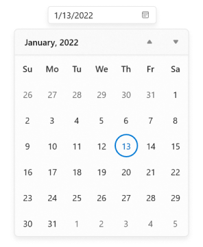

# WinUI Calendar Date Picker (SfCalendarDatePicker) Overview

The [WinUI Calendar Date Picker](https://www.syncfusion.com/winui-controls/calendar-datepicker) control provides an intuitive, touch-friendly interface for quickly selecting a date from a drop-down calendar. It supports different date formats. Date selection can be restricted by specifying minimum and maximum dates. Specific dates can also be disabled from selection. In addition, it supports editing with validation and has a built-in watermark text display.

### Normal view

### Expanded view

## Key Features

* `Calendar Date Picker` supports different cultures and language types.
* The drop-down portion is used for selecting the date, and it can be customized.
* The control displays the selected date value in various formats.
* Options to change the direction of the month while navigating.
* The drop-down display area in the `Calendar Date Picker` control is limited using abbreviated days and months.
* UI customization support for each cell in the drop-down.
* Supports highlighting special dates with icons.
* Supports blocking certain dates from selection and user interaction.