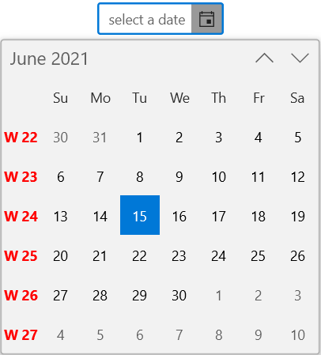
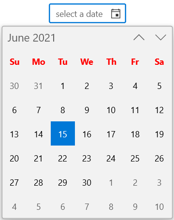

# Week number of the WinUI Calendar Date Picker (SfCalendarDatePicker)

This section describes about the week number in [Calendar Date Picker](https://help.syncfusion.com/cr/winui/Syncfusion.UI.Xaml.Calendar.SfCalendarDatePicker.html) control.

## Enable week numbers

You can show week numbers for each week in the dropdown calendar of `Calendar Date Picker` control by setting the value of `ShowWeekNumbers` property as **true**. You can also customize the week number displayed in calendar by using the`WeekNumberRule` property and `WeekNumberFormat` property. By default, the value of `ShowWeekNumber` property is **false**, `WeekNumberRule` is **FirstDay** and `WeekNumberFormat` is **#**.

N> You can change the `WeekNumberRule` property value with the [CalendarWeekRule](https://docs.microsoft.com/en-us/dotnet/api/system.globalization.calendarweekrule?view=net-5.0) and you can also add any prefix or suffix characters to **#** for `WeekNumberFormat` property.




<calendar:SfCalendarDatePicker HorizontalAlignment="Center" VerticalAlignment="Center"
                     ShowWeekNumbers="True"
                     />




SfCalendarDatePicker sfCalendarDatePicker = new SfCalendarDatePicker();
sfCalendarDatePicker.ShowWeekNumbers = true;




## Week rule

You can apply different rules for determining the first week of the year in the dropdown calendar of `Calendar Date Picker` control using the `WeekNumberRule` property. The default value of `WeekNumberRule` property is **FirstDay**.

N> You can change the `WeekNumberRule` property value with the [CalendarWeekRule](https://docs.microsoft.com/en-us/dotnet/api/system.globalization.calendarweekrule?view=net-5.0) 




<calendar:SfCalendarDatePicker HorizontalAlignment="Center" VerticalAlignment="Center"
                     ShowWeekNumbers="True" WeekNumberRule="FirstFullWeek"
                     />




SfCalendarDatePicker sfCalendarDatePicker = new SfCalendarDatePicker();
sfCalendarDatePicker.ShowWeekNumbers = true;
sfCalendarDatePicker.WeekNumberRule = CalendarWeekRule.FirstFullWeek;




## Format week numbers

You can customize the format in which week numbers are displayed in the dropdown calendar of `Calendar Date Picker` control using `WeekNumberFormat` property. The default value of `WeekNumberFormat` property is **#**.

N> You can add any prefix or suffix characters to **#** in `WeekNumberFormat` property to apply different custom formats.




<calendar:SfCalendarDatePicker HorizontalAlignment="Center" VerticalAlignment="Center"
                     ShowWeekNumbers="True" WeekNumberRule="FirstFullWeek"
                     />




SfCalendarDatePicker sfCalendarDatePicker = new SfCalendarDatePicker();
sfCalendarDatePicker.ShowWeekNumbers = true;
sfCalendarDatePicker.WeekNumberRule = CalendarWeekRule.FirstFullWeek;




## Customize the week number appearance

You can show week number in `Calendar Date Picker` control by setting the value of `ShowWeekNumbers` property  as **true**.
`Calendar Date Picker` control also allows you to customize the template of the week numbers using `WeekNumberTemplate` property in `CalendarItemTemplateSelector` class. The default value of `ShowWeekNumbers` property is **false**.




<calendar:SfCalendarDatePicker x:Name="sfCalendarDatePicker"
                            HorizontalAlignment="Center" VerticalAlignment="Center" ShowWeekNumbers="True"
                            WeekNumberFormat="W #" WeekNumberRule="FirstFullWeek"
                            >
    <FlyoutBase.AttachedFlyout>
        <editors:DropDownFlyout>
            <calendar:SfCalendar >
                <calendar:SfCalendar.Resources>
                    
                </calendar:SfCalendar.Resources>
            </calendar:SfCalendar>
        </editors:DropDownFlyout>
    </FlyoutBase.AttachedFlyout>
</calendar:SfCalendarDatePicker>




## Customize the week day name appearance

`Calendar Date Picker` control allows you to customize the template of the week day names using `WeekNameTemplate` property in `CalendarItemTemplateSelector` class. 




<calendar:SfCalendarDatePicker x:Name="sfCalendarDatePicker"
                            HorizontalAlignment="Center" VerticalAlignment="Center"  
                            >
    <FlyoutBase.AttachedFlyout>
        <editors:DropDownFlyout>
            <calendar:SfCalendar >
                <calendar:SfCalendar.Resources>
                    
                </calendar:SfCalendar.Resources>
            </calendar:SfCalendar>
        </editors:DropDownFlyout>
    </FlyoutBase.AttachedFlyout>
</calendar:SfCalendarDatePicker>




