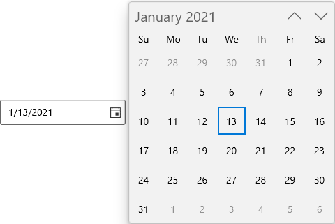
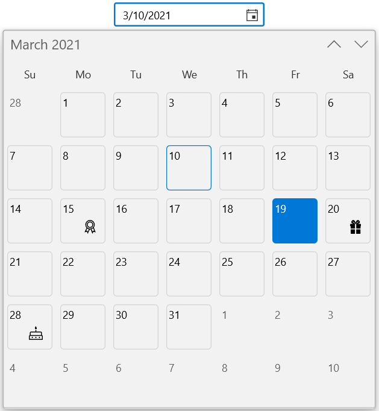
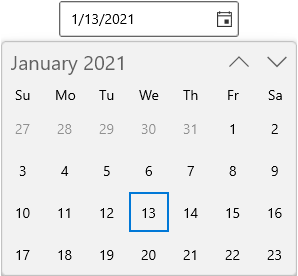
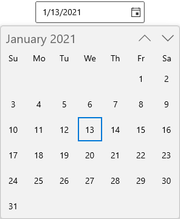
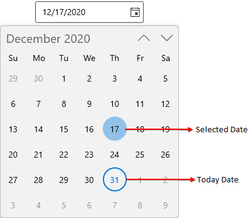
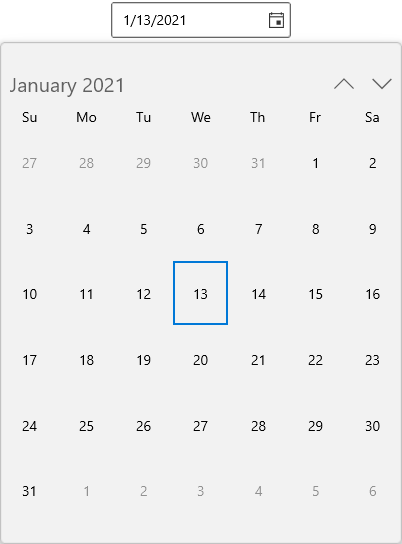

# Dropdown Calendar in WinUI Calendar DatePicker

This section describes how to select a date from dropdown Calendar and its customization options in [SfCalendarDatePicker](https://help.syncfusion.com/cr/winui/Syncfusion.UI.Xaml.Calendar.SfCalendarDatePicker.html) control.

## Change dropdown alignment

You can change the alignment of the dropdown spinner as full, center, left, right, top or bottom edge by using the [DropDownPlacement](https://help.syncfusion.com/cr/winui/Syncfusion.UI.Xaml.Editors.SfDropDownBase.html#Syncfusion_UI_Xaml_Editors_SfDropDownBase_DropDownPlacement) property. The default value of `DropDownPlacement` property is `Auto`.

N> If you change the dropdown alignment by using `DropDownPlacement` property and there is not sufficient space, then `CalendarDatePicker` smartly shifts the spinner alignment.




<calendar:SfCalendarDatePicker DropDownPlacement="Right" 
                             x:Name="sfCalendarDatePicker"/>




SfCalendarDatePicker sfCalendarDatePicker = new SfCalendarDatePicker();
sfCalendarDatePicker.DropDownPlacement = FlyoutPlacementMode.Right;




N> Download demo application from [GitHub](https://github.com/SyncfusionExamples/syncfusion-winui-tools-calendardatepicker-examples/blob/main/Samples/DropDown)

## Hide the dropdown button

You can hide the dropdown button in `CalendarDatePicker` by setting the [ShowDropDownButton](https://help.syncfusion.com/cr/winui/Syncfusion.UI.Xaml.Editors.SfDropDownBase.html#Syncfusion_UI_Xaml_Editors_SfDropDownBase_ShowDropDownButton) property value as `false`. The default value of `ShowDropDownButton` property is `true`.

N> When the dropdown button is hidden, you can still open the dropdown calendar using `ALT + down` keyboard shortcut.




<calendar:SfCalendarDatePicker ShowDropDownButton="False" 
                               x:Name="sfCalendarDatePicker"/>




SfCalendarDatePicker sfCalendarDatePicker = new SfCalendarDatePicker();
sfCalendarDatePicker.ShowDropDownButton = false;




N> Download demo application from [GitHub](https://github.com/SyncfusionExamples/syncfusion-winui-tools-calendardatepicker-examples/blob/main/Samples/DropDown)

## Customize individual items in Calendar

You can change the UI of specific cells in `CalendarDatePicker` dropdown calendar by using the [AttachedFlyout](https://docs.microsoft.com/en-us/uwp/api/windows.ui.xaml.controls.primitives.flyoutbase.attachedflyout?view=winrt-19041) and `DropDownFlyout` properties.




public class CustomCalendarItemTemplateSelector : DataTemplateSelector
{
     public CustomCalendarItemTemplateSelector()
    {
            SpecialDates = new Dictionary<DateTimeOffset, string>();
            SpecialDates.Add(DateTimeOffset.Now.AddMonths(-1).AddDays(1), "SingleEvent_1");
            SpecialDates.Add(DateTimeOffset.Now.AddMonths(-1).AddDays(5), "DoubleEvent_1");
            SpecialDates.Add(DateTimeOffset.Now.AddMonths(-1).AddDays(-2), "TripleEvent_2");
            SpecialDates.Add(DateTimeOffset.Now.AddDays(1), "TripleEvent_1");
            SpecialDates.Add(DateTimeOffset.Now.AddDays(5), "SingleEvent_2");
            SpecialDates.Add(DateTimeOffset.Now.AddDays(7), "DoubleEvent_2");
            SpecialDates.Add(DateTimeOffset.Now.AddDays(9), "SingleEvent_1");
            SpecialDates.Add(DateTimeOffset.Now.AddDays(12), "TripleEvent_2");
            SpecialDates.Add(DateTimeOffset.Now.AddDays(-4), "DoubleEvent_1");
            SpecialDates.Add(DateTimeOffset.Now.AddMonths(1).AddDays(1), "DoubleEvent_3");
            SpecialDates.Add(DateTimeOffset.Now.AddMonths(1).AddDays(3), "SingleEvent_2");
            SpecialDates.Add(DateTimeOffset.Now.AddMonths(1).AddDays(-5), "DoubleEvent_2");
    }

    private Dictionary<DateTimeOffset, string> SpecialDates { get; set; }

    public DataTemplate DefaultTemplate { get; set; }
    public DataTemplate SingleEventTemplate_1 { get; set; }
    public DataTemplate SingleEventTemplate_2 { get; set; }
    public DataTemplate DoubleEventTemplate_1 { get; set; }
    public DataTemplate DoubleEventTemplate_2 { get; set; }
    public DataTemplate DoubleEventTemplate_3 { get; set; }
    public DataTemplate TripleEventTemplate_1 { get; set; }
    public DataTemplate TripleEventTemplate_2 { get; set; }

    protected override DataTemplate SelectTemplateCore(object item, DependencyObject container)
    {
        if (item != null)
        {
            DateTimeOffset calendarItem = (DateTimeOffset)item;
            DateTimeOffset dateTimeOffset = SpecialDates.Keys.FirstOrDefault(x => x.Date == calendarItem.Date);

            if (dateTimeOffset != DateTimeOffset.MinValue)
            {
                string template = this.SpecialDates[dateTimeOffset];

                switch (template)
                {
                    case "SingleEvent_1":
                        return SingleEventTemplate_1;
                    case "SingleEvent_2":
                        return SingleEventTemplate_2;
                    case "DoubleEvent_1":
                        return DoubleEventTemplate_1;
                    case "DoubleEvent_2":
                        return DoubleEventTemplate_2;
                    case "DoubleEvent_3":
                        return DoubleEventTemplate_3;
                    case "TripleEvent_1":
                        return TripleEventTemplate_1;
                    case "TripleEvent_2":
                        return TripleEventTemplate_2;
                }
            }

            return DefaultTemplate;
        }

        return base.SelectTemplateCore(item, container);
    }
}







<Page.Resources>
    <DataTemplate x:Key="defaultTemplate">
    </DataTemplate>
    <DataTemplate x:Key="singleEventTemplate_1">
        <StackPanel Orientation="Horizontal">
            <Ellipse MinWidth="4" MinHeight="4" Fill="DeepPink" Margin="2"/>
        </StackPanel>
    </DataTemplate>
    <DataTemplate x:Key="singleEventTemplate_2">
        <StackPanel Orientation="Horizontal">
            <Ellipse MinWidth="4" MinHeight="4" Fill="Cyan" Margin="2"/>
        </StackPanel>
    </DataTemplate>
    <DataTemplate x:Key="doubleEventTemplate_1">
        <StackPanel Orientation="Horizontal">
            <Ellipse MinWidth="4" MinHeight="4" Fill="Violet" Margin="2"/>
            <Ellipse MinWidth="4" MinHeight="4" Fill="Orange" Margin="2"/>
        </StackPanel>
    </DataTemplate>
    <DataTemplate x:Key="doubleEventTemplate_2">
        <StackPanel Orientation="Horizontal">
            <Ellipse MinWidth="4" MinHeight="4" Fill="Gold" Margin="2"/>
            <Ellipse MinWidth="4" MinHeight="4" Fill="Green" Margin="2"/>
        </StackPanel>
    </DataTemplate>
    <DataTemplate x:Key="doubleEventTemplate_3">
        <StackPanel Orientation="Horizontal">
            <Ellipse MinWidth="4" MinHeight="4" Fill="Brown" Margin="2"/>
            <Ellipse MinWidth="4" MinHeight="4" Fill="Blue" Margin="2"/>
        </StackPanel>
    </DataTemplate>
    <DataTemplate x:Key="tripleEventTemplate_1">
        <StackPanel Orientation="Horizontal">
            <Ellipse MinWidth="4" MinHeight="4" Fill="Green" Margin="2"/>
            <Ellipse MinWidth="4" MinHeight="4" Fill="DeepSkyBlue" Margin="2"/>
            <Ellipse MinWidth="4" MinHeight="4" Fill="Orange" Margin="2"/>
        </StackPanel>
    </DataTemplate>
     <DataTemplate x:Key="tripleEventTemplate_2">
        <StackPanel Orientation="Horizontal">
            <Ellipse MinWidth="4" MinHeight="4" Fill="Red" Margin="2"/>
            <Ellipse MinWidth="4" MinHeight="4" Fill="Green" Margin="2"/>
            <Ellipse MinWidth="4" MinHeight="4" Fill="Gold" Margin="2"/>
        </StackPanel>
    </DataTemplate>
</Page.Resources>
<Grid>
    <calendar:SfCalendarDatePicker
                        MinWidth="180"
                        DayOfWeekFormat="{}{dayofweek.abbreviated(3)}"
                        HorizontalAlignment="Center"
                        VerticalAlignment="Center">
        <FlyoutBase.AttachedFlyout>
            <editor:DropDownFlyout>
                    <calendar:SfCalendar >
                        <calendar:SfCalendar.Resources>
                            <ResourceDictionary>
                                <!--  Resources and color keys for Calendar Control  -->
                                <SolidColorBrush x:Key="SyncfusionCalendarItemOutOfScopeForeground"
                                                 Color="SlateGray" Opacity="0.5" />
                                <SolidColorBrush x:Key="SyncfusionCalendarWeekItemForeground"
                                                 Color="{ThemeResource SystemBaseMediumLowColor}" />
                                <x:Double x:Key="SyncfusionSubtitleAltFontSize">16</x:Double>
                                <Thickness x:Key="SyncfusionCalendarItemMargin">1</Thickness>
                                <x:Double x:Key="SyncfusionBodyFontSize">13</x:Double>

                                <local:CustomCalendarItemTemplateSelector x:Key="selector"
                                    SingleEventTemplate_1="{StaticResource singleEventTemplate_1}"
                                    SingleEventTemplate_2="{StaticResource singleEventTemplate_2}"
                                    DoubleEventTemplate_1="{StaticResource doubleEventTemplate_1}"
                                    DoubleEventTemplate_2="{StaticResource doubleEventTemplate_2}"                                                                     
                                    DoubleEventTemplate_3="{StaticResource doubleEventTemplate_3}"
                                    TripleEventTemplate_1="{StaticResource tripleEventTemplate_1}"
                                    TripleEventTemplate_2="{StaticResource tripleEventTemplate_2}"
                                    DefaultTemplate="{StaticResource defaultTemplate}"/>
                                
                            </ResourceDictionary>
                        </calendar:SfCalendar.Resources>
                    </calendar:SfCalendar>
            </editor:DropDownFlyout>
        </FlyoutBase.AttachedFlyout>
    </calendar:SfCalendarDatePicker>
</Grid>




N> Download demo application from [GitHub](https://github.com/SyncfusionExamples/syncfusion-winui-tools-calendardatepicker-examples/blob/main/Samples/CustomUI)

## First day of week

By default, Sunday is shown as the first day of the week in a drop-down spinner. If you want to change the first day of week, use the [FirstDayOfWeek](https://help.syncfusion.com/cr/winui/Syncfusion.UI.Xaml.Calendar.SfCalendarDatePicker.html#Syncfusion_UI_Xaml_Calendar_SfCalendarDatePicker_FirstDayOfWeek) property value. The default value of `FirstDayOfWeek` property is `Sunday`.




<calendar:SfCalendarDatePicker x:Name="sfCalendarDatePicker" 
                               FirstDayOfWeek="Monday"/>




SfCalendarDatePicker sfCalendarDatePicker = new SfCalendarDatePicker();
sfCalendarDatePicker.FirstDayOfWeek = DayOfWeek.Monday;




N> Download demo application from [GitHub](https://github.com/SyncfusionExamples/syncfusion-winui-tools-calendardatepicker-examples/blob/main/Samples/Selection)

## Number of weeks in a view

If you want to increase or decrease the number of weeks shown in a month view in drop-down spinner, use the [NumberOfWeeksInView](https://help.syncfusion.com/cr/winui/Syncfusion.UI.Xaml.Calendar.SfCalendarDatePicker.html#Syncfusion_UI_Xaml_Calendar_SfCalendarDatePicker_NumberOfWeeksInView) property. The default value of `NumberOfWeeksInView` property is `6`.




<calendar:SfCalendarDatePicker NumberOfWeeksInView="4"
                               x:Name="sfCalendarDatePicker"/>




SfCalendarDatePicker sfCalendarDatePicker = new SfCalendarDatePicker();
sfCalendarDatePicker.NumberOfWeeksInView = 4;




N> Download demo application from [GitHub](https://github.com/SyncfusionExamples/syncfusion-winui-tools-calendardatepicker-examples/blob/main/Samples/Selection)

## Hide days that is out of scope

By default, out of scope days are disabled in drop-down spinner. If you want to hide the days that are out of the scope of current view, use the [OutOfScopeVisibility](https://help.syncfusion.com/cr/winui/Syncfusion.UI.Xaml.Calendar.SfCalendarDatePicker.html#Syncfusion_UI_Xaml_Calendar_SfCalendarDatePicker_OutOfScopeVisibility) property value as `Hidden`. The default value of `OutOfScopeVisibility` property is `Disabled`.




<calendar:SfCalendarDatePicker OutOfScopeVisibility="Hidden"
                               x:Name="sfCalendarDatePicker"/>




SfCalendarDatePicker sfCalendarDatePicker = new SfCalendarDatePicker();
sfCalendarDatePicker.OutOfScopeVisibility = OutOfScopeVisibility.Hidden;




N> Download demo application from [GitHub](https://github.com/SyncfusionExamples/syncfusion-winui-tools-calendardatepicker-examples/blob/main/Samples/Restriction)

## Show submit button

If you want to select the date from drop down calendar only by clicking the `Ok` button, use the [ShowSubmitButtons](https://help.syncfusion.com/cr/winui/Syncfusion.UI.Xaml.Editors.SfDropDownBase.html#Syncfusion_UI_Xaml_Editors_SfDropDownBase_ShowSubmitButtons) property value as `true`. The default value of `ShowSubmitButtons` property is `false`.

N> When the submit buttons are hidden, `SelectedDate` property will be updated as soon you choose start and end date from dropdown.




<calendar:SfCalendarDatePicker ShowSubmitButtons="true"
                               x:Name="sfCalendarDatePicker"/>




SfCalendarDatePicker sfCalendarDatePicker = new SfCalendarDatePicker();
sfCalendarDatePicker.ShowSubmitButtons = true;




N> Download demo application from [GitHub](https://github.com/SyncfusionExamples/syncfusion-winui-tools-calendardatepicker-examples/blob/main/Samples/DropDown)

## Today and selected date highlighting

You can highlight the today and selected date with rectangle and circle shapes. You can customize the selected date cell shape using `SelectionShape` property and use the [SelectionHighlightMode](https://help.syncfusion.com/cr/winui/Syncfusion.UI.Xaml.Calendar.SfCalendarDatePicker.html#Syncfusion_UI_Xaml_Calendar_SfCalendarDatePicker_SelectionHighlightMode) property to update the background of the selected date. The default value of `SelectionShape` property is `Rectangle` and `SelectionHighlightMode` property is `Outline`.

When `SelectionHighlightMode` value is `Outline`, today's date will have highlighted background as default and on selection. When `SelectionHighlightMode` value is `Filled`, today's date will have highlighted foreground as default and highlighted background when selected. 




<calendar:SfCalendarDatePicker SelectionHighlightMode="Filled"
                     SelectionShape="Circle"
                     x:Name="sfCalendarDatePicker"/>




SfCalendarDatePicker sfCalendarDatePicker = new SfCalendarDatePicker();
sfCalendarDatePicker.SelectionHighlightMode = CalendarItemHighlightMode.Filled;
sfCalendarDatePicker.SelectionShape = CalendarItemHighlightMode.Circle;




N> Download demo application from [GitHub](https://github.com/SyncfusionExamples/syncfusion-winui-tools-calendardatepicker-examples/blob/main/Samples/Selection)

## Change dropdown size

You can change the size of dropdown calendar by using [DropDownWidth](https://help.syncfusion.com/cr/winui/Syncfusion.UI.Xaml.Calendar.SfCalendarDatePicker.html#Syncfusion_UI_Xaml_Calendar_SfCalendarDatePicker_DropDownWidth) and [DropDownHeight](https://help.syncfusion.com/cr/winui/Syncfusion.UI.Xaml.Editors.SfDropDownBase.html#Syncfusion_UI_Xaml_Editors_SfDropDownBase_DropDownHeight) property. The default value of `DropDownHeight`  properties is `NaN`.




<calendar:SfCalendarDatePicker DropDownWidth="400"
                               DropDownHeight="500"
                               x:Name="sfCalendarDatePicker"/>




SfCalendarDatePicker sfCalendarDatePicker = new SfCalendarDatePicker();
sfCalendarDatePicker.DropDownWidth = 400;
sfCalendarDatePicker.DropDownHeight = 500;




N> Download demo application from [GitHub](https://github.com/SyncfusionExamples/syncfusion-winui-tools-calendardatepicker-examples/blob/main/Samples/DropDown)

## Change flow direction

By default, `SfCalendarDatePicker` control flow direction is updated based on `CalendarIdentifier` property value. You can change the flow direction  of `SfCalendarDatePicker` control and the dropdown calendar layout from right to left by setting the `FlowDirection` property value as `RightToLeft`. The default value of `FlowDirection` property is `LeftToRight`.

N> When `CalendarIdentifier` and `FlowDirection` properties value are changed, `FlowDirection` property is given precedence.




<calendar:SfCalendarDatePicker FlowDirection="RightToLeft" 
                               x:Name="sfCalendarDatePicker"/>




SfCalendarDatePicker sfCalendarDatePicker = new SfCalendarDatePicker();
sfCalendarDatePicker.FlowDirection = FlowDirection.RightToLeft;




N> Download demo application from [GitHub](https://github.com/SyncfusionExamples/syncfusion-winui-tools-calendardatepicker-examples/blob/main/Samples/Formatting)
