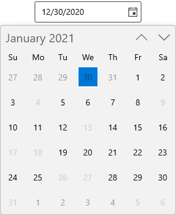
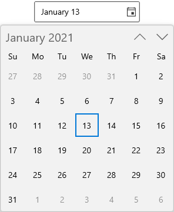
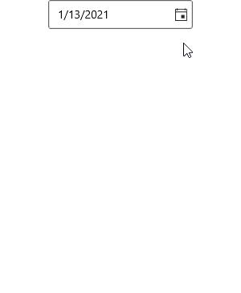
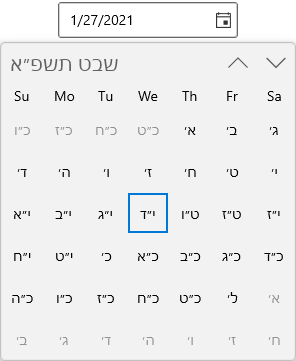
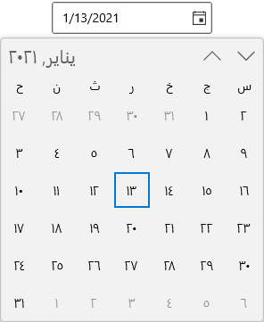

# Getting Started with WinUI Calendar DatePicker

This section explains the steps required to add the [CalendarDatePicker](https://help.syncfusion.com/cr/winui/Syncfusion.UI.Xaml.Calendar.SfCalendarDatePicker.html) control and its date selection options. This section covers only basic features needed to get started with Syncfusion `CalendarDatePicker` control.

## Structure of CalendarDatePicker control

## Creating an application with WinUI CalendarDatePicker

1. Create a [WinUI 3 desktop app for C# and .NET 5](https://docs.microsoft.com/en-us/windows/apps/winui/winui3/get-started-winui3-for-desktop) or [WinUI 3 app in UWP for C#](https://docs.microsoft.com/en-us/windows/apps/winui/winui3/get-started-winui3-for-uwp).
2. Add reference to [Syncfusion.Calendar.WinUI](https://www.nuget.org/packages/Syncfusion.Calendar.WinUI) NuGet. 
3. Import the control namespace `Syncfusion.UI.Xaml.Calendar` in XAML or C# code.
4. Initialize the `SfCalendarDatePicker` control.




<Page
    x:Class="GettingStarted.MainPage"
    xmlns="http://schemas.microsoft.com/winfx/2006/xaml/presentation"
    xmlns:x="http://schemas.microsoft.com/winfx/2006/xaml"
    xmlns:local="using:GettingStarted"
    xmlns:d="http://schemas.microsoft.com/expression/blend/2008"
    xmlns:mc="http://schemas.openxmlformats.org/markup-compatibility/2006"
    xmlns:calendar="using:Syncfusion.UI.Xaml.Calendar"
    mc:Ignorable="d"
    Background="{ThemeResource ApplicationPageBackgroundThemeBrush}">
    <Grid Name="grid">
        <!--Adding CalendarDatePicker control -->
        <calendar:SfCalendarDatePicker Name="sfCalendarDatePicker"/>
    </Grid>
</Page>




using Syncfusion.UI.Xaml.Calendar;

namespace GettingStarted
{
    /// 

    /// An empty page that can be used on its own or navigated to within a Frame.
    /// 

    public sealed partial class MainPage : Page
    {
        public MainPage()
        {
            this.InitializeComponent();
            // Creating an instance of the Calendar control
            SfCalendarDatePicker sfCalendarDatePicker = new SfCalendarDatePicker();

            grid.Children.Add(sfCalendarDatePicker);
        }
    }
}




N> Download demo application from [GitHub](https://github.com/SyncfusionExamples/syncfusion-winui-tools-calendardatepicker-examples/blob/main/Samples/Getting_started)

## Select the date programmatically

You can set or change the selected date programmatically by using [SelectedDate](https://help.syncfusion.com/cr/winui/Syncfusion.UI.Xaml.Calendar.SfCalendarDatePicker.html#Syncfusion_UI_Xaml_Calendar_SfCalendarDatePicker_SelectedDate) property. If you not assign any value for the `SelectedDate` property, `CalendarDatePicker` will automatically assign the current system date as `SelectedDate`.




SfCalendarDatePicker sfCalendarDatePicker= new SfCalendarDatePicker();
sfCalendarDatePicker.SelectedDate = new DateTimeOffset(new DateTime(2021, 01, 06));




N> Download demo application from [GitHub](https://github.com/SyncfusionExamples/syncfusion-winui-tools-calendardatepicker-examples/blob/main/Samples/Restriction)

## Select date interactively

You can change the selected date interactively by enter the date value using keyboard or select from drop down calendar spinner. You can get the selected date from the `SelectedDate` property.




<calendar:SfCalendarDatePicker Name="sfCalendarDatePicker" />




SfCalendarDatePicker sfCalendarDatePicker= new SfCalendarDatePicker();




N> Download demo application from [GitHub](https://github.com/SyncfusionExamples/syncfusion-winui-tools-calendardatepicker-examples/blob/main/Samples/Getting_started)

## Setting null value

If you want to set null value for the `CalendarDatePicker`, set the [AllowNullValue](https://help.syncfusion.com/cr/winui/Syncfusion.UI.Xaml.Calendar.SfCalendarDatePicker.html#Syncfusion_UI_Xaml_Calendar_SfCalendarDatePicker_AllowNullValue) property as `true` and set `SelectedDate` property as `null`. If `AllowNullValue` property is `false`, then the current system date is updated in `SelectedDate` property and displayed instead of `null`.




<calendar:SfCalendarDatePicker SelectedDate="{x:Null}"
                               AllowNullValue="True"
                               Name="sfCalendarDatePicker" />




SfCalendarDatePicker sfCalendarDatePicker= new SfCalendarDatePicker();
sfCalendarDatePicker.SelectedDate = null;
sfCalendarDatePicker.AllowNullValue = true;




N> Download demo application from [GitHub](https://github.com/SyncfusionExamples/syncfusion-winui-tools-calendardatepicker-examples/blob/main/Samples/Selection)

## Setting watermark text

You can prompt the user with some information by using the [PlaceHolderText](https://help.syncfusion.com/cr/winui/Syncfusion.UI.Xaml.Calendar.SfCalendarDatePicker.html#Syncfusion_UI_Xaml_Calendar_SfCalendarDatePicker_PlaceHolderText) property. This will be displayed only when the `CalendarDatePicker` contains the `SelectedDate` property as `null` and `AllowNullValue` property as `true`. If `AllowNullValue` property is `false`, then the current system date is updated in `SelectedDate` property and displayed instead of `PlaceHolderText`.




<calendar:SfCalendarDatePicker PlaceHolderText="Select the Date"
                               SelectedDate="{x:Null}"
                               AllowNullValue="True"
                               Name="sfCalendarDatePicker" />




SfCalendarDatePicker sfCalendarDatePicker= new SfCalendarDatePicker();
sfCalendarDatePicker.PlaceHolderText = "Select the Date";
sfCalendarDatePicker.SelectedDate = null;
sfCalendarDatePicker.AllowNullValue = true;




N> Download demo application from [GitHub](https://github.com/SyncfusionExamples/syncfusion-winui-tools-calendardatepicker-examples/blob/main/Samples/Selection)

## Restrict date selection

You can restrict the users from selecting a date within the particular range by specifying [MinDate](https://help.syncfusion.com/cr/winui/Syncfusion.UI.Xaml.Calendar.SfCalendarDatePicker.html#Syncfusion_UI_Xaml_Calendar_SfCalendarDatePicker_MinDate) and [MaxDate](https://help.syncfusion.com/cr/winui/Syncfusion.UI.Xaml.Calendar.SfCalendarDatePicker.html#Syncfusion_UI_Xaml_Calendar_SfCalendarDatePicker_MaxDate) properties. The default value of `MinDate` property is `1/1/1920 12:00:00 AM +00:00` and `MaxDate` property is `12/31/2120 11:59:59 PM +00:00`.

N> Dates that appears outside the minimum and maximum date range will be disabled (blackout).




<calendar:Calendar x:Name="sfCalendarDatePicker"/>




SfCalendarDatePicker sfCalendarDatePicker = new SfCalendarDatePicker();
sfCalendarDatePicker.MinDate = new DateTimeOffset(new DateTime(2021, 01, 5));
sfCalendarDatePicker.MaxDate = new DateTimeOffset(new DateTime(2021, 01, 24));




N> Download demo application from [GitHub](https://github.com/SyncfusionExamples/syncfusion-winui-tools-calendardatepicker-examples/blob/main/Samples/Restriction)

## Block dates using BlackoutDates

If you want to block particular dates from the date selection, add that dates into the [BlackoutDates](https://help.syncfusion.com/cr/winui/Syncfusion.UI.Xaml.Calendar.SfCalendarDatePicker.html#Syncfusion_UI_Xaml_Calendar_SfCalendarDatePicker_BlackoutDates) collection. You can add more block out dates to the `BlackoutDates` collection. The default value of `BlackoutDates` property is `null`.




public class ViewModel
{       
    public DateTimeOffsetCollection BlockedDates { get; set; }
    public ViewModel()
    {
        BlockedDates = new DateTimeOffsetCollection();
        BlockedDates.Add(new DateTimeOffset(new DateTime(2021, 1, 17)));
        BlockedDates.Add(new DateTimeOffset(new DateTime(2021, 1, 4)));
        BlockedDates.Add(new DateTimeOffset(new DateTime(2021, 2, 5)));
        BlockedDates.Add(new DateTimeOffset(new DateTime(2021, 2, 6)));
        BlockedDates.Add(new DateTimeOffset(new DateTime(2021, 1, 9)));
        BlockedDates.Add(new DateTimeOffset(new DateTime(2021, 3, 11)));
        BlockedDates.Add(new DateTimeOffset(new DateTime(2021, 1, 13)));
        BlockedDates.Add(new DateTimeOffset(new DateTime(2021, 4, 14)));
        BlockedDates.Add(new DateTimeOffset(new DateTime(2021, 1, 18)));
        BlockedDates.Add(new DateTimeOffset(new DateTime(2021, 5, 19)));
        BlockedDates.Add(new DateTimeOffset(new DateTime(2021, 1, 26)));
        BlockedDates.Add(new DateTimeOffset(new DateTime(2021, 6, 29)));
        BlockedDates.Add(new DateTimeOffset(new DateTime(2021, 1, 31)));
        BlockedDates.Add(new DateTimeOffset(new DateTime(2021, 1, 27)));
    }
}







<calendar:SfCalendarDatePicker BlackoutDates="{Binding BlockedDates}" 
                     x:Name="sfCalendarDatePicker">
    <calendar:SfCalendarDatePicker.DataContext>
        <local:ViewModel/>
    </calendar:SfCalendarDatePicker.DataContext>
</calendar:SfCalendarDatePicker>




sfCalendarDatePicker.DataContext = new ViewModel();
sfCalendarDatePicker.BlackoutDates = (sfCalendarDatePicker.DataContext as ViewModel).BlockedDates;




N> Download demo application from [GitHub](https://github.com/SyncfusionExamples/syncfusion-winui-tools-calendardatepicker-examples/blob/main/Samples/BlockedDates)

## Disable/block all weekends

You can prevent the users from selecting weekend days or any other dates by handling the [CalendarItemPrepared](https://help.syncfusion.com/cr/winui/Syncfusion.UI.Xaml.Calendar.SfCalendarDatePicker.html#Syncfusion_UI_Xaml_Calendar_SfCalendarDatePicker_CalendarItemPrepared) event and setting [ItemInfo.IsBlackout](https://help.syncfusion.com/cr/winui/Syncfusion.UI.Xaml.Calendar.CalendarItemPreparedEventArgs.html#Syncfusion_UI_Xaml_Calendar_CalendarItemPreparedEventArgs_ItemInfo) property value as `true` for that specific dates.




<calendar:SfCalendarDatePicker x:Name="sfCalendarDatePicker"
                               CalendarItemPrepared="SfCalendarDatePicker_CalendarItemPrepared"/>




SfCalendarDatePicker sfCalendarDatePicker = new SfCalendarDatePicker();
sfCalendarDatePicker.CalendarItemPrepared += SfCalendarDatePicker_CalendarItemPrepared;




You can handle the event as follows:




private void SfCalendarDatePicker_CalendarItemPrepared(object sender, CalendarItemPreparedEventArgs e)
{
    //Block all weekend days
    if (e.ItemInfo.ItemType == CalendarItemType.Day &&
        (e.ItemInfo.Date.DayOfWeek == DayOfWeek.Saturday ||
        e.ItemInfo.Date.DayOfWeek == DayOfWeek.Sunday))
    {
        e.ItemInfo.IsBlackout = true;
    }
}




N> Download demo application from [GitHub](https://github.com/SyncfusionExamples/syncfusion-winui-tools-calendardatepicker-examples/blob/main/Samples/BlockedDates)

## Selected date changed notification

You will be notified when selected date changed in `CalendarDatePicker` by using [SelectedDateChanged](https://help.syncfusion.com/cr/winui/Syncfusion.UI.Xaml.Calendar.SfCalendarDatePicker.html#Syncfusion_UI_Xaml_Calendar_SfCalendarDatePicker_SelectedDateChanged) event. The `SelectedDateChanged` event contains the old and newly selected date in the [OldDate](https://help.syncfusion.com/cr/winui/Syncfusion.UI.Xaml.Calendar.SelectedDateChangedEventArgs.html#Syncfusion_UI_Xaml_Calendar_SelectedDateChangedEventArgs_OldDate), [NewDate](https://help.syncfusion.com/cr/winui/Syncfusion.UI.Xaml.Calendar.SelectedDateChangedEventArgs.html#Syncfusion_UI_Xaml_Calendar_SelectedDateChangedEventArgs_NewDate) properties.

* `OldDate` - Gets a date which is previously selected.
* `NewDate` - Gets a date which is currently selected.




<calendar:SfCalendarDatePicker SelectedDateChanged="SfCalendarDatePicker_SelectedDateChanged" 
                               Name="sfCalendarDatePicker"/>




SfCalendarDatePicker sfCalendarDatePicker = new SfCalendarDatePicker();
sfCalendarDatePicker.SelectedDateChanged += SfCalendarDatePicker_SelectedDateChanged;




You can handle the event as follows:




private void SfCalendarDatePicker_SelectedDateChanged(object sender, SelectedDateChangedEventArgs e)
{
    var oldDate = e.OldDate;
    var newDate = e.NewDate;
}




## Change date display format

 You can edit and display the selected date with various formatting like date, month and year formats by using the [FormatString](https://help.syncfusion.com/cr/winui/Syncfusion.UI.Xaml.Calendar.SfCalendarDatePicker.html#Syncfusion_UI_Xaml_Calendar_SfCalendarDatePicker_FormatString) property. The default value of `FormatString` property is `d`.




<calendar:SfCalendarDatePicker x:Name="sfCalendarDatePicker" 
                               FormatString="M"/>




SfCalendarDatePicker sfCalendarDatePicker = new SfCalendarDatePicker();
sfCalendarDatePicker.FormatString= "M";




N> Download demo application from [GitHub](https://github.com/SyncfusionExamples/syncfusion-winui-tools-calendardatepicker-examples/blob/main/Samples/Formatting)

## Change date format for Spinner

You can use different date formats such as abbreviated or full name for a day, month, week names or header name of month and year in drop-down spinner by using the [DateFormat](https://help.syncfusion.com/cr/winui/Syncfusion.UI.Xaml.Calendar.SfCalendarDatePicker.html#Syncfusion_UI_Xaml_Calendar_SfCalendarDatePicker_DateFormat), [MonthFormat](https://help.syncfusion.com/cr/winui/Syncfusion.UI.Xaml.Calendar.SfCalendarDatePicker.html#Syncfusion_UI_Xaml_Calendar_SfCalendarDatePicker_MonthFormat), [DayOfWeekFormat](https://help.syncfusion.com/cr/winui/Syncfusion.UI.Xaml.Calendar.SfCalendarDatePicker.html#Syncfusion_UI_Xaml_Calendar_SfCalendarDatePicker_DayOfWeekFormat) and [HeaderFormatInMonthView](https://help.syncfusion.com/cr/winui/Syncfusion.UI.Xaml.Calendar.SfCalendarDatePicker.html#Syncfusion_UI_Xaml_Calendar_SfCalendarDatePicker_HeaderFormatInMonthView) properties.

N> Refer [DateTimeFormatter](https://docs.microsoft.com/en-us/uwp/api/windows.globalization.datetimeformatting.datetimeformatter?view=winrt-19041) page to get more date formatting.




<calendar:SfCalendarDatePicker DateFormat="{}{day.integer(2)}"
                               MonthFormat="{}{month.full}"
                               DayOfWeekFormat="{}{dayofweek.abbreviated(3)}"
                               HeaderFormatInMonthView="{}{month.abbreviated} {year.abbreviated}‎"
                               x:Name="sfCalendarDatePicker"/>




SfCalendarDatePicker sfCalendarDatePicker = new SfCalendarDatePicker();
sfCalendarDatePicker.DateFormat = "{day.integer(2)}";
sfCalendarDatePicker.MonthFormat = "{month.full}";
sfCalendarDatePicker.DayOfWeekFormat = "{dayofweek.abbreviated(3)}";
sfCalendarDatePicker.HeaderFormatInMonthView = "{month.abbreviated} {year.abbreviated}‎";




N> Download demo application from [GitHub](https://github.com/SyncfusionExamples/syncfusion-winui-tools-calendardatepicker-examples/blob/main/Samples/Formatting)

## Edit date using free form editing

By default, user entering each input numbers are automatically validated with the `FormatString`'s formats and assigned the proper value for current field, then it will move to next input field of the date format.

If you want to perform the validation after the user completely entering their date inputs, use the [EditMode](https://help.syncfusion.com/cr/winui/Syncfusion.UI.Xaml.Calendar.SfCalendarDatePicker.html#Syncfusion_UI_Xaml_Calendar_SfCalendarDatePicker_EditMode) property value as `Normal`. Then the entered date value is validated with the `FormatString` property value by pressing the `Enter` key or lost focus. If entered value is not suit with `FormatString` property, the previously selected date value sets to `SelectedDate` property.




<calendar:SfCalendarDatePicker EditMode="Normal"
                               x:Name="sfCalendarDatePicker" />




SfCalendarDatePicker sfCalendarDatePicker = new SfCalendarDatePicker();
sfCalendarDatePicker.EditMode = DateTimeEditingMode.Normal;




N> Download demo application from [GitHub](https://github.com/SyncfusionExamples/syncfusion-winui-tools-calendardatepicker-examples/blob/main/Samples/Selection)

## Navigate between views

You can easily navigate to the month, year, decade, or century views to select different dates in the drop-down spinner by repeatedly clicking the header button. Initially month view is loaded. If you want to change the initial view, use [DisplayMode](https://help.syncfusion.com/cr/winui/Syncfusion.UI.Xaml.Calendar.SfCalendarDatePicker.html#Syncfusion_UI_Xaml_Calendar_SfCalendarDatePicker_DisplayMode) property.

You can restrict navigation within a minimum and maximum views by using [MinDisplayMode](https://help.syncfusion.com/cr/winui/Syncfusion.UI.Xaml.Calendar.SfCalendarDatePicker.html#Syncfusion_UI_Xaml_Calendar_SfCalendarDatePicker_MinDisplayMode) and [MaxDisplayMode](https://help.syncfusion.com/cr/winui/Syncfusion.UI.Xaml.Calendar.SfCalendarDatePicker.html#Syncfusion_UI_Xaml_Calendar_SfCalendarDatePicker_MaxDisplayMode) properties. This will be useful when your date range is smaller and you don’t want to show century view.




<calendar:SfCalendarDatePicker x:Name="sfCalendarDatePicker"
                               MinDisplayMode="Month"
                               MaxDisplayMode="Century"
                               DisplayMode="Month"/>




SfCalendarDatePicker sfCalendarDatePicker = new SfCalendarDatePicker();
sfCalendarDatePicker.MinDisplayMode = CalendarDisplayMode.Month;
sfCalendarDatePicker.MaxDisplayMode = CalendarDisplayMode.Century;
sfCalendarDatePicker.DisplayMode = CalendarDisplayMode.Month;




N> Download demo application from [GitHub](https://github.com/SyncfusionExamples/syncfusion-winui-tools-calendardatepicker-examples/blob/main/Samples/Restriction)

## Calendar types

The `CalendarDatePicker` control supports different type of calendars such as Gregorian, Julian, Hebrew, etc. You can change the calendar type by using [CalendarIdentifier](https://help.syncfusion.com/cr/winui/Syncfusion.UI.Xaml.Calendar.SfCalendarDatePicker.html#Syncfusion_UI_Xaml_Calendar_SfCalendarDatePicker_CalendarIdentifier) property. The default value of `CalendarIdentifier` property is `GregorianCalendar`.

You can select the required `CalendarIdentifier` value from below types.

 * JulianCalendar
 * GregorianCalendar
 * HebrewCalendar
 * HijriCalendar
 * KoreanCalendar
 * TaiwanCalendar
 * ThaiCalendar
 * UmAlQuraCalendar
 * PersianCalendar

N> The value in `CalendarDatePicker` control textbox is updated based on `CalendarIdentifier` property calendar type.




<calendar:SfCalendarDatePicker CalendarIdentifier="HebrewCalendar"
                               x:Name="sfCalendarDatePicker"/>




SfCalendarDatePicker sfCalendarDatePicker = new SfCalendarDatePicker();
sfCalendarDatePicker.CalendarIdentifier = "HebrewCalendar";




N> Download demo application from [GitHub](https://github.com/SyncfusionExamples/syncfusion-winui-tools-calendardatepicker-examples/blob/main/Samples/Formatting)

## Culture support

If you want to localize the drop-down spinner calendar, use the `Language` property. The default value of `Language` property is `en-US`.




<calendar:SfCalendarDatePicker Language="ar"
                               x:Name="sfCalendarDatePicker"/>




SfCalendarDatePicker sfCalendarDatePicker = new SfCalendarDatePicker();
sfCalendarDatePicker.Language = "ar";




N> Download demo application from [GitHub](https://github.com/SyncfusionExamples/syncfusion-winui-tools-calendardatepicker-examples/blob/main/Samples/Formatting)

## Cancel a date that is being changed

The `DateChanging` event will be triggered, as soon as a date is selected but before `SelectedDate` property is updated. If the change is considered invalid, it can be canceled. The `DateChanging` event contains the following properties.

* `OldDate` - Gets a date which is previously selected.
* `NewDate` - Gets a date which is currently selected.
* `Cancel` - Gets or sets whether to cancel the selected date value update.

Users are restricted to select a blackout date from dropdown, however user can give text input through editor. As selecting a blackout date leads to crash, we can cancel the change using `DateChanging` event.

N> `DateChanging` event is called before the `SelectedDateChanged` event when a date is selected.




<calendar:SfCalendarDatePicker Height="30" Width="250" 
                               x:Name="SfCalendarDatePicker"
                               DateChanging="SfCalendarDatePicker_DateChanging" />




SfCalendarDatePicker sfCalendarDatePicker = new SfCalendarDatePicker();
sfCalendarDatePicker.DateChanging += SfCalendarDatePicker_DateChanging;




You can handle the event as follows:




 private void SfCalendarDatePicker_DateChanging(object sender, Syncfusion.UI.Xaml.Editors.DateChangingEventArgs e)
{
    var OldDate = e.OldDate;
    var NewDate = e.NewDate;

    //Cancel Selected date update
    e.Cancel = true;
}



