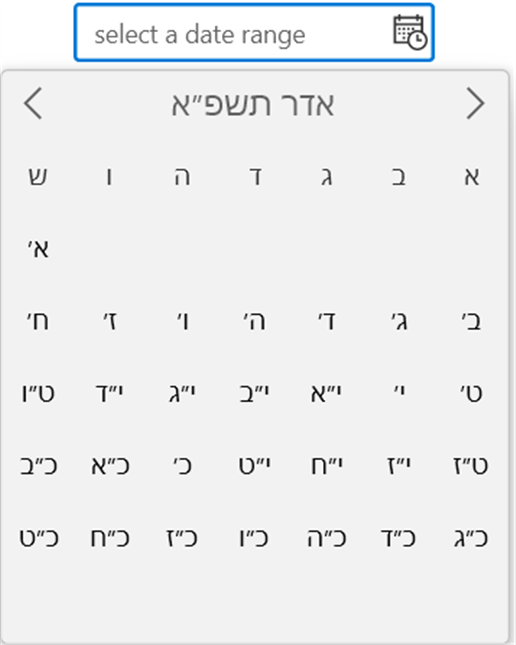
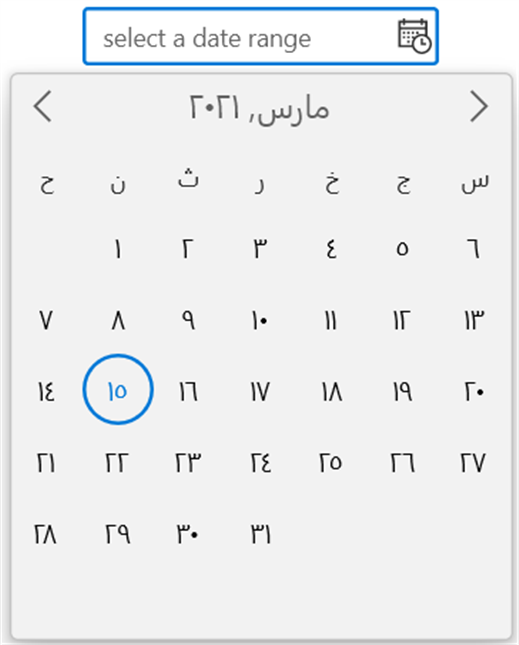
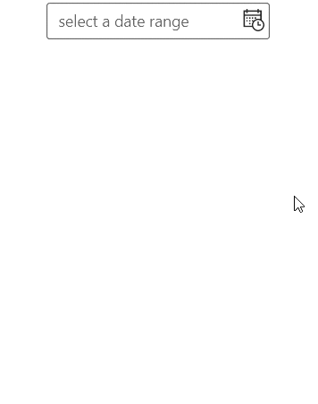
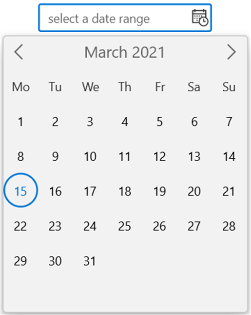
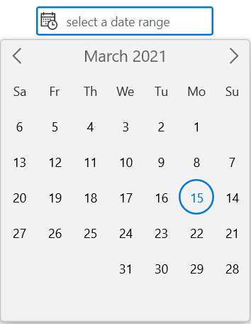

# Localization and Formatting in WinUI Calendar DateRange Picker

## Types of Calendar

The `Calendar DateRange Picker` control supports different type of calendars such as Gregorian, Julian, Hebrew, etc. You can change the calendar type by using [`CalendarIdentifier`](https://help.syncfusion.com/cr/winui/Syncfusion.UI.Xaml.Calendar.SfCalendarDateRangePicker.html#Syncfusion_UI_Xaml_Calendar_SfCalendarDateRangePicker_CalendarIdentifier) property. The default value of `CalendarIdentifier` property is **GregorianCalendar**.

You can select the required `CalendarIdentifier` value from below types.
 * JulianCalendar
 * GregorianCalendar
 * HebrewCalendar
 * HijriCalendar
 * KoreanCalendar
 * TaiwanCalendar
 * ThaiCalendar
 * UmAlQuraCalendar
 * PersianCalendar

N> Japanese and Lunar type calendars are not supported in `Calendar` control.

N> When `CalendarIdentifier` and `FlowDirection` properties are set, `FlowDirection` property is given higher precedence.

N> `Calendar DateRange Picker` control updates the flow direction visually based on the `CalendarIdentifier` property value.




<calendar:SfCalendarDateRangePicker CalendarIdentifier="HebrewCalendar"
                               x:Name="sfCalendarDateRangePicker"/>




SfCalendarDateRangePicker sfCalendarDateRangePicker = new SfCalendarDateRangePicker();
sfCalendarDateRangePicker.CalendarIdentifier = "HebrewCalendar";




N> Download demo from [Github](https://github.com/SyncfusionExamples/syncfusion-winui-tools-calendar-daterange-picker-examples/tree/main/Samples/Formatting)

## Change the language

If you want to localize the dropdown calendar, use the `Language` property. The default value of `Language` property is **en-US**.




<calendar:SfCalendarDateRangePicker Language="ar-AR"
                               x:Name="sfCalendarDateRangePicker"/>




SfCalendarDateRangePicker sfCalendarDateRangePicker = new SfCalendarDateRangePicker();
sfCalendarDateRangePicker.Language = "ar-AR";




N> Download demo from [Github](https://github.com/SyncfusionExamples/syncfusion-winui-tools-calendar-daterange-picker-examples/tree/main/Samples/Formatting)

## Change editor display format

You can modify and display the selected date range with various formatting like date, month and year formats by using the [`FormatString`](https://help.syncfusion.com/cr/winui/Syncfusion.UI.Xaml.Calendar.SfCalendarDateRangePicker.html#Syncfusion_UI_Xaml_Calendar_SfCalendarDateRangePicker_FormatString) property. The default value of `FormatString` property is **{0:d}-{1:d}**.




<calendar:SfCalendarDateRangePicker x:Name="sfCalendarDateRangePicker" FormatString="{}{0:D} - {1:D}" />
   



SfCalendarDateRangePicker sfCalendarDateRangePicker = new SfCalendarDateRangePicker();
sfCalendarDateRangePicker.FormatString= "{0:D}-{1:D}";




N> Download demo from [Github](https://github.com/SyncfusionExamples/syncfusion-winui-tools-calendar-daterange-picker-examples/tree/main/Samples/Formatting)

## Change calendar display format

You can use different date formats such as abbreviated or full name for a day, month, week names or header name of month and year in dropdown calendar by using the [`DateFormat`](https://help.syncfusion.com/cr/winui/Syncfusion.UI.Xaml.Calendar.SfCalendarDateRangePicker.html#Syncfusion_UI_Xaml_Calendar_SfCalendarDateRangePicker_DateFormat), [`MonthFormat`](https://help.syncfusion.com/cr/winui/Syncfusion.UI.Xaml.Calendar.SfCalendarDateRangePicker.html#Syncfusion_UI_Xaml_Calendar_SfCalendarDateRangePicker_MonthFormat), [`DayOfWeekFormat`](https://help.syncfusion.com/cr/winui/Syncfusion.UI.Xaml.Calendar.SfCalendarDateRangePicker.html#Syncfusion_UI_Xaml_Calendar_SfCalendarDateRangePicker_DayOfWeekFormat) and [`MonthHeaderFormat`](https://help.syncfusion.com/cr/winui/Syncfusion.UI.Xaml.Calendar.SfCalendarDateRangePicker.html#Syncfusion_UI_Xaml_Calendar_SfCalendarDateRangePicker_MonthHeaderFormat) properties.

N> Refer [DateTimeFormatter](https://docs.microsoft.com/en-us/uwp/api/windows.globalization.datetimeformatting.datetimeformatter?view=winrt-19041) page to get more date formats.




<calendar:SfCalendarDateRangePicker DateFormat="{}{day.integer(2)}"
                                    MonthFormat="{}{month.full}"
                                    DayOfWeekFormat="{}{dayofweek.abbreviated(3)}"
                                    MonthHeaderFormat="{}{month.abbreviated} {year.abbreviated}‎"
                                    x:Name="sfCalendarDateRangePicker"/>




SfCalendarDateRangePicker sfCalendarDateRangePicker = new SfCalendarDateRangePicker();
sfCalendarDateRangePicker.DateFormat = "{day.integer(2)}";
sfCalendarDateRangePicker.MonthFormat = "{month.full}";
sfCalendarDateRangePicker.DayOfWeekFormat = "{dayofweek.abbreviated(3)}";
sfCalendarDateRangePicker.MonthHeaderFormat = "{month.abbreviated} {year.abbreviated}‎";




N> Download demo from [Github](https://github.com/SyncfusionExamples/syncfusion-winui-tools-calendar-daterange-picker-examples/tree/main/Samples/Formatting)

## First day of week

By default, **Sunday** is shown as the first day of the week in a dropdown calendar of `Calendar DateRange Picker` control. You can change the first day of week, by changing the [`FirstDayOfWeek`](https://help.syncfusion.com/cr/winui/Syncfusion.UI.Xaml.Calendar.SfCalendarDateRangePicker.html#Syncfusion_UI_Xaml_Calendar_SfCalendarDateRangePicker_FirstDayOfWeek) property value. 




<calendar:SfCalendarDateRangePicker x:Name="sfCalendarDateRangePicker" 
                               FirstDayOfWeek="Monday"/>




SfCalendarDateRangePicker sfCalendarDateRangePicker = new SfCalendarDateRangePicker();
sfCalendarDateRangePicker.FirstDayOfWeek = DayOfWeek.Monday;




## Change flow direction

By default, flow direction is changed automatically based on selected `CalendarIdentifier` value in `Calendar DateRange Picker` control. However you can override it by explicitly specifying the `FlowDirection` property value. The default value of `FlowDirection` property is **LeftToRight**.

N> When `CalendarIdentifier` and `FlowDirection` properties are set, `FlowDirection` property is given higher precedence.




<calendar:SfCalendarDateRangePicker FlowDirection="RightToLeft" 
                               x:Name="sfCalendarDateRangePicker"/>




SfCalendarDateRangePicker sfCalendarDateRangePicker = new SfCalendarDateRangePicker();
sfCalendarDateRangePicker.FlowDirection = FlowDirection.RightToLeft;




N> Download demo from [Github](https://github.com/SyncfusionExamples/syncfusion-winui-tools-calendar-daterange-picker-examples/tree/main/Samples/Formatting)