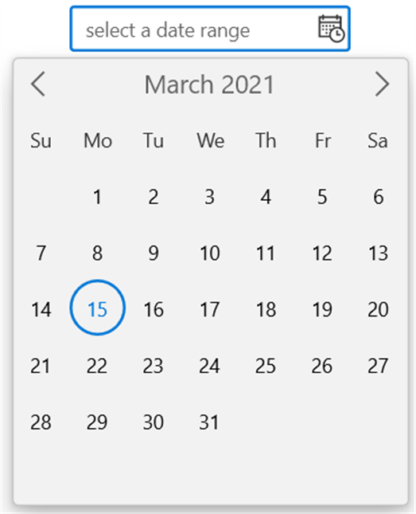

# WinUI Calendar DateRange Picker Overview

The [WinUI Calendar DateRange Picker](https://www.syncfusion.com/winui-controls/calendar-daterangepicker) control provides an intuitive, touch-friendly interface to quickly select a date range from a dropdown calendar. It supports different date formats. Date selection can be restricted by specifying minimum and maximum dates. Specific dates can also disabled from selection. In addition, it supports built-in watermark text display.

### Normal view:

### Expanded view:

## Key Features

* `Calendar DateRange Picker` supports different culture and language types.
* The dropdown region used for selecting the date range can be customized.
* Displays the selected date range value in a various formats.
* Dropdown display area in `Calendar DateRange Picker` control is limited using abbreviated days and months.
* Supports blocking a certain dates from selection and user interaction.
* Supports showing preset items containing predefined date range values in dropdown.