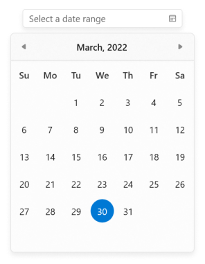

# About Syncfusion WinUI Calendar DateRange Picker Control

The [WinUI Calendar DateRange Picker](https://www.syncfusion.com/winui-controls/calendar-daterangepicker) control provides an intuitive, touch-friendly interface to quickly select a date range from a drop-down calendar. It supports different date formats. Date selection can be restricted by specifying minimum and maximum dates. Specific dates can also be disabled from the selection. In addition, it supports built-in watermark text display.

### Normal view

### Expanded view

## Key Features

* The `Calendar DateRange Picker` supports different cultures and languages.
* The drop-down region used for selecting the date range can be customized.
* Displays the selected date range value in various formats.
* The drop-down display area in the `Calendar DateRange Picker` control is limited using abbreviated days and months.
* Supports blocking certain dates from selection and user interaction.
* Supports showing preset items containing predefined date range values in the drop-down.