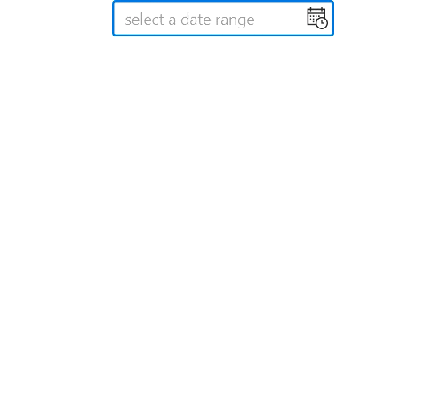

# Show preset items in drop-down calendar of Calendar DateRange Picker

## Show preset items in drop-down

You can show a collection of preset items in dropdown of `Calendar DateRange Picker` control using the [`Preset`](https://help.syncfusion.com/cr/winui/Syncfusion.UI.Xaml.Calendar.SfCalendarDateRangePicker.html#Syncfusion_UI_Xaml_Calendar_SfCalendarDateRangePicker_Preset) and [`PresetTemplate`](https://help.syncfusion.com/cr/winui/Syncfusion.UI.Xaml.Calendar.SfCalendarDateRangePicker.html#Syncfusion_UI_Xaml_Calendar_SfCalendarDateRangePicker_PresetTemplate) properties. Bind the collection of preset items to be displayed in the `Preset` property and set the required template in the `PresetTemplate` property.




//ViewModel class
class ViewModel
    {
        public ObservableCollection<string> PresetCollection { get; set; }
        public ViewModel()
        {
            PresetCollection = new ObservableCollection<string>();
            PresetCollection.Add("This Week");
            PresetCollection.Add("This Month");
            PresetCollection.Add("Last Month");
            PresetCollection.Add("This Year");
            PresetCollection.Add("Custom Range");
        }
    }




Add the `Syncfusion.UI.Xaml.Calendar` namespace reference in code-behind.




<Page
    x:Class="Calendar_WinUI_FT.MainPage"
    xmlns="http://schemas.microsoft.com/winfx/2006/xaml/presentation"
    xmlns:x="http://schemas.microsoft.com/winfx/2006/xaml"
    xmlns:local="using:Calendar_WinUI_FT"
    xmlns:d="http://schemas.microsoft.com/expression/blend/2008"
    xmlns:mc="http://schemas.openxmlformats.org/markup-compatibility/2006" xmlns:calendar="using:Syncfusion.UI.Xaml.Calendar"
    mc:Ignorable="d"
    Background="{ThemeResource ApplicationPageBackgroundThemeBrush}">
    <Page.DataContext>
        <local:ViewModel x:Name="viewModel" />
    </Page.DataContext>
    <Grid>
        <calendar:SfCalendarDateRangePicker  x:Name="sfCalendar" Height="35" Width="200"
                                            Preset="{x:Bind viewModel.PresetCollection, Mode=TwoWay}" >
            <calendar:SfCalendarDateRangePicker.PresetTemplate>
                <DataTemplate>
                    <ListBox ItemsSource="{Binding}" SelectionChanged="ListBox_SelectionChanged" />
                </DataTemplate>
            </calendar:SfCalendarDateRangePicker.PresetTemplate>
        </calendar:SfCalendarDateRangePicker>
    </Grid>
</Page>




private void ListBox_SelectionChanged(object sender, SelectionChangedEventArgs e)
{
    ListBox listBox = sender as ListBox;
    DateTimeOffset todayDate = DateTimeOffset.Now;

    if (listBox.SelectedItem.ToString() == "This Week")
    {
        DateTimeOffset startdate = todayDate.AddDays(-(todayDate.DayOfWeek - sfCalendarDateRangePicker.FirstDayOfWeek));
        sfCalendarDateRangePicker.SelectedRange = new DateTimeOffsetRange(startdate, startdate.AddDays(6));
    }
    else if (listBox.SelectedItem.ToString() == "This Month")
    {
        DateTimeOffset startdate = todayDate.AddDays(-(todayDate.Date.Day - 1));
        int daysToAdd = DateTime.DaysInMonth(startdate.Year, startdate.Month) - 1;
        DateTimeOffset lastDateInMonth = startdate.AddDays(daysToAdd);
        sfCalendarDateRangePicker.SelectedRange = new DateTimeOffsetRange(startdate, lastDateInMonth);
    }
    else if (listBox.SelectedItem.ToString() == "Last Month")
    {
        DateTimeOffset startdate = todayDate.AddMonths(-1).AddDays(-(todayDate.Date.Day - 1));
        int daysToAdd = DateTime.DaysInMonth(startdate.Year, startdate.Month) - 1;
        DateTimeOffset lastDateInMonth = startdate.AddDays(daysToAdd);
        sfCalendarDateRangePicker.SelectedRange = new DateTimeOffsetRange(startdate, lastDateInMonth);
    }
    else if (listBox.SelectedItem.ToString() == "This Year")
    {
        DateTimeOffset startdate = todayDate.AddMonths(-(todayDate.Month - 1)).AddDays(-(todayDate.Date.Day - 1));
        int daysToAdd = DateTime.DaysInMonth(startdate.Year, startdate.Month) - 1;
        DateTimeOffset lastDateInLastMonth = startdate.AddMonths(11).AddDays(daysToAdd);
        sfCalendarDateRangePicker.SelectedRange = new DateTimeOffsetRange(startdate, lastDateInLastMonth);
    }
    else
    {
        sfCalendarDateRangePicker.SelectedRange = null;
    }
}




## Hide calendar on selecting a preset item

You can hide the calendar in the drop-down when user selects any preset items in drop-down other than **CustomRange** using the `ShowCalendar` property. When a user wants to select a custom range of dates, the calendar is added to the drop-down of the 'Calendar DateRange Picker' control after selecting the **CustomRange** preset item.



privateprivate void ListBox_SelectionChanged(object sender, SelectionChangedEventArgs e)
{
    ListBox listBox = sender as ListBox;
    sfCalendarDateRangePicker.ShowCalendar = false;
    DateTimeOffset todayDate = DateTimeOffset.Now;

    if (listBox.SelectedItem.ToString() == "This Week")
    {
        DateTimeOffset startdate = todayDate.AddDays(-(todayDate.DayOfWeek - sfCalendarDateRangePicker.FirstDayOfWeek));
        sfCalendarDateRangePicker.SelectedRange = new DateTimeOffsetRange(startdate, startdate.AddDays(6));
    }
    else if (listBox.SelectedItem.ToString() == "This Month")
    {
        DateTimeOffset startdate = todayDate.AddDays(-(todayDate.Date.Day - 1));
        int daysToAdd = DateTime.DaysInMonth(startdate.Year, startdate.Month) - 1;
        DateTimeOffset lastDateInMonth = startdate.AddDays(daysToAdd);
        sfCalendarDateRangePicker.SelectedRange = new DateTimeOffsetRange(startdate, lastDateInMonth);
    }
    else if (listBox.SelectedItem.ToString() == "Last Month")
    {
        DateTimeOffset startdate = todayDate.AddMonths(-1).AddDays(-(todayDate.Date.Day - 1));
        int daysToAdd = DateTime.DaysInMonth(startdate.Year, startdate.Month) - 1;
        DateTimeOffset lastDateInMonth = startdate.AddDays(daysToAdd);
        sfCalendarDateRangePicker.SelectedRange = new DateTimeOffsetRange(startdate, lastDateInMonth);
    }
    else if (listBox.SelectedItem.ToString() == "This Year")
    {
        DateTimeOffset startdate = todayDate.AddMonths(-(todayDate.Month - 1)).AddDays(-(todayDate.Date.Day - 1));
        int daysToAdd = DateTime.DaysInMonth(startdate.Year, startdate.Month) - 1;
        DateTimeOffset lastDateInLastMonth = startdate.AddMonths(11).AddDays(daysToAdd);
        sfCalendarDateRangePicker.SelectedRange = new DateTimeOffsetRange(startdate, lastDateInLastMonth);
    }
    else
    {
        sfCalendarDateRangePicker.SelectedRange = null;
        sfCalendarDateRangePicker.ShowCalendar = true;
    }
}




N> Download demo from [GitHub](https://github.com/SyncfusionExamples/syncfusion-winui-tools-calendar-daterange-picker-examples/tree/main/Samples/PresetItems).