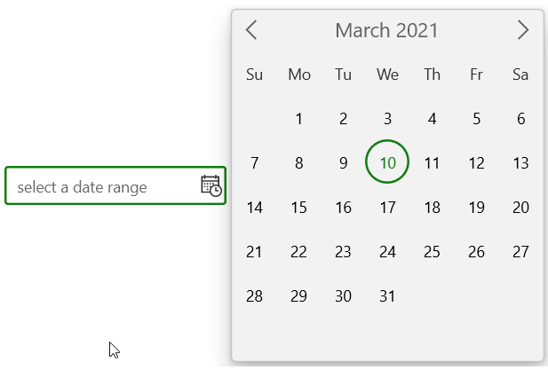
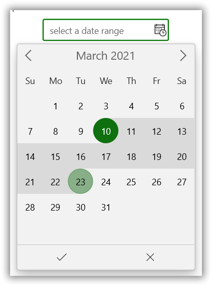
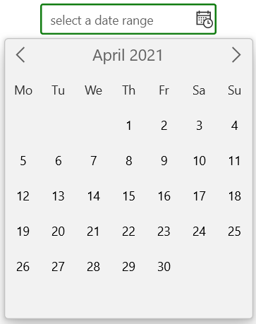
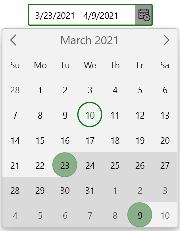
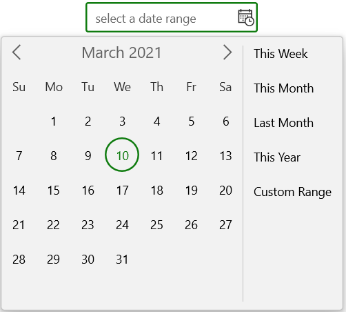
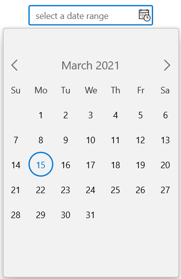
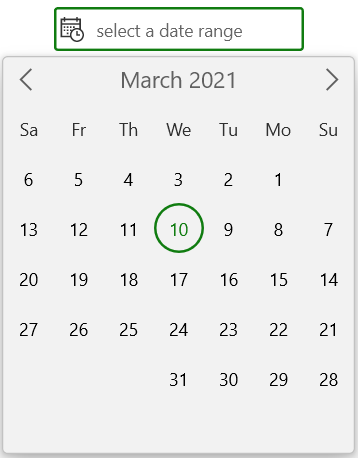

# Dropdown Calendar in WinI CalendarDateRangePicker

This section describes how to select a date from dropdown Calendar and its customization options in `SfCalendarDateRangePicker` control.

## Change dropdown alignment

You can change the alignment of the dropdown spinner as full, center, left, right, top or bottom edge by using the `DropDownPlacement` property. The default value of `DropDownPlacement` property is `Auto`.

N> If you change the dropdown alignment by using `DropDownPlacement` property and there is not sufficient space, then `CalendarDateRangePicker` smartly shifts the spinner alignment.




<calendar:SfCalendarDateRangePicker DropDownPlacement="Right" 
                             x:Name="sfCalendarDateRangePicker"/>




SfCalendarDateRangePicker sfCalendarDateRangePicker = new SfCalendarDateRangePicker();
sfCalendarDateRangePicker.DropDownPlacement = FlyoutPlacementMode.Right;




## Hide the dropdown button

You can hide the dropdown button in `CalendarDateRangePicker` by setting the `ShowDropDownButton` property value as `false`. The default value of `ShowDropDownButton` property is `true`.




<calendar:SfCalendarDateRangePicker ShowDropDownButton="False" 
                               x:Name="sfCalendarDateRangePicker"/>




SfCalendarDateRangePicker sfCalendarDateRangePicker = new SfCalendarDateRangePicker();
sfCalendarDateRangePicker.ShowDropDownButton = false;




## Show the submit button

You can show the submit button in `CalendarDateRangePicker` by setting the `ShowSubmitButtons` property value as `true`. The default value of `ShowSubmitButtons` property is `false`.




<calendar:SfCalendarDateRangePicker ShowSubmitButtons="True" 
                               x:Name="sfCalendarDateRangePicker"/>




SfCalendarDateRangePicker sfCalendarDateRangePicker = new SfCalendarDateRangePicker();
sfCalendarDateRangePicker.ShowSubmitButtons = true;




## First day of week

By default, Sunday is shown as the first day of the week in a drop-down spinner. If you want to change the first day of week, use the `FirstDayOfWeek` property value. The default value of `FirstDayOfWeek` property is `Sunday`.




<calendar:SfCalendarDateRangePicker x:Name="sfCalendarDateRangePicker" 
                               FirstDayOfWeek="Monday"/>




SfCalendarDateRangePicker sfCalendarDateRangePicker = new SfCalendarDateRangePicker();
sfCalendarDateRangePicker.FirstDayOfWeek = DayOfWeek.Monday;




## Hide days that is out of scope

By default, out of scope days are hidden in drop-down spinner. If you want to show and select the days that are out of the scope of current view, use the `OutOfScopeVisibility` property value as `Enabled` or if you want to only show but not select the days that are out of the scope of current view, set `Disabled`. The default value of `OutOfScopeVisibility` property is `Hidden`.




<calendar:SfCalendarDateRangePicker OutOfScopeVisibility="Hidden"
                               x:Name="sfCalendarDateRangePicker"/>




SfCalendarDateRangePicker sfCalendarDateRangePicker = new SfCalendarDateRangePicker();
sfCalendarDateRangePicker.OutOfScopeVisibility = OutOfScopeVisibility.Hidden;




## Showing preset items in dropdown

You can show collection of preset items in dropdown of `SfCalendarDateRangePicker` control using `Preset` property and `PresetTemplate` template. Bind the collection of preset items to be displayed in `Preset` property and set the required template in `PresetTemplate`.




//ViewModel class
class ViewModel
    {
        public ObservableCollection<string> PresetCollection { get; set; }
        public ViewModel()
        {
            PresetCollection = new ObservableCollection<string>();
            PresetCollection.Add("This Week");
            PresetCollection.Add("This Month");
            PresetCollection.Add("Last Month");
            PresetCollection.Add("This Year");
            PresetCollection.Add("Custom Range");
        }
    }







<Page
    x:Class="Calendar_WinUI_FT.MainPage"
    xmlns="http://schemas.microsoft.com/winfx/2006/xaml/presentation"
    xmlns:x="http://schemas.microsoft.com/winfx/2006/xaml"
    xmlns:local="using:Calendar_WinUI_FT"
    xmlns:d="http://schemas.microsoft.com/expression/blend/2008"
    xmlns:mc="http://schemas.openxmlformats.org/markup-compatibility/2006" xmlns:calendar="using:Syncfusion.UI.Xaml.Calendar"
    mc:Ignorable="d"
    Background="{ThemeResource ApplicationPageBackgroundThemeBrush}">
    <Page.DataContext>
        <local:ViewModel x:Name="viewModel" />
    </Page.DataContext>
    <Grid>
        <calendar:SfCalendarDateRangePicker  x:Name="sfCalendar" Height="35" Width="200"
                                            Preset="{x:Bind viewModel.PresetCollection, Mode=TwoWay}" >
            <calendar:SfCalendarDateRangePicker.PresetTemplate>
                <DataTemplate>
                    <ListBox ItemsSource="{Binding}" SelectionChanged="ListBox_SelectionChanged" />
                </DataTemplate>
            </calendar:SfCalendarDateRangePicker.PresetTemplate>
        </calendar:SfCalendarDateRangePicker>
    </Grid>
</Page>




 private void ListBox_SelectionChanged(object sender, SelectionChangedEventArgs e)
 {
    ListBox listBox = sender as ListBox;
    this.sfCalendarDateRangePicker.ShowCalendar = false;
    if (listBox.SelectedItem.ToString() == "This Week")
    {
        DateTimeOffset startdate = DateTimeOffset.Now.AddDays(-(DateTimeOffset.Now.DayOfWeek - sfCalendarDateRangePicker.FirstDayOfWeek));
        this.sfCalendarDateRangePicker.SelectedRange = new Syncfusion.UI.Xaml.Calendar.DateTimeOffsetRange(startdate, startdate.AddDays(6));
    }
    else if (listBox.SelectedItem.ToString() == "This Month")
    {
        DateTimeOffset startdate = DateTimeOffset.Now.AddDays(-(DateTimeOffset.Now.Date.Day - 1));
        this.sfCalendarDateRangePicker.SelectedRange = new Syncfusion.UI.Xaml.Calendar.DateTimeOffsetRange(startdate, startdate.AddDays(DateTime.DaysInMonth(startdate.Year, startdate.Month) - 1));
    }
    else if (listBox.SelectedItem.ToString() == "Last Month")
    {
        DateTimeOffset startdate = DateTimeOffset.Now.AddMonths(1).AddDays(-(DateTimeOffset.Now.Date.Day - 1));
        this.sfCalendarDateRangePicker.SelectedRange = new Syncfusion.UI.Xaml.Calendar.DateTimeOffsetRange(startdate, startdate.AddDays(DateTime.DaysInMonth(startdate.Year, startdate.Month) - 1));
    }
    else if (listBox.SelectedItem.ToString() == "This Year")
    {
        DateTimeOffset startdate = DateTimeOffset.Now.AddMonths(-(DateTimeOffset.Now.Month - 1)).AddDays(-(DateTimeOffset.Now.Date.Day - 1));
        this.sfCalendarDateRangePicker.SelectedRange = new Syncfusion.UI.Xaml.Calendar.DateTimeOffsetRange(startdate, startdate.AddMonths(11).AddDays(DateTime.DaysInMonth(startdate.Year, startdate.Month) - 1));
    }
    else
    {
        this.sfCalendarDateRangePicker.SelectedRange = null;
        this.sfCalendarDateRangePicker.ShowCalendar = true;
    }
 }




## Change dropdown size

You can change the size of dropdown calendar by using `DropDownHeight` property. The default value of `DropDownHeight` property is `NaN`.




<calendar:SfCalendarDateRangePicker DropDownHeight="500"
                               x:Name="sfCalendarDateRangePicker"/>




SfCalendarDateRangePicker sfCalendarDateRangePicker = new SfCalendarDateRangePicker();
sfCalendarDateRangePicker.DropDownHeight = 500;




## Change flow direction

You can change the flow direction of the `Calendar` layout in dropdown from right to left by setting the `FlowDirection` property value as `RightToLeft`. The default value of `FlowDirection` property is `LeftToRight`.




<calendar:SfCalendarDateRangePicker FlowDirection="RightToLeft" 
                               x:Name="sfCalendarDateRangePicker"/>




SfCalendarDateRangePicker sfCalendarDateRangePicker = new SfCalendarDateRangePicker();
sfCalendarDateRangePicker.FlowDirection = FlowDirection.RightToLeft;




