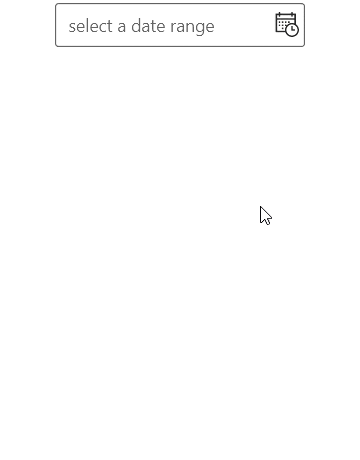
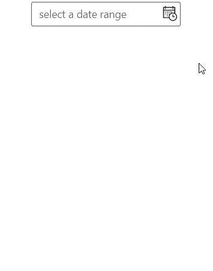
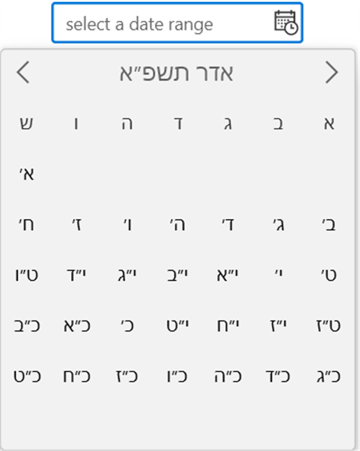
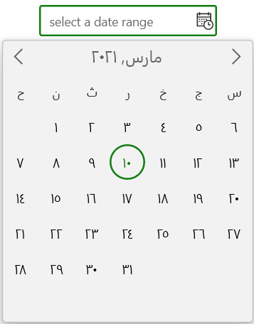

# Getting Started with WinUI CalendarDateRangePicker

This section explains the steps required to add the `CalendarDateRangePicker` control and its date range selection options. 
## Structure of CalendarDateRangePicker control

## Creating an application with WinUI CalendarDateRangePicker

1. Create a simple project using the instructions given in the [Getting Started with your first WinUI app](https://docs.microsoft.com/en-us/windows/apps/winui/winui3/get-started-winui3-for-uwp) documentation.
2. Add reference to [Syncfusion.Calendar.WinUI](https://www.nuget.org/packages/Syncfusion.Calendar.WinUI) NuGet. 
3. Import the control namespace `Syncfusion.UI.Xaml.Calendar` in XAML or C# code.
4. Initialize the `SfCalendarDateRangePicker` control.




<Page
    x:Class="GettingStarted.MainPage"
    xmlns="http://schemas.microsoft.com/winfx/2006/xaml/presentation"
    xmlns:x="http://schemas.microsoft.com/winfx/2006/xaml"
    xmlns:local="using:GettingStarted"
    xmlns:d="http://schemas.microsoft.com/expression/blend/2008"
    xmlns:mc="http://schemas.openxmlformats.org/markup-compatibility/2006"
    xmlns:calendar="using:Syncfusion.UI.Xaml.Calendar"
    mc:Ignorable="d"
    Background="{ThemeResource ApplicationPageBackgroundThemeBrush}">
    <Grid Name="grid">
        <!--Adding CalendarDateRangePicker control -->
        <calendar:SfCalendarDateRangePicker Name="sfCalendarDateRangePicker"/>
    </Grid>
</Page>




using Syncfusion.UI.Xaml.Calendar;

namespace GettingStarted
{
    /// 

    /// An empty page that can be used on its own or navigated to within a Frame.
    /// 

    public sealed partial class MainPage : Page
    {
        public MainPage()
        {
            this.InitializeComponent();
            // Creating an instance of the Calendar control
            SfCalendarDateRangePicker sfCalendarDateRangePicker = new SfCalendarDateRangePicker();

            grid.Children.Add(sfCalendarDateRangePicker);
        }
    }
}




## Select the date range programmatically

You can set or change the selected date range programmatically by using SelectedRange property. If you not assign any value for the `SelectedDate` property, `CalendarDateRangePicker` will automatically assign the current system date as `SelectedDate`.




SfCalendarDateRangePicker sfCalendarDateRangePicker= new SfCalendarDateRangePicker();
sfCalendarDateRangePicker.SelectedRange = new DateTimeOffsetRange(new DateTimeOffset(new DateTime(2021, 03,10)), new DateTimeOffset(new DateTime(2021, 03, 22)));




## Select date range interactively

You can change the selected date range interactively by selecting from drop down calendar spinner. You can get the selected date range from the `SelectedRange` property.




<calendar:SfCalendarDateRangePicker Name="sfCalendarDateRangePicker" />




SfCalendarDateRangePicker sfCalendarDateRangePicker= new SfCalendarDateRangePicker();




## Setting watermark text

You can prompt the user with some information by using the PlaceHolderText property. This watermark text will be displayed only when the `SelectedRange` property value is `null`. 




<calendar:SfCalendarDateRangePicker PlaceHolderText="Select the Date"
                               SelectedRange="{x:Null}"
                               Name="sfCalendarDateRangePicker" />




SfCalendarDateRangePicker sfCalendarDateRangePicker= new SfCalendarDateRangePicker();
sfCalendarDateRangePicker.PlaceHolderText = "Select the Date";
sfCalendarDateRangePicker.SelectedRange = null;




## Restrict date range selection

You can allow the users to select a date range within the particular range by specifying `MinDate` and `MaxDate` properties. The default value of `MinDate` property is `1/1/1920 12:00:00 AM +00:00` and `MaxDate` property is `12/31/2120 11:59:59 PM +00:00`.




<calendar:Calendar x:Name="sfCalendarDateRangePicker"/>




SfCalendarDateRangePicker sfCalendarDateRangePicker = new SfCalendarDateRangePicker();
sfCalendarDateRangePicker.MinDate = new DateTimeOffset(new DateTime(2021, 03, 06));
sfCalendarDateRangePicker.MaxDate = new DateTimeOffset(new DateTime(2021, 03, 24));




N> The `MinDate` property value should not be greater than the `MaxDate` property value.

## Block dates using BlackoutDates

If you want to block particular dates from the date selection, add that dates into the `BlackoutDates` collection. You can add more block out dates to the `BlackoutDates` collection. The default value of `BlackoutDates` property is `null`.




public class ViewModel
{       
    public DateTimeOffsetCollection BlockedDates { get; set; }
    public ViewModel()
    {
        BlockedDates = new DateTimeOffsetCollection();
        BlockedDates.Add(new DateTimeOffset(new DateTime(2021, 1, 17)));
        BlockedDates.Add(new DateTimeOffset(new DateTime(2021, 1, 4)));
        BlockedDates.Add(new DateTimeOffset(new DateTime(2021, 2, 5)));
        BlockedDates.Add(new DateTimeOffset(new DateTime(2021, 2, 6)));
        BlockedDates.Add(new DateTimeOffset(new DateTime(2021, 1, 9)));
        BlockedDates.Add(new DateTimeOffset(new DateTime(2021, 3, 11)));
        BlockedDates.Add(new DateTimeOffset(new DateTime(2021, 3, 12)));
        BlockedDates.Add(new DateTimeOffset(new DateTime(2021, 3, 23)));
        BlockedDates.Add(new DateTimeOffset(new DateTime(2021, 3, 26)));
        BlockedDates.Add(new DateTimeOffset(new DateTime(2021, 4, 14)));
        BlockedDates.Add(new DateTimeOffset(new DateTime(2021, 1, 18)));
        BlockedDates.Add(new DateTimeOffset(new DateTime(2021, 5, 19)));
        BlockedDates.Add(new DateTimeOffset(new DateTime(2021, 1, 26)));
        BlockedDates.Add(new DateTimeOffset(new DateTime(2021, 6, 29)));
        BlockedDates.Add(new DateTimeOffset(new DateTime(2021, 1, 31)));
        BlockedDates.Add(new DateTimeOffset(new DateTime(2021, 1, 27)));
    }
}







<calendar:SfCalendarDateRangePicker BlackoutDates="{Binding BlockedDates}" 
                     x:Name="sfCalendarDateRangePicker">
    <calendar:SfCalendarDateRangePicker.DataContext>
        <local:ViewModel/>
    </calendar:SfCalendarDateRangePicker.DataContext>
</calendar:SfCalendarDateRangePicker>




sfCalendarDateRangePicker.DataContext = new ViewModel();
sfCalendarDateRangePicker.BlackoutDates = (sfCalendarDateRangePicker.DataContext as ViewModel).BlockedDates;




## Disable/block all weekends

You can prevent the users from selecting weekend days or any other dates by handling the `ItemPrepared` event and setting `ItemInfo.IsBlackout` property value as `true` for that specific dates.




<calendar:SfCalendarDateRangePicker x:Name="sfCalendarDateRangePicker"
                                    ItemPrepared="SfCalendarDateRangePicker_ItemPrepared"/>




SfCalendarDateRangePicker sfCalendarDateRangePicker = new SfCalendarDateRangePicker();
sfCalendarDateRangePicker.ItemPrepared += SfCalendarDateRangePicker_ItemPrepared;




You can handle the event as follows:




private void SfCalendarDateRangePicker_ItemPrepared(object sender, ItemPreparedEventArgs e)
{
    //Block all weekend days
    if (e.ItemInfo.ItemType == CalendarItemType.Day &&
        (e.ItemInfo.Date.DayOfWeek == DayOfWeek.Saturday ||
        e.ItemInfo.Date.DayOfWeek == DayOfWeek.Sunday))
    {
        e.ItemInfo.IsBlackout = true;
    }
}




N> Blackout dates will not be added in `SelectedRange` property if blackout dates is highlighted in dropdown selected range.

## Selected range changed notification

You will be notified when selected range changed in `CalendarDateRangePicker` by using `SelectedDateRangeChanged` event. The `SelectedDateRangeChanged` event contains the old and new start value of range in `RangeStartNewValue` and `RangeStartOldValue` properties and old and new end value of range in `RangeEndNewValue` and `RangeEndOldValue` properties.

* `RangeStartOldValue` - Gets a date which is previously selected as start value in range.
* `RangeStartNewValue` - Gets a date which is currently selected as start value in range.
* `RangeEndOldValue` - Gets a date which is previously selected as end value in range.
* `RangeEndNewValue` - Gets a date which is currently selected as end value in range.




<calendar:SfCalendarDateRangePicker SelectedDateChanged="SfCalendarDateRangePicker_SelectedDateChanged" 
                               Name="sfCalendarDateRangePicker"/>




SfCalendarDateRangePicker sfCalendarDateRangePicker = new SfCalendarDateRangePicker();
sfCalendarDateRangePicker.SelectedDateChanged += SfCalendarDateRangePicker_SelectedDateChanged;




You can handle the event as follows:




private void SfCalendarDateRangePicker_SelectedDateChanged(object sender, SelectedDateChangedEventArgs e)
{
    var StartOldValue = e.RangeStartOldValue;
    var StartNewValue = e.RangeStartNewValue;
    var EndOldValue = e.RangeEndOldValue;
    var EndNewValue = e.RangeEndNewValue;
}




## Change date display format

 You can modify and display the selected date range with various formatting like date, month and year formats by using the FormatString property. The default value of `FormatString` property is `{0:d}-{1:d}`.




<calendar:SfCalendarDateRangePicker x:Name="sfCalendarDateRangePicker" >
    <calendar:SfCalendarDateRangePicker.FormatString>
        <x:String>{0:D} - {1:D}</x:String>
    </calendar:SfCalendarDateRangePicker.FormatString>
</calendar:SfCalendarDateRangePicker>




SfCalendarDateRangePicker sfCalendarDateRangePicker = new SfCalendarDateRangePicker();
sfCalendarDateRangePicker.FormatString= "{0:D}-{1:D}";




## Change date format for Spinner

You can use different date formats such as abbreviated or full name for a day, month, week names or header name of month and year in drop-down spinner by using the `DateFormat`, `MonthFormat`, `DayOfWeekFormat` and `MonthHeaderFormat` properties.

N> Refer [DateTimeFormatter](https://docs.microsoft.com/en-us/uwp/api/windows.globalization.datetimeformatting.datetimeformatter?view=winrt-19041) page to get more date formatting.




<calendar:SfCalendarDateRangePicker DateFormat="{}{day.integer(2)}"
                               MonthFormat="{}{month.full}"
                               DayOfWeekFormat="{}{dayofweek.abbreviated(3)}"
                               MonthHeaderFormat="{}{month.abbreviated} {year.abbreviated}‎"
                               x:Name="sfCalendarDateRangePicker"/>




SfCalendarDateRangePicker sfCalendarDateRangePicker = new SfCalendarDateRangePicker();
sfCalendarDateRangePicker.DateFormat = "{day.integer(2)}";
sfCalendarDateRangePicker.MonthFormat = "{month.full}";
sfCalendarDateRangePicker.DayOfWeekFormat = "{dayofweek.abbreviated(3)}";
sfCalendarDateRangePicker.MonthHeaderFormat = "{month.abbreviated} {year.abbreviated}‎";




## Restrict the end range value selection

You can restrict the end range value selection of `SelectedRange` property value by using `MinDayCount` and `MaxDayCount` properties.




SfCalendarDateRangePicker sfCalendarDateRangePicker = new SfCalendarDateRangePicker();
sfCalendarDateRangePicker.MaxDayCount = 10;
sfCalendarDateRangePicker.MaxDayCount = 5;




## Navigate between views

You can easily navigate to the month, year, decade, or century views to select different date ranges in the drop-down spinner by repeatedly clicking the header button. Initially month view is loaded.

You can restrict navigation within a minimum and maximum views by using `MinDisplayMode` and `MaxDisplayMode` properties. This will be useful when your date range is smaller and you don’t want to show century, decade and year view.




<calendar:SfCalendarDateRangePicker x:Name="sfCalendarDateRangePicker"
                               MinDisplayMode="Month"
                               MaxDisplayMode="Year"
                               />




SfCalendarDateRangePicker sfCalendarDateRangePicker = new SfCalendarDateRangePicker();
sfCalendarDateRangePicker.MinDisplayMode = CalendarDisplayMode.Month;
sfCalendarDateRangePicker.MaxDisplayMode = CalendarDisplayMode.Year;




## Calendar types

The `CalendarDateRangePicker` control supports different type of calendars such as Gregorian, Julian, Hebrew, etc. You can change the calendar type by using [CalendarIdentifier](https://help.syncfusion.com/cr/winui/Syncfusion.UI.Xaml.Calendar.SfCalendarDateRangePicker.html#Syncfusion_UI_Xaml_Calendar_SfCalendarDateRangePicker_CalendarIdentifier) property. The default value of `CalendarIdentifier` property is `GregorianCalendar`.

N> Refer [CalendarIdentifiers](https://docs.microsoft.com/en-us/uwp/api/windows.globalization.calendaridentifiers?view=winrt-19041) page to get more calendar types.




<calendar:SfCalendarDateRangePicker CalendarIdentifier="HebrewCalendar"
                               x:Name="sfCalendarDateRangePicker"/>




SfCalendarDateRangePicker sfCalendarDateRangePicker = new SfCalendarDateRangePicker();
sfCalendarDateRangePicker.CalendarIdentifier = "HebrewCalendar";




## Culture support

If you want to localize the drop-down spinner calendar, use the `Language` property. The default value of `Language` property is `en-US`.




<calendar:SfCalendarDateRangePicker Language="ar"
                               x:Name="sfCalendarDateRangePicker"/>




SfCalendarDateRangePicker sfCalendarDateRangePicker = new SfCalendarDateRangePicker();
sfCalendarDateRangePicker.Language = "ar";




